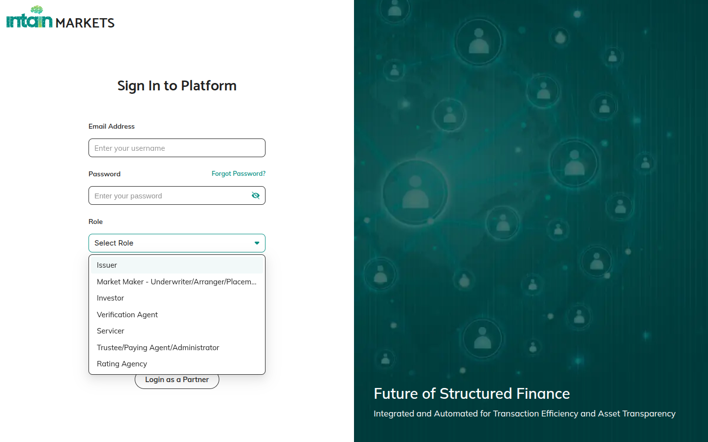

# User Roles & Responsibilities

Your role determines what actions you can take, what you can see, and what you are responsible for.

## Roles at a Glance

| Role | Key responsibilities |
|---|---|
| **Issuer / Borrower** | Create pools, onboard loans, mint NFTs, create deals and term sheets, initiate repayment |
| **Market Maker / Facility Agent** | Accept pool mandates, review term sheets, configure and manage credit facilities, approve asset sale deals |
| **Investor / Lender** | Review pools and deals, approve master commitments, confirm fund transfers, burn NFTs |
| **Servicer** | Upload monthly loan tapes for assigned deals |
| **Paying Agent** | View pools/facilities, manage payment distributions |
| **Rating Agency** | View and download items shared with them (read-only) |
| **Admin** | Manage organizations/users, KYC approval, handle delegation tasks |

## Key Rules

- **One role per session** — if you have multiple roles, select one at login; log out and back in to switch
- **Role-based views** — you only see items relevant to your role or shared with your organization
- **Action availability** — buttons are on or off based on your role and the item's current status
- **Microsoft SSO** supported — sign in with Microsoft Entra credentials if your organization uses it

→ See [Login and Navigation](03_Login_and_Navigation.md) for sign-in steps.
→ See [Who Can Do What](74_Who_can_do_what.md) for a detailed role-action reference.
