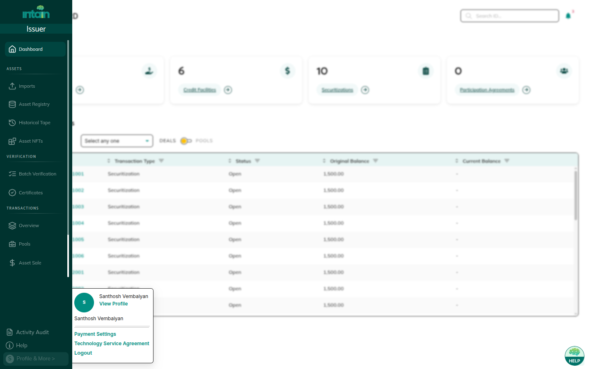
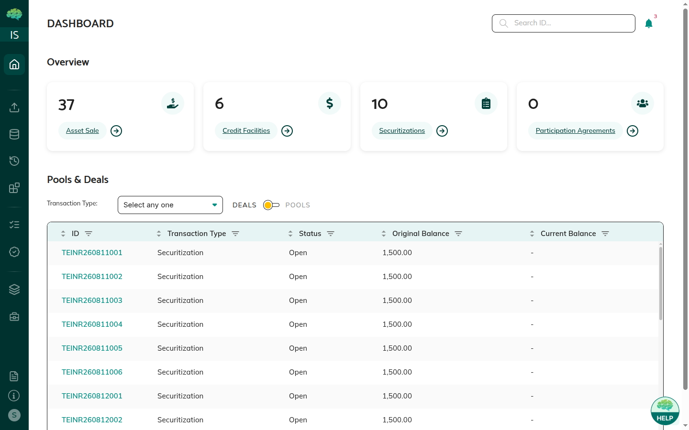
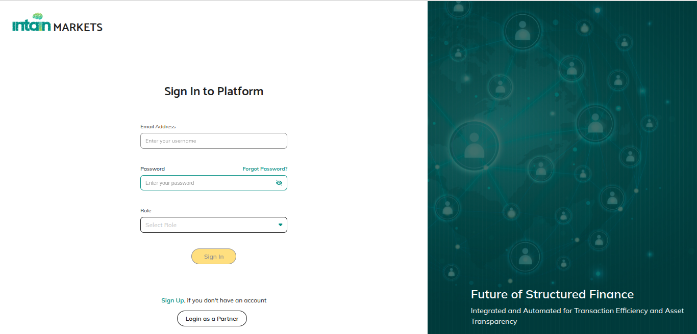
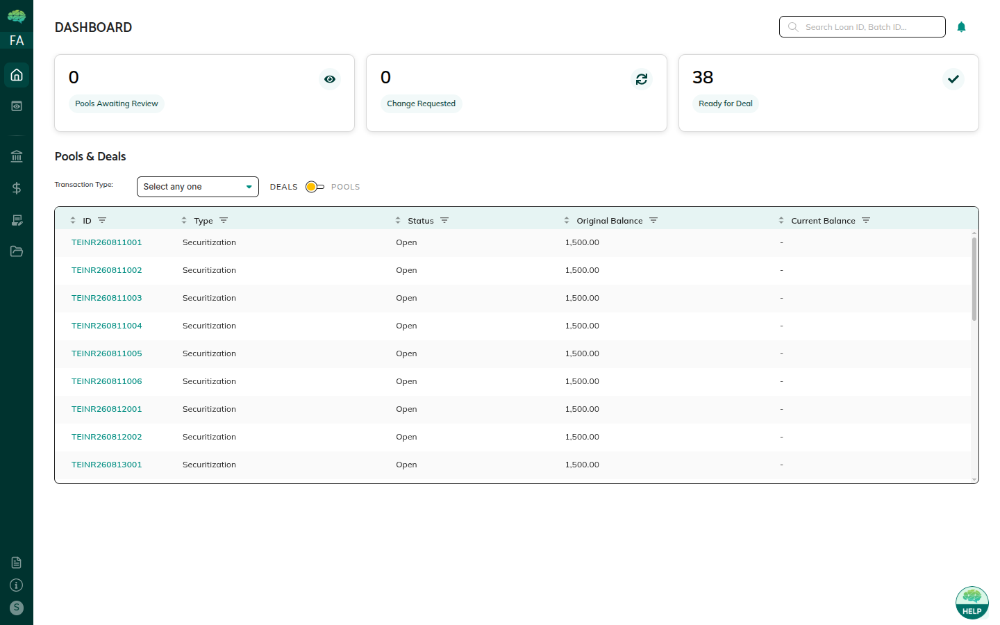

# Login & Navigation

## Overview

Logging into Intain Markets and navigating the platform is straightforward and role-focused. The platform automatically presents relevant information and appropriate actions based on your role, making it easy to find what you need and focus on your responsibilities.

## How to Navigate the Platform

**Login Process** — The platform supports two authentication methods:

1. **Microsoft Entra SSO** — If your organization uses Microsoft Entra (formerly Azure AD), click the **Sign in with Microsoft** button on the login page. You will be redirected to Microsoft's authentication flow. After authentication, if your account has multiple roles, you will be prompted to select a role on the **Select Role** page before entering the platform.
2. **Direct Login** — Enter your credentials (username and password) on the login page, select your role from those you have registered, and click submit. The platform presents a dashboard tailored to your selected role.

**Role Selection** — If your account has multiple roles, select which role to use for this session. You can only use one role per session, but you can log out and log back in with a different role if needed.

**Dashboard Access** — After logging in, you'll see a dashboard showing items relevant to your role — pools you've created or are involved with, pending actions, recent activity, and items in various statuses. The dashboard provides quick-action tiles for common tasks.

**Main Navigation** — A left-side expandable navigation sidebar (which expands when you hover over it) contains tabs for:

* **Pools** — Pool management and review
* **Asset Registry / Loan Registry** — Loan onboarding and management
* **Credit Facility** — Credit facility term sheets and master commitments
* **Asset Sale** — Whole loan sale deals and settlement
* **Securitization** — Securitization deals and tranches
* **Imports** — Loan tape uploads and ingestion
* **Batch Verification** — Loan verification batches
* **Activity Audit** — Cross-module activity log
* Other sections depending on your role (Reports, Payment Settings, Profile)

The visible navigation items depend on your role — you only see sections relevant to your responsibilities.

**Search and Filter** — Search and filter capabilities help you find specific items by name, status, or other criteria. Tables support server-side column filters for efficient searching across large datasets.

**Notifications** — A notification drawer provides real-time alerts for items requiring your attention, status changes, and approvals needed.

## What You Will See

**Login Page** - When you access the platform, you'll see the login page where you enter your credentials to access your account. The login page supports Sign In with credentials, Microsoft SSO, role selection, and Sign Up.

**Role Selection** - The role dropdown on the login page lets you select from all available roles (Issuer, Market Maker, Investor, Servicer, Paying Agent, Rating Agency, Admin).

**Your Dashboard** - After login, you'll see a dashboard showing items relevant to your role. As an issuer, you'll see pools you've created. As a market maker, you'll see pools shared with you. As an investor, you'll see pools shared with you. The dashboard helps you quickly see what needs your attention and provides an overview of your activities.

**Dashboard Notifications** - The dashboard includes notifications and alerts for items requiring your attention. You can click on notifications to view details in the context panel, which appears as a right drawer with relevant information.

**Filtered Lists** - When you navigate to sections like Pools or Credit Facilities, you'll see lists automatically filtered for your role. You won't see items where you don't have a role or that aren't shared with you. This filtering happens automatically—you don't need to manually filter. This automatic filtering ensures you only see relevant items.

**Role-Appropriate Actions** - Action buttons throughout the platform are automatically enabled or disabled based on your role and the item's status. You'll only see actions you can actually take. Disabled buttons typically show tooltips explaining why they're disabled. This role-based action availability ensures you can only take actions that are appropriate for your role.

**Notifications** - The platform may show notifications about items requiring your attention, status changes, approvals needed, or other important updates. These notifications help you stay informed about relevant activities and ensure you don't miss important updates or actions that require your attention.

**Search and Filter Options** - The platform provides search and filter capabilities to help you find specific items. You can search by name, filter by status, or use other criteria to locate items quickly. These tools help you find items efficiently, especially when dealing with large numbers of items.

## Helpful Tips

**Select the Correct Role** - Select the role that matches what you want to do. If you're creating pools, use the Issuer role. If you're reviewing shared pools, use the Investor role.

**Check Your Dashboard First** - Your dashboard shows items requiring your attention and recent activity. Check it regularly to stay on top of pending actions.

**Use Navigation Menus** - The main navigation menus organize features logically. Use them to move between different sections efficiently.

**Look for Tooltips** - When actions are disabled, hover over buttons or check tooltips to see why they're disabled.

**Check Notifications** - Notifications alert you to important updates, pending actions, or items requiring your attention. Check them regularly.

**Use Search When Needed** - Use the search functionality rather than scrolling through long lists to find specific items quickly.

**Understand Role-Based Views** - You only see items relevant to your role. If you can't find something, it might not be shared with you or you might need a different role.

**Multiple Roles** - If you have multiple roles, switch between them by logging out and logging back in with a different role.

**Action Availability** - Action buttons are enabled or disabled based on both your role and the item's status. Check both to understand why an action isn't available.

**Use Filters Effectively** - Use filters to narrow down items by status, date, or other criteria when viewing lists.

