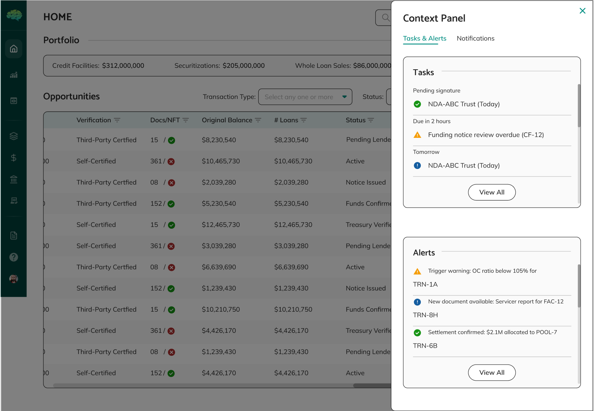

# Login and Navigation

## Overview

Logging into Intain Markets and navigating the platform is designed to be straightforward and role-focused. The platform automatically presents you with relevant information and appropriate actions based on your role, making it easy to find what you need and focus on your responsibilities. Understanding login and navigation helps you access the platform efficiently, find information quickly, and work effectively within your role's capabilities.

## How to Navigate the Platform

**Login Process** - When you access the platform, you'll see a login page where you enter your credentials (username and password). After authentication, you'll select your role from a dropdown menu if you have multiple roles. The platform then presents you with a dashboard tailored to your selected role, showing items relevant to your responsibilities and pending actions requiring your attention.

**Role Selection** - If your account has multiple roles (for example, you might be both an issuer and an investor), you'll select which role you want to use for this session. You can only use one role per session, but you can log out and log back in with a different role if needed. The role you select determines what you can see and do throughout your session.

**Dashboard Access** - After logging in, you'll see a dashboard that shows items relevant to your role—pools you've created or are involved with, pending actions requiring your attention, recent activity, and items in various statuses. The dashboard is automatically filtered to show only what's relevant to your role, making it easy to see what needs your attention.

**Main Navigation** - The platform provides navigation menus that organize features by function—Pools, Loans, Credit Facilities, Documents, and other sections. These menus are available throughout the platform, allowing you to move between different areas easily. The navigation is consistent across the platform, making it easy to find what you need.

**Item Lists** - When you navigate to a section (like Pools or Credit Facilities), you'll see lists of items relevant to your role. The platform automatically filters these lists to show only items where you have a role or where items are shared with you. This automatic filtering ensures you only see relevant items.

**Item Details** - Clicking on an item takes you to its detail page, where you can see all information, available actions, status, history, and related items. Action buttons are automatically enabled or disabled based on your role and the item's status. This detail view provides complete information about items and shows what actions are available.

**Search and Filter** - The platform provides search and filter capabilities to help you find specific items. You can search by name, filter by status, or use other criteria to locate items quickly. These tools help you find items efficiently, especially when dealing with large numbers of items.

## What You Will See

**Your Dashboard** - After login, you'll see a dashboard showing items relevant to your role. As an issuer, you'll see pools you've created. As a market maker, you'll see pools shared with you. As an investor, you'll see investment opportunities. The dashboard helps you quickly see what needs your attention and provides an overview of your activities.

**Dashboard Notifications** - The dashboard includes notifications and alerts for items requiring your attention. You can click on notifications to view details in the context panel, which appears as a right drawer with relevant information.

**Filtered Lists** - When you navigate to sections like Pools or Credit Facilities, you'll see lists automatically filtered for your role. You won't see items where you don't have a role or that aren't shared with you. This filtering happens automatically—you don't need to manually filter. This automatic filtering ensures you only see relevant items.

**Role-Appropriate Actions** - Action buttons throughout the platform are automatically enabled or disabled based on your role and the item's status. You'll only see actions you can actually take. Disabled buttons typically show tooltips explaining why they're disabled. This role-based action availability ensures you can only take actions that are appropriate for your role.

**Status Indicators** - Items display status badges or labels that show where they are in their workflow. Statuses are often color-coded—green for completed or approved, yellow for pending or under review, red for rejected or blocked. These indicators help you quickly understand where items stand and what actions might be available.

**Notifications** - The platform may show notifications about items requiring your attention, status changes, approvals needed, or other important updates. These notifications help you stay informed about relevant activities and ensure you don't miss important updates or actions that require your attention.

**Search and Filter Options** - The platform provides search and filter capabilities to help you find specific items. You can search by name, filter by status, or use other criteria to locate items quickly. These tools help you find items efficiently, especially when dealing with large numbers of items.

**Breadcrumbs and Navigation Paths** - The platform provides breadcrumbs and clear navigation paths to help you understand where you are and how to navigate back. These navigation aids help you move through the platform efficiently and understand your location within the platform structure.

## Helpful Tips

**Select the Correct Role** - Make sure you select the role that matches what you want to do. If you're creating pools, use the Issuer role. If you're reviewing opportunities, use the Investor role. The role you select determines what you can see and do throughout your session.

**Check Your Dashboard First** - Your dashboard shows items requiring your attention and recent activity. Check it regularly to stay on top of pending actions and important updates. The dashboard provides a quick overview of what needs your attention.

**Understand Status Indicators** - Status badges help you quickly see where items are in their workflow. Learn what different statuses mean so you can understand what actions are available and what needs to happen next. Understanding statuses helps you navigate the platform effectively.

**Use Navigation Menus** - The main navigation menus organize features logically. Use them to move between different sections of the platform efficiently. The navigation is consistent across the platform, making it easy to find what you need.

**Look for Tooltips** - When actions are disabled, hover over buttons or check tooltips to see why they're disabled. This helps you understand what needs to happen to enable actions. Tooltips provide helpful information about why actions might not be available.

**Check Notifications** - Notifications alert you to important updates, pending actions, or items requiring your attention. Check them regularly to stay informed. Notifications help you stay on top of important activities and ensure you don't miss actions that require your attention.

**Use Search When Needed** - If you're looking for a specific item, use the search functionality rather than scrolling through long lists. Search helps you find items quickly, especially when dealing with large numbers of items.

**Understand Role-Based Views** - Remember that you only see items relevant to your role. If you can't find something, it might not be shared with you or you might need to use a different role. Understanding role-based views helps you know what you can see and why.

**Multiple Roles** - If you have multiple roles, you can switch between them by logging out and logging back in with a different role. Each role shows you a different view of the platform. Understanding multiple roles helps you use the platform effectively when you have multiple responsibilities.

**Action Availability** - Action buttons are enabled or disabled based on both your role and the item's status. If an action isn't available, check both your role permissions and the item's status to understand why. Understanding action availability helps you know what you can do and why certain actions might not be available.

**Use Filters Effectively** - When viewing lists, use filters to narrow down items by status, date, or other criteria. This helps you find specific items quickly and focus on what's relevant. Effective use of filters helps you navigate large lists efficiently.

Understanding login and navigation helps you access the platform efficiently, find what you need quickly, understand what actions are available, and work effectively within your role's capabilities. This understanding enables you to use the platform effectively and efficiently, focusing on your responsibilities and finding the information you need quickly.
