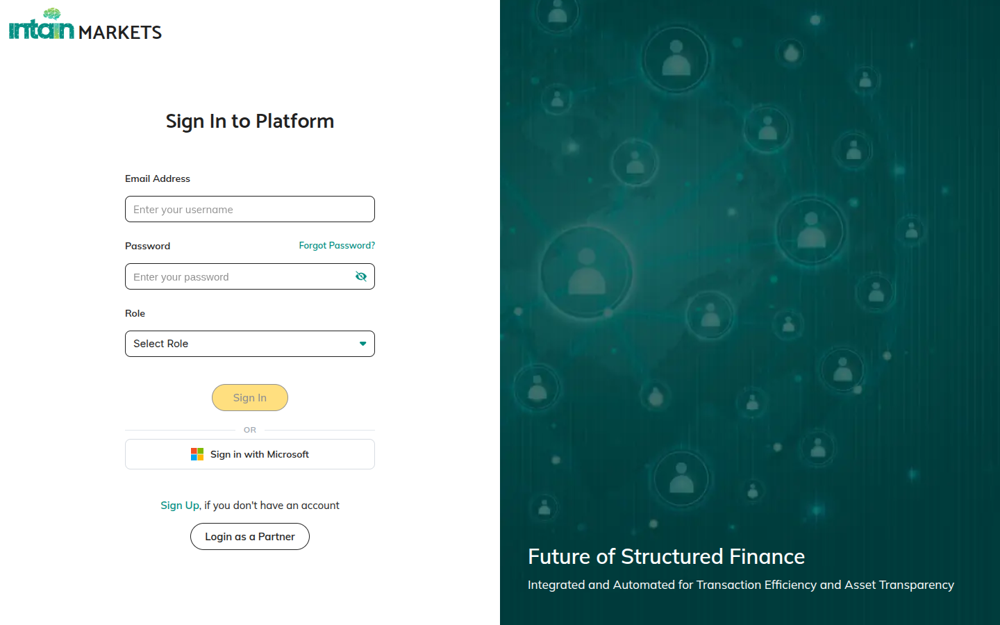
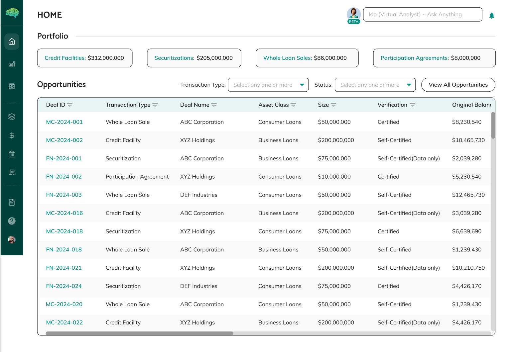
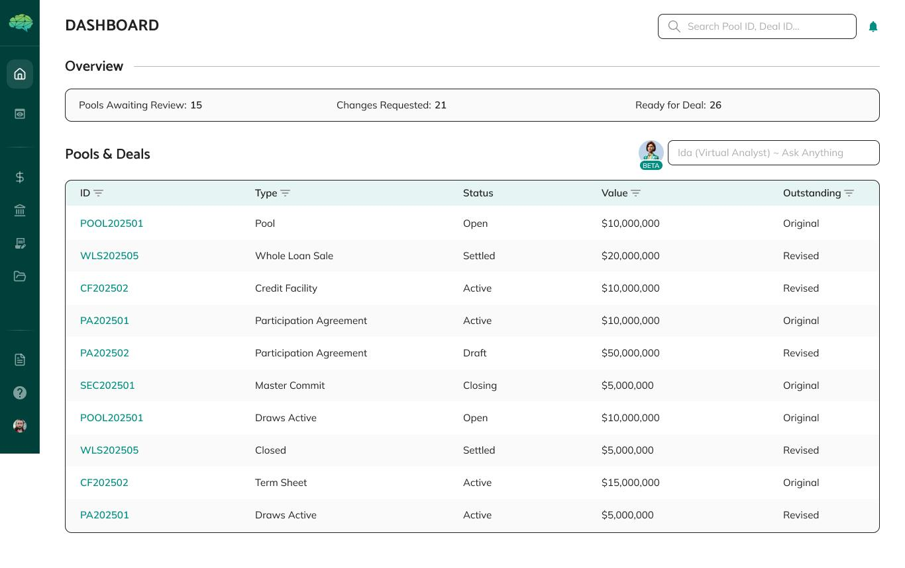
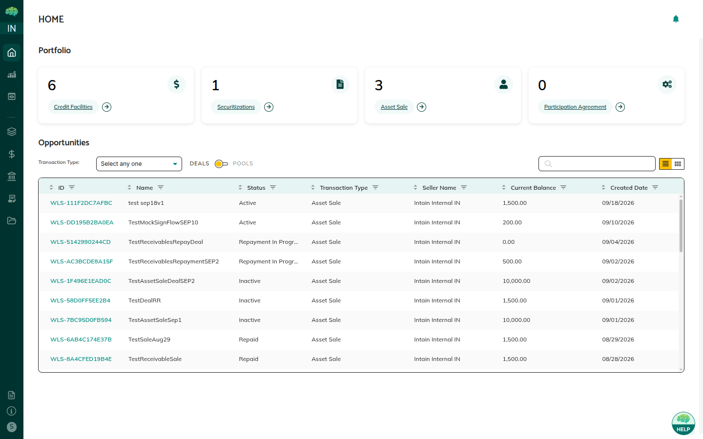
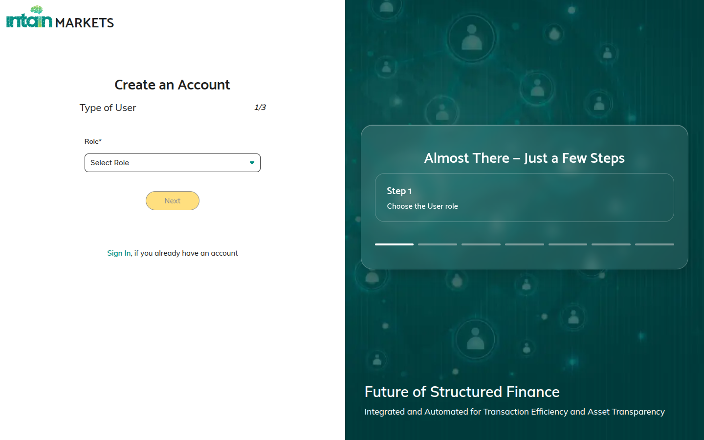

# Login and Navigation

## Overview

Signing in and moving around Intain Markets depends on your role. The platform shows the items and actions that match the role you chose for this session.

## How to Navigate the Platform

**Login Process** — You can sign in in two ways:

1. **Microsoft Entra SSO** — If your organization uses Microsoft Entra (formerly Azure AD), click **Sign in with Microsoft** on the login page. You complete sign-in with Microsoft. If your account has more than one role, the **Select Role** page asks you to choose one before you enter the platform.

2. **Direct Login** — Enter your username and password, choose a role you are registered for, and submit. The dashboard matches the role you selected.

**Role Selection** — If you have more than one role, pick one for this session. You use one role at a time. To switch, log out and sign in again with the other role.

**Dashboard Access** — After you sign in, the dashboard shows pools, deals, and other items for your role, plus pending actions and recent activity. Tiles on the dashboard open common tasks.

**Main Navigation** — A left sidebar expands when you hover over it. Depending on your role, it can include:

- **Pools** — Pool management and review
- **Asset Registry / Loan Registry** — Loan onboarding and management
- **Credit Facility** — Term sheets and master commitments
- **Asset Sale** — Asset sale deals and settlement
- **Securitization** — Securitization deals and tranches
- **Imports** — Loan tape uploads
- **Batch Verification** — Loan verification batches
- **Activity Audit** — Activity across the platform
- Other sections for your role, such as Reports, Payment Settings, and Profile

You only see sections that apply to your role.

**Search and Filter** — You can search and filter large lists. Use name, status, or other criteria to find a specific item.

**Notifications** — The notification drawer alerts you when something needs your attention, when a status changes, or when an approval is waiting.

## What You Will See

**Login Page** — The login page offers sign-in with a username and password, Microsoft sign-in, role selection, and sign-up.

**Role Selection** — The role list includes Issuer, Market Maker, Investor, Servicer, Paying Agent, Rating Agency, and Admin.

**Your Dashboard** — Issuers see pools they created. Market makers and investors see pools shared with them. The dashboard highlights what needs attention.

**Dashboard Notifications** — Alerts appear on the dashboard. Open one to see details in a panel on the right.

**Filtered Lists** — Lists such as Pools or Credit Facilities already show items for your role and your organization. You do not see items that were not shared with you.

**Role-Appropriate Actions** — Buttons turn on or off based on your role and the item’s status. A disabled button usually has a tooltip that explains why.

**Notifications** — Alerts cover items that need you, status changes, and approvals. Check them so you do not miss a required step.

**Search and Filter Options** — Search by name, filter by status, or use other criteria when a list is long. You can search and filter large lists.

## Helpful Tips

**Select the Correct Role** — Use Issuer when you create pools. Use Investor when you review pools shared with you.

**Check Your Dashboard First** — It shows pending work and recent activity.

**Use the Sidebar** — Sections are grouped by product. Hover the sidebar to expand it.

**Look for Tooltips** — Hover a disabled button to see why it is off.

**Check Notifications** — They point to updates and actions that are waiting.

**Use Search** — Search is faster than scrolling a long list.

**Understand Role-Based Views** — If you cannot find an item, it may not be shared with you, or you may need a different role.

**Multiple Roles** — Log out and sign in again to switch roles.

**Action Availability** — A button depends on both your role and the item’s status.

**Use Filters** — Narrow a list by status, date, or other criteria.

