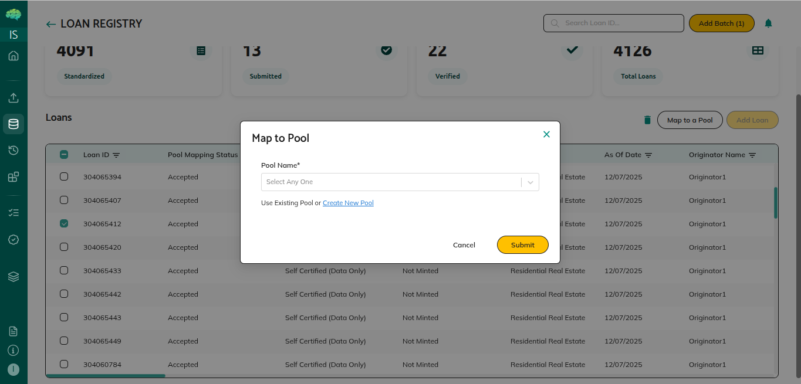
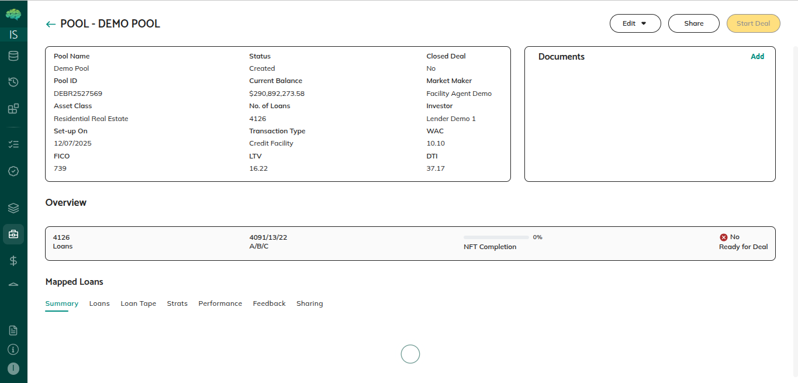

# Pools Overview

## Overview

Pools are collections of loans grouped together for securitization, whole loan sales, or other structured finance transactions. They serve as the fundamental building blocks for presenting loan portfolios to investors, structuring deals, and managing transactions from creation through completion.

## What Pools Are

A pool is a container that holds multiple individual loans, organizing them into a single transaction unit. When you create a pool, you group related loans together to present them as a cohesive investment opportunity or transaction package.

Pools are dynamic—you can add loans, remove loans, and share them with other parties for review and collaboration. The platform automatically calculates aggregate metrics from all loans in a pool, such as total balance, loan count, weighted average interest rates, and other characteristics.

## Purpose and Use Cases

Pools serve several important purposes in structured finance:

**For Securitization Transactions** - Pools organize loans that will be packaged into securities and sold to investors.

**For Whole Loan Sales** - Pools present loans as investment opportunities to potential buyers.

**For Transaction Management** - Pools provide a structured way to manage the entire transaction process from creation through deal completion.

**For Collaboration** - Pools enable collaboration between issuers, market makers, investors, and other parties.

**For Analysis** - Pools aggregate loan data into meaningful metrics that help all parties understand pool characteristics and assess quality.

## Key Components

**Pool Information** - Basic details about the pool including pool name, asset class, transaction type, description, and closing deal indicator. The pool name must be unique and helps identify the pool throughout the transaction.

**Mapped Loans** - Individual loans that have been assigned to the pool. Loans can only belong to one pool at a time. When loans are mapped, they contribute their balance, characteristics, and data to pool-level metrics.

**Pool Metrics** - Aggregate statistics calculated automatically from mapped loans, including total balance, loan count, weighted average coupon, weighted average FICO scores, geographic distribution, and other characteristics. These metrics update automatically when loans are added or removed.

**Organization Assignments** - Organizations assigned to participate in the transaction, such as market makers for structuring, investors for funding, servicers for loan administration, paying agents for payment distributions, and rating agencies for analysis.

**Status** - The current stage of the pool in its workflow, such as Created, Preview, Mandate Pending, or Deal. Status determines what actions are available and what needs to happen next.

**Sharing Configuration** - Settings that control which organizations can see the pool and what they can do with it, such as viewing, providing feedback, downloading data, or requesting changes.

## How Pools Work

**Creation** - You create a pool by providing basic information like pool name, asset class, and transaction type. The pool starts in Created status, visible only to you, ready for loan mapping and configuration.

**Loan Mapping** - You map loans to the pool by selecting individual loans and assigning them to the pool. When loans are mapped, pool metrics calculate automatically. You can add or remove loans while the pool is in Created or Preview status.

**Sharing** - You share pools with other organizations for review and collaboration. When shared, pools become visible to those organizations, and recipients can view, analyze, and provide feedback based on sharing permissions.

**Pool Details** - When viewing pools, you can access detailed information including pool metrics, loan composition, and available actions. The pool details view provides comprehensive information for decision-making.

**Status Progression** - Pools progress through statuses from Created to Preview to Mandate Pending to Deal. Each status represents a specific stage and determines what actions are available.

**Collaboration** - Multiple parties can work together on pools. Issuers create and share, market makers review and structure, investors evaluate opportunities, and rating agencies analyze for ratings.

**Finalization** - When market makers accept mandates, pools become Deals, representing finalized and committed transactions. Editing is restricted at this stage.

## Important Points to Know

**Automatic Metric Calculation** - Pool metrics calculate automatically from mapped loans. Total balance, loan count, weighted averages, and other statistics update automatically when loans are added or removed.

**One Pool Per Loan** - Loans can only belong to one pool at a time. To move a loan to a different pool, unmap it from the current pool first.

**Status Controls Actions** - Pool status determines what actions are available. You can edit pools in Created or Preview status, but editing is restricted once pools become Deals.

**Removed Loans Are Excluded** - Removed loans are excluded from pool calculations but remain visible for tracking. Removed loans can be reinstated if needed.

**Sharing Enables Collaboration** - Sharing pools with other organizations enables collaboration and review. You can share with multiple parties simultaneously, and sharing permissions control what recipients can do.

**Complete Audit Trail** - All pool changes, status updates, and actions are recorded with who did what and when.
