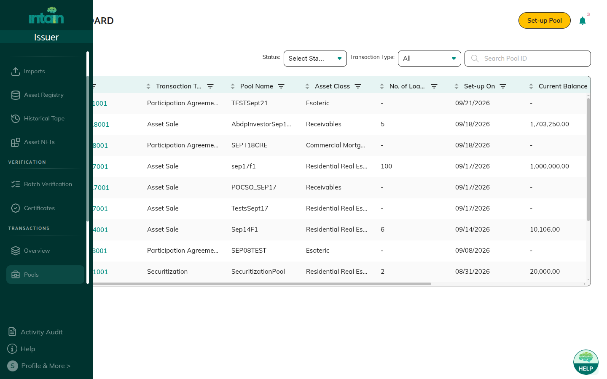
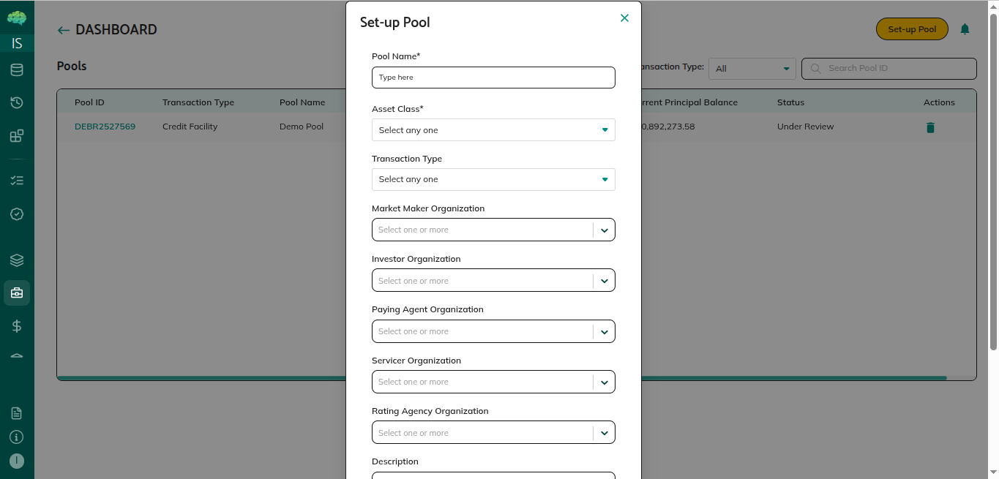
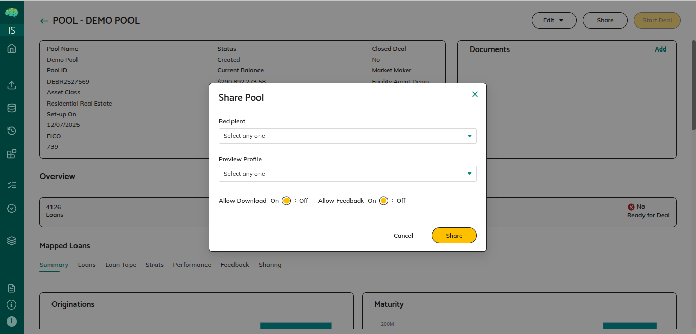

# Pools Overview

A pool is a collection of loans grouped together for securitization, whole loan sales, or other structured finance transactions. Issuers create pools, map loans from the Loan Registry, and share them with market makers, investors, and rating agencies.

## Key Components

| Component | Description |
|---|---|
| **Pool Info** | Name (unique), asset class, transaction type, description, closing deal flag |
| **Organisation Assignments** | Market makers, investors, servicers, paying agents, rating agencies, verification agents |
| **Mapped Loans** | Loans assigned from the Loan Registry; one pool per loan |
| **Pool Metrics** | Auto-calculated from mapped loans; update when loans are added, removed, or reinstated |
| **Status** | Current workflow stage: Created → Preview → Deal |
| **Sharing Config** | Per-organisation permissions (feedback, download) |

## Pool Details Sections

| Section | What you see |
|---|---|
| **Summary** | Charts and analytics of pool composition |
| **Loans tab** | Mapped loans with chat icon (feedback), tick/cross (loan removal) |
| **Loan Tape** | Full field data; select As Of Date for different periods; download XLSX/CSV |
| **Strats** | Stratification analytics by loan characteristics |
| **Performance** | Performance analytics |
| **Feedback** | Pool-level comments from recipients |
| **Sharing tab** | Organisations shared with and their permissions |

## How Pools Work

1. **Create** — **Pools → Set-up Pool**; enter details and assign organisations
2. **Map loans** — **Loan Registry → select loans → Map to Pool**; metrics calculate automatically
3. **Share (Preview)** — Share button; recipients see **Mandate Pending**; accept/reject mandate
4. **Start Deal** — Enabled after all loans are NFT-minted; recipients see **Ready for Deal**; accept locks pool to **Deal** status

## Key Rules

- Loans belong to one pool at a time — unmap to reassign
- Editing is allowed in Created, Preview, and Under Review; locked in Deal
- Market makers cannot give feedback until mandate is accepted
- Preview sharing retains issuer editing rights; Start Deal locks structure on acceptance

→ See [Pool Creation and Sharing](41_Pool_Creation_and_Sharing.md) for step-by-step instructions.
→ See [All Pool States Explained](65_All_pool_states_explained.md) for status definitions.
