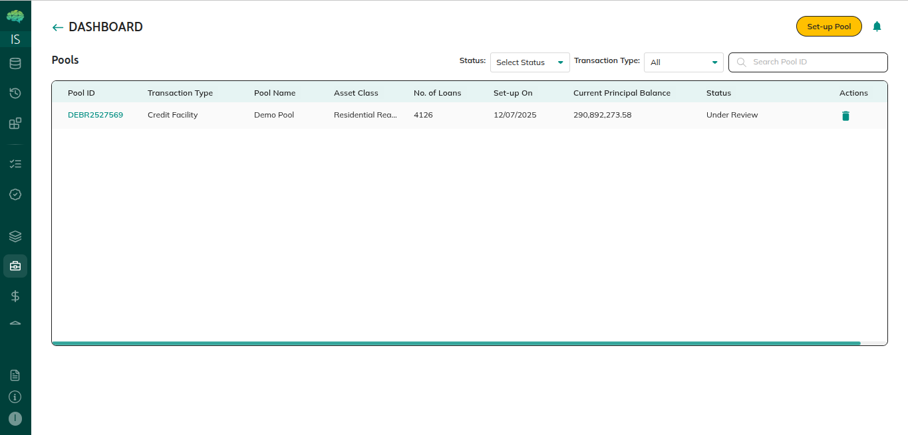
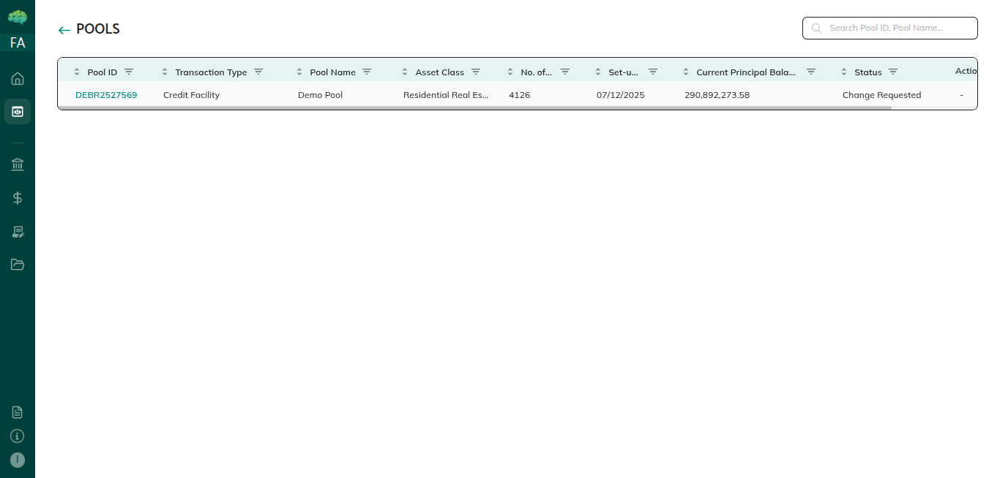

# Role-Based Pool Views

What you see in **Pools** depends on your role. Issuers see pools they created; market makers, investors, and rating agencies see only pools shared with them.

## Issuer View

**Dashboard:** All pools created by your organisation, with Pool ID, name, status, and metrics.

**Pool details actions:**
- **Edit Pool Details** — modify name, asset class, organisations
- **Edit Loan Tape** — upload recurring loan tape with As Of Date
- **Share** — share with market makers, investors, rating agencies
- **Start Deal** — enabled after all loans are NFT-minted

**Loans tab icons:**
- **Chat box** — loan-level feedback dialog
- **Tick** — accept a loan removal request (loan → Removed)
- **Cross** — reject a loan removal request

**Feedback section:** View pool-level comments; respond through loan-level chat.

## Market Maker View

**Dashboard:** Pools shared with your organisation. Status shows **Mandate Pending** (Preview) or **Ready for Deal** (Start Deal).

**After accepting mandate:**
- **Share** button to share with investors
- **Cross icon** in Loans tab to request loan removal
- **Chat box** for loan-level feedback
- **Feedback section** for pool-level comments

No Edit, Start Deal, or Sharing tab.

## Investor View

Same as market maker view, except:
- **No Share button** — investors cannot share pools further
- Cross icon and chat box available in Loans tab if permissions allow

## Rating Agency View

- View pool details, Summary, Strats, Performance, Feedback sections
- **Chat box** for loan-level comments
- **No cross icon** — cannot request loan removal
- **No Share button**

## Key Notes

- Pools in **Created** status are visible only to the issuer
- Market makers cannot leave feedback until they accept the mandate
- Download availability depends on permissions set by the issuer in the Sharing tab
- If you don't see expected pools, confirm you are logged in with the correct role

→ See [Pool Creation and Sharing](41_Pool_Creation_and_Sharing.md) for full workflow.
→ See [Pool Feedback Workflow](09_Pool_Feedback_Workflow.md) for feedback steps.
