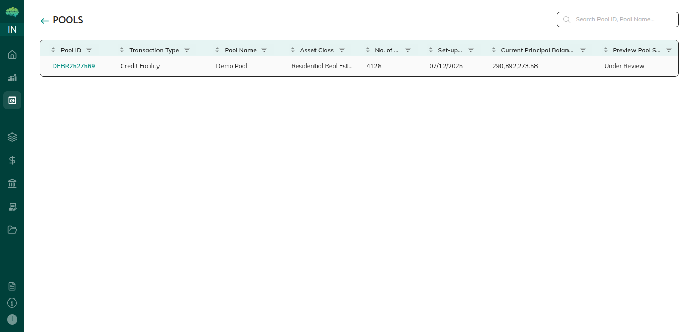
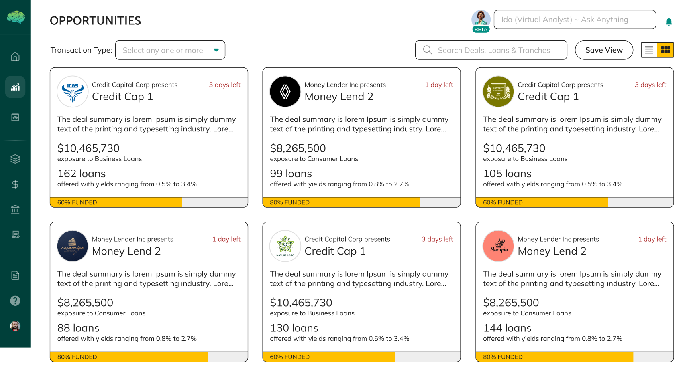
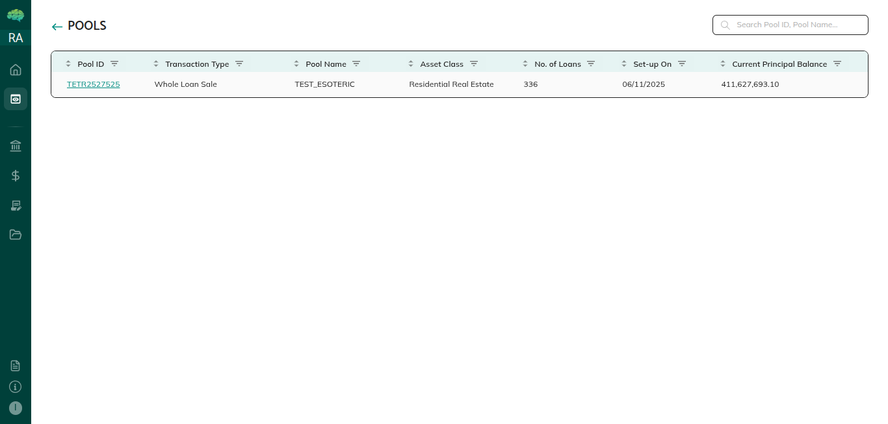

# Role-Based Pool Views

## Overview

Different users see pools differently based on their role. The platform automatically filters information and shows only relevant items and appropriate actions for your role, making navigation simpler and more focused.

## How to Navigate the Platform

**Accessing Pool Lists** - When you navigate to the Pools section, the platform automatically shows only pools relevant to your role. As an issuer, you'll see pools you've created. As a market maker, you'll see pools shared with you. As an investor, you'll see investment opportunities.

**Viewing Pool Details** - Clicking on a pool takes you to its detail page, showing all information, metrics, loan details, status, history, and available actions. The information and actions shown are automatically filtered based on your role.

**Understanding Visibility** - Pools are visible to you if you created them, if they're shared with your organization, or if you have an assigned role in them.

**Role Selection Matters** - The role you select during login determines what pools you can see. If you have multiple roles, you'll see different pools when you log in with different roles.

**Status Affects Visibility** - Some statuses affect visibility. Pools in Created status are only visible to the issuer who created them until they're shared.

**Sharing Controls Visibility** - Pools must be shared with your organization for you to see them (unless you created them). Issuers control sharing.

## What You Will See

**As an Issuer** - You'll see all pools you've created, regardless of status. You'll see pools in Created, Preview, Mandate Pending, and Deal statuses. You'll see pending actions requiring your attention, such as responding to feedback.

**As a Market Maker** - You'll see pools shared with you for review, pools submitted to you for mandate review, pools where you've accepted the mandate, and deals you've helped structure. You'll see actions like reviewing pool details, accepting or rejecting mandates, providing feedback, and structuring deals.

**As an Investor** - You'll see investment opportunities (pools shared with you for investment review), your investments (deals where you've invested or committed), funding requests waiting for your approval, and active deals you're involved with.

**Opportunities Card View** - You can also view opportunities in a card format, which provides a different perspective on available investment opportunities.

**As a Rating Agency** - You'll see pools shared with you for rating analysis, pool data needed for rating purposes, and access to analysis tools. You'll typically have read-only access—you can view and analyze but cannot make changes or approvals.

**Action Availability** - Action buttons are automatically enabled or disabled based on your role and the pool's status. Disabled buttons show tooltips explaining why they're disabled.

**Status Indicators** - Pools display status badges showing where they are in their workflow.

**Filtered Information** - The information shown for each pool is filtered based on your role.

## Helpful Tips

**Check Sharing Settings** - If you're an issuer and want others to see your pool, make sure you've shared it with the right organizations. If you're a market maker or investor and can't see a pool, check if it's been shared with your organization.

**Understand Status Visibility** - Pools in Created status are only visible to the issuer until shared. Once shared, they become visible to shared parties.

**Use the Correct Role** - Make sure you're logged in with the correct role for what you want to do. If you want to create pools, use the Issuer role. If you want to review opportunities, use the Investor role.

**Check Action Tooltips** - When actions are disabled, hover over buttons or check tooltips to see why they're disabled.

**Multiple Roles** - If you have multiple roles, you can log in with different roles at different times to see different views.

**Dashboard First** - Check your dashboard first—it shows items relevant to your role, pending actions, and recent activity.

**Status Affects Actions** - Both your role and the pool's status determine what actions are available. Even if you have permission, the status must allow the action.

**Collaboration Through Sharing** - Different roles collaborate through sharing. Issuers share pools with market makers and investors, who then see the pools in their views.

**Filtering Is Automatic** - The platform filters information automatically—you don't need to manually filter or search through irrelevant items.

**Read-Only Access** - Some roles, like Rating Agency, have read-only access. You can view and analyze but cannot make changes or approvals.

**Track Status Changes** - Monitor pool status changes to understand where pools are in their workflow.
