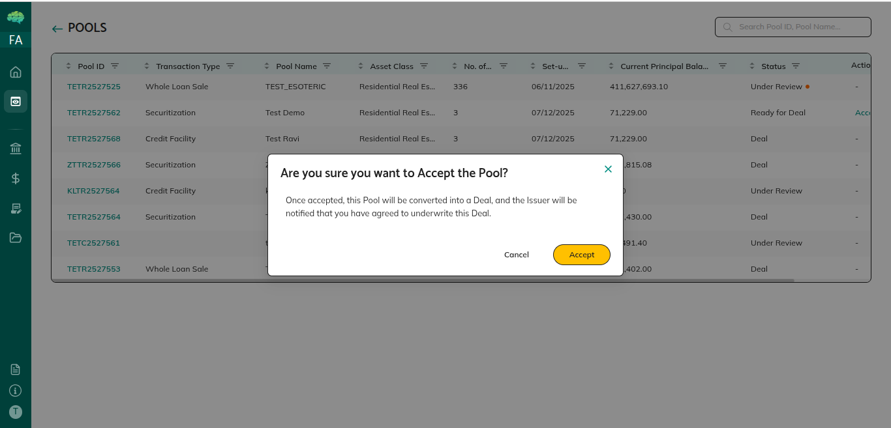

# Pool Sharing & Mandates

Two sharing flows: **Share (Preview)** for review and feedback; **Start Deal** for deal commitment once prerequisites are met.

## Share (Preview Flow)

1. Pool details → **Share** button (top right) → sharing pop-up opens
2. Select **Recipient** type (Underwriter / Facility Agent, Investor, Rating Agency, etc.) → select organisations
3. Set permissions:
   - **Allow Feedback** (default on) — recipients can comment on pool and loans
   - **Allow Download** (default on) — recipients can download loan tape
4. Add documents (optional) → click **Share**
5. Pool moves to **Preview**; recipients see **Mandate Pending** with Accept / Reject buttons

> Only organisations assigned to the pool during creation appear in the list. Add more via **Edit Pool Details** first.

### Mandate Decisions (Recipients)

| Decision | Recipient sees | What happens |
|---|---|---|
| **Accept** | Under Review | Feedback and loan removal requests become available |
| **Reject** | Pool Rejected | Issuer can revise and re-share |

## Start Deal Flow

Use when all pool loans are NFT-minted and pool composition is final.

1. Pool details → **Start Deal** button → select recipients → send
2. Recipients see **Ready for Deal** with Accept / Reject buttons

| Decision | Outcome |
|---|---|
| **Accept** | Pool status → **Deal**; structural editing locked; deal structuring begins |
| **Reject** | Pool stays in **Ready for Deal**; issuer can revise and resend |

## Managing Sharing Permissions

Pool details → **Sharing** tab — view all shared organisations; toggle **Allow Feedback** and **Allow Download** per organisation; changes save automatically.

## Key Rules

| Rule | Detail |
|---|---|
| Pool status for Share | Created or Preview |
| Start Deal prerequisite | All pool loans must be NFT-minted |
| Feedback timing | Underwriters / Facility Agents cannot give feedback until mandate accepted |
| Who can share further | Underwriters / Facility Agents can share with investors; investors cannot share further |
| Editing window | Created, Preview, Under Review — editable; Deal — locked |

→ See [Pool Feedback Workflow](09_Pool_Feedback_Workflow.md) for feedback and loan removal steps.
→ See [Pool Creation and Sharing](41_Pool_Creation_and_Sharing.md) for the full creation-to-deal workflow.
