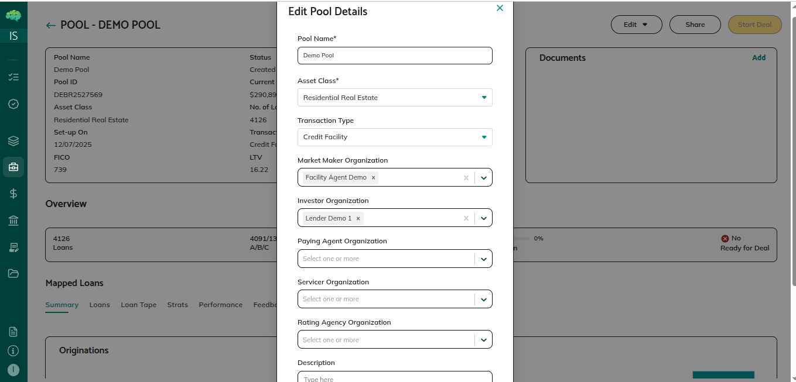
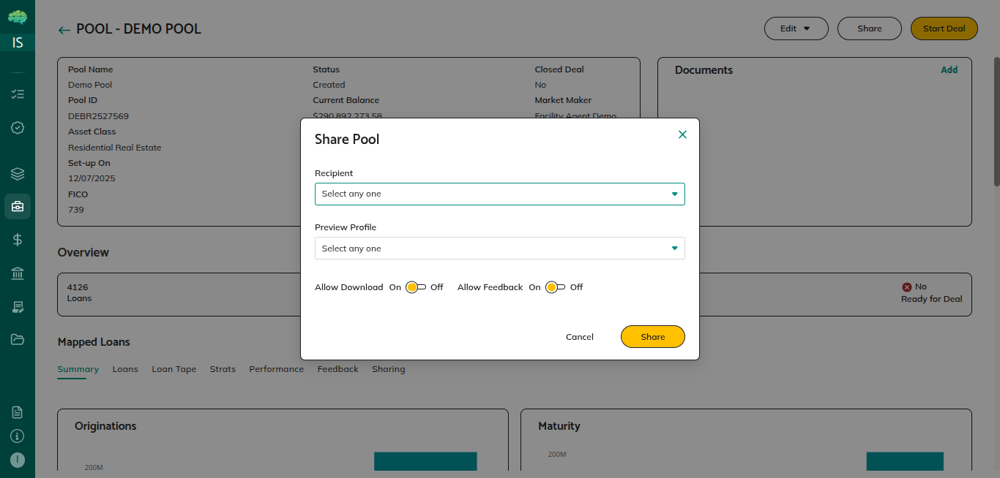
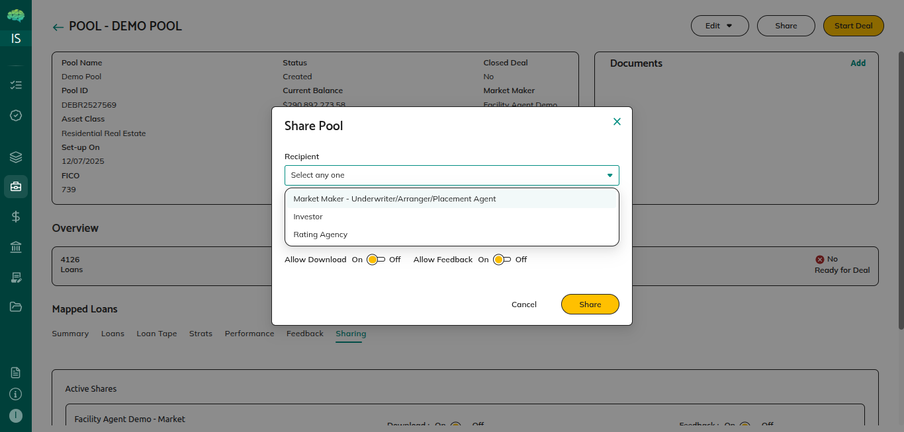
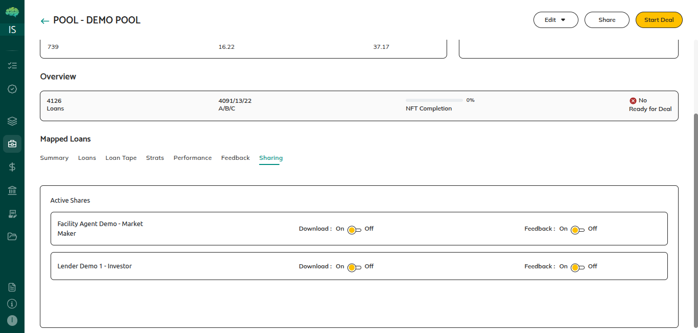
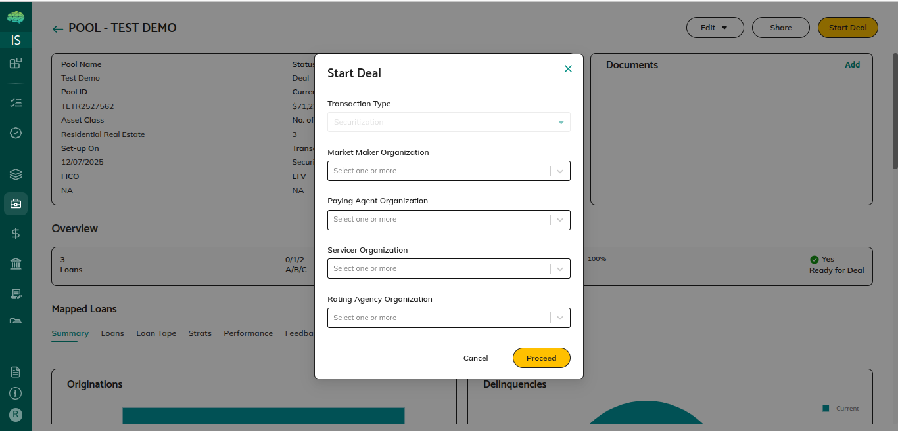

# Pool Sharing and Mandates

## Overview

Pool sharing enables collaboration with other organizations in the structured finance process. As an issuer, you share pools with market makers, investors, rating agencies, and other parties who need to review or participate in your transaction. There are two distinct sharing flows: **Preview (Share)** for review and mandate decisions, and **Start Deal** for deal commitment when prerequisites are met. Understanding these flows helps you move pools through the workflow effectively.

## Who Can Use This

- **Issuers/Borrowers**: Create pools and share them with other parties using the Share button or Start Deal button. Issuers control sharing configuration and permissions.

- **Market Makers/Facility Agents**: Receive pool shares, review pool details, and make mandate decisions (Accept or Reject). After accepting, market makers can share pools further with investors.

- **Investors/Lenders**: Receive pool shares in their Pools dashboard, review pool details, and provide feedback. Investors cannot share pools further.

- **Rating Agencies**: Receive pool shares for analysis, review pool details, and provide comments. Rating agencies have read-only access.

## When This Is Used

**Use Preview Sharing (Share button) when:**
- You want market makers, investors, or rating agencies to review the pool
- You need feedback before finalizing pool composition
- You want recipients to make mandate decisions (Accept/Reject)
- You want to collaborate while retaining editing rights
- The pool is in Created or Preview status

**Use Start Deal when:**
- Prerequisites are met (typically all pool loans NFT-minted)
- Pool composition is final and ready for deal commitment
- You want to send a deal-ready pool to market makers
- You're ready to lock down structural editing after acceptance

## Step-by-Step Process

### Preparing the Pool for Sharing

Before sharing, ensure your pool is ready for review:

1. **Verify Pool Information**
   - Pool name, asset class, and transaction type are correct
   - Description provides relevant context for recipients
   - Organization assignments include all parties you want to share with

2. **Confirm Loan Mapping**
   - Loans have been mapped from the Loan Registry
   - Pool metrics reflect the current loan composition
   - Review metrics in pool details to ensure they meet your targets

3. **Check Pool Status**
   - Pool should be in Created or Preview status for Share
   - For Start Deal, verify prerequisites (NFT minting) are complete

### Sharing via Preview Flow (Share Button)

1. **Access Sharing**
   - Navigate to the pool details page by clicking on the Pool ID
   - Click the **Share** button at the top right
   - A sharing configuration pop-up appears

2. **Select Recipient Type and Organizations**
   - Select the **Recipient** type from the dropdown (Market Maker, Investor, Rating Agency, etc.)
   - The **Preview Profile** dropdown shows organizations of that type that were assigned to this pool during creation or editing
   - Select the specific organizations you want to share with
   - You can share with multiple organizations of the same type in one action

3. **Configure Sharing Permissions**
   - **Allow Feedback**: Toggle on/off to control whether recipients can provide feedback on the pool and loans. Default is enabled.
   - **Allow Download**: Toggle on/off to control whether recipients can download loan tape data. Default is enabled.
   - These permissions apply to the selected organizations and can be adjusted later in the Sharing tab.

4. **Add Documents (Optional)**
   - You can add documents relevant to the pool for recipients to review
   - Upload offering memorandums, legal documents, or other supporting materials
   - Recipients can view and download these documents based on permissions

5. **Complete the Share**
   - Click **Share** to finalize
   - If the pool was in **Created** status, it moves to **Preview** status
   - Recipients see the pool in their dashboard with status **Mandate Pending**
   - Recipients have **Accept** and **Reject** action buttons
   - **Important**: Before accepting the mandate, market makers cannot provide feedback on the pool—feedback functionality becomes available only after acceptance

6. **Track Sharing in the Sharing Tab**
   - In pool details, go to the **Sharing** tab to see all shared organizations
   - View and edit permissions (feedback, download) for each organization
   - Changes save automatically

### Managing Mandates (Preview Flow)

After sharing via Preview, recipients make mandate decisions:

1. **Recipients Review the Pool**
   - Market makers see the pool in their Pools dashboard with status **Mandate Pending**
   - They can view pool details, metrics, loan composition, and supporting documents
   - They evaluate whether to accept the mandate to structure the deal

2. **Recipients Make Decisions**
   - **Accept**: Recipient accepts the mandate
     - Their view shows status **Under Review**
     - Feedback functionality becomes available
     - They can now provide pool-level and loan-level feedback
     - They can request loan removals using the cross icon in the Loans tab
   - **Reject**: Recipient declines the mandate
     - Their view remains **Pool Rejected**
     - You can revise the pool and share with other organizations

3. **Respond to Feedback**
   - If recipients provide feedback, review it in the Feedback section (pool-level) or via the chat box icons in the Loans tab (loan-level)
   - Make changes based on feedback if needed
   - Address loan removal requests using the tick (accept) or cross (reject) icons

4. **Proceed to Start Deal When Ready**
   - After completing review and addressing feedback, you can proceed to Start Deal when prerequisites are met

### Sharing via Start Deal Flow

When prerequisites are met (typically all pool loans NFT-minted), you can initiate the Deal flow:

1. **Verify Prerequisites**
   - The **Start Deal** button is enabled only after required prerequisites are met
   - Typically, all loans in the pool must have completed NFT minting
   - Check that the pool composition is final

2. **Access Start Deal**
   - In pool details, click the **Start Deal** button at the top right
   - A configuration pop-up appears similar to the Share pop-up

3. **Select Recipients**
   - Select organizations to receive the deal invitation
   - You can include market makers, paying agents, servicers, and rating agencies as applicable
   - These organizations will receive the pool with status **Ready for Deal**

4. **Send Deal Invitation**
   - Click to send the deal invitation
   - Pool status changes to **Deal**
   - Recipients see the pool as **Ready for Deal** with Accept/Reject actions

5. **Recipients Make Deal Decisions**
   - **Accept**: Recipient commits to the deal
     - Pool status remains **Deal** and structural editing is restricted
     - The accepting market maker proceeds with deal structuring
     - Downstream activities (structuring, investor allocation, etc.) continue
   - **Reject**: Recipient declines the deal
     - Pool remains in **Pool Rejected** for that recipient
     - You can send deal invitation with other organizations

### Managing Shared Organizations

After sharing, you can manage sharing settings:

1. **Access the Sharing Tab**
   - In pool details, navigate to the **Sharing** tab
   - View all organizations shared with and their current settings

2. **Edit Permissions**
   - For each organization, you can toggle:
     - **Allow Feedback**: Enable or disable feedback capability
     - **Allow Download**: Enable or disable loan tape download capability
   - Changes save automatically

3. **Track Acceptance Status**
   - View acceptance status for each organization (pending, accepted, rejected)
   - Monitor which organizations have accepted or are still deciding

## Rules & Validations

- **Pool Status for Sharing**: You can share pools while they're in Created or Preview status. For Start Deal, prerequisites must be met.

- **Organization Assignment Required**: Only organizations assigned to the pool during creation or editing appear as sharing options. Add organizations via Edit Pool Details before sharing.

- **Preview vs Start Deal**: Preview sharing allows recipients to review with mandate decision; Start Deal sends a deal-ready pool after prerequisites are met.

- **Feedback Before Acceptance**: Market makers cannot provide feedback until they accept the mandate. After acceptance, feedback becomes available.

- **One-Way Sharing**: Issuers share with market makers, investors, and rating agencies. Market makers can share further with investors. Investors and rating agencies cannot share further.

- **Permissions Per Organization**: Feedback and download permissions are set per organization and can be adjusted in the Sharing tab.

- **Status Progression**: Preview share moves status to Preview (if it was Created). Recipients see Mandate Pending. Accept shows Under Review. Start Deal moves status to Deal. Recipients see Ready for Deal.

- **Edit Rights**: You retain editing rights during Created, Preview, and Under Review phases. Deal status restricts structural editing.

- **Mandate Decisions Are Recorded**: All acceptance and rejection decisions are recorded with who decided, when, and any associated messages.

## What Happens Next

**After Preview Sharing:**
- Recipients see the pool in their dashboard with **Mandate Pending** status
- Recipients can view pool details, metrics, and loan information
- Recipients make Accept/Reject decisions
- After acceptance, recipients can provide feedback and request changes
- You respond to feedback and refine the pool
- When ready, proceed to Start Deal

**After Mandate Acceptance:**
- Recipient view shows **Under Review** status
- Feedback functionality becomes available for the recipient
- You can collaborate through feedback and continue refining the pool
- The pool moves toward deal readiness

**After Start Deal:**
- Pool status becomes **Deal**
- Recipients see **Ready for Deal** status with Accept/Reject options
- Acceptance commits the deal and restricts structural editing
- Accepting market maker proceeds with deal structuring
- Downstream activities (investor allocation, documentation, closing) continue

**After Deal Acceptance:**
- Pool is finalized and committed
- Structural editing is restricted
- Market maker coordinates structuring activities
- Pool progresses through remaining transaction steps
