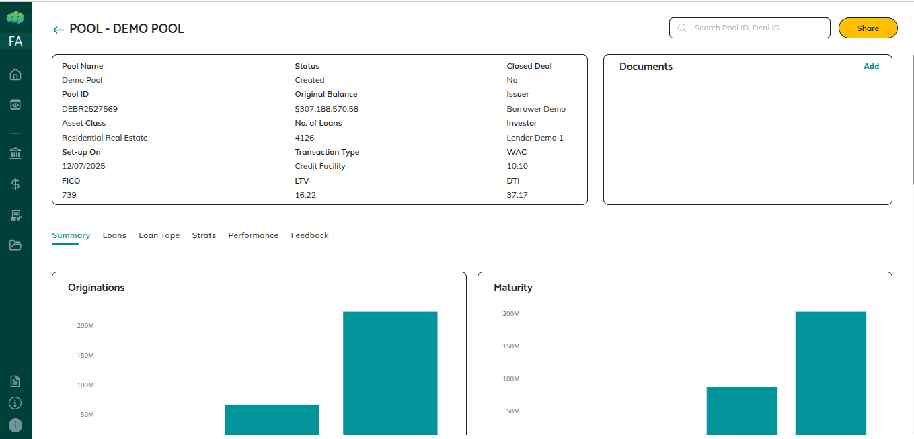
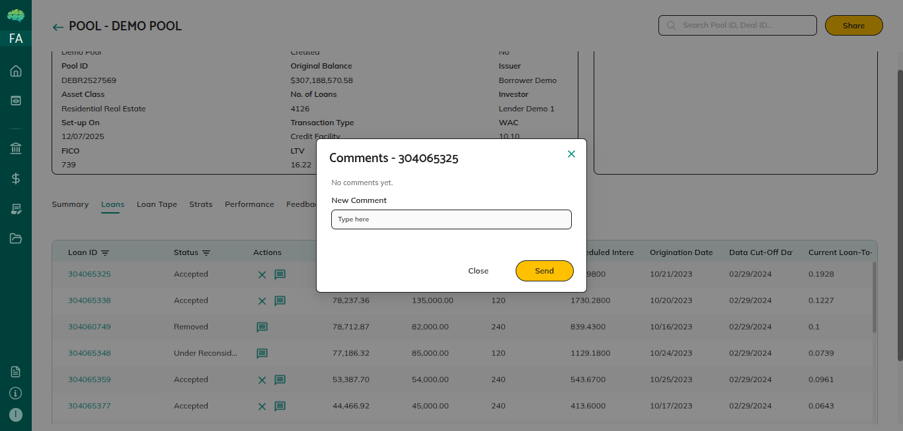

# Pool Feedback Workflow

## Overview

The feedback workflow enables collaboration between issuers and reviewing parties on shared pools. Market makers, investors, and rating agencies can provide feedback at both pool-level and loan-level to communicate observations, questions, and change requests. Issuers review this feedback and respond by making changes or providing explanations. This iterative process helps improve pool quality and ensures all parties are aligned before finalizing deals.

## Who Can Use This

- **Market Makers/Facility Agents**: Provide pool-level and loan-level feedback after accepting a mandate. Can request loan removals using the cross icon in the Loans tab.

- **Investors/Lenders**: Provide pool-level and loan-level feedback on shared pools. Can request loan removals using the cross icon in the Loans tab.

- **Rating Agencies**: Provide pool-level and loan-level feedback (comments) on shared pools. Cannot request loan removals.

- **Issuers/Borrowers**: View pool-level feedback from other parties. Provide loan-level feedback/comments via the chat box icon. Respond to loan removal requests using tick (accept) or cross (reject) icons.

## When This Is Used

**Use Pool-Level Feedback when:**
- You have comments or observations about the pool overall
- You want to ask questions about pool composition, metrics, or structure
- You need to communicate findings or concerns at the pool level
- You're reviewing the pool and want to document your analysis

**Use Loan-Level Feedback when:**
- You have comments about specific loans
- You notice data issues or concerns with individual loans
- You want to request changes to specific loans
- You need to discuss loan-specific characteristics or eligibility

**Use Loan Removal Requests when:**
- You (as market maker or investor) want a loan removed from the pool
- A loan doesn't meet eligibility criteria
- A loan has issues that affect pool quality
- You want the issuer to reconsider including a specific loan

## Step-by-Step Process

### Viewing Pool Details Before Providing Feedback

1. **Navigate to Pool Details**
   - From your Pools dashboard, click on the Pool ID
   - The pool details page opens with summary tiles, metrics, and tabbed sections

2. **Review Pool Information**
   - Review summary metrics to understand pool composition
   - Check loan count, balances, weighted averages, and other characteristics
   - Examine charts in the Summary section for visual analysis

3. **Review Loan Details**
   - Navigate to the **Loans** tab to see individual mapped loans
   - Review loan characteristics, statuses, and any existing feedback indicators
   - Navigate to the **Loan Tape** section for detailed loan-level data
   - Use the **As Of Date** dropdown to view data from different reporting periods

### Providing Pool-Level Feedback (Market Makers, Investors, Rating Agencies)

1. **Navigate to the Feedback Section**
   - In pool details, locate the **Feedback** section
   - This section shows existing pool-level feedback and allows you to add new feedback

2. **Enter Your Feedback**
   - Click to add new feedback
   - Type your message clearly and specifically
   - Provide context for your observation, question, or concern
   - Be specific about what you're commenting on or what you need clarified

3. **Submit Feedback**
   - Review your message for clarity
   - Click **Submit** button
   - Your feedback is saved and recorded
   - The issuer receives notification about the new feedback
   - Your feedback appears in the Feedback section

### Providing Loan-Level Feedback (All Roles)

1. **Navigate to the Loans Tab**
   - In pool details, go to the **Loans** tab
   - Locate the loan you want to provide feedback on
   - Find the **chat box icon** in the Actions column for that loan

2. **Open the Feedback Dialog**
   - Click the chat box icon to open the loan-level feedback dialog
   - View any existing feedback/comments for this specific loan
   - The dialog shows the conversation history for this loan

3. **Enter Loan-Specific Feedback**
   - Type your message about this specific loan
   - Be clear about what aspect of the loan you're commenting on
   - Reference specific loan characteristics if relevant

4. **Submit Feedback**
   - Click send to save your feedback
   - Your feedback is recorded for this specific loan
   - Other parties with access can view the feedback conversation
   - The loan may show a feedback indicator in the Loans tab

### Requesting Loan Removal (Market Makers and Investors)

If you believe a loan should be removed from the pool, you can request its removal:

1. **Navigate to the Loans Tab**
   - In pool details, go to the **Loans** tab
   - Locate the loan you want to request removal for
   - Find the **cross icon** in the Actions column

2. **Request Removal**
   - Click the cross icon to request removal of this loan
   - The system records your removal request
   - The issuer receives notification of the removal request
   - The loan shows a pending removal status

3. **Wait for Issuer Response**
   - The issuer reviews your removal request
   - The issuer sees tick and cross icons next to the loan:
     - **Tick**: Issuer accepts the removal—loan becomes **Removed** and is excluded from pool calculations
     - **Cross**: Issuer rejects the removal request—loan remains in the pool
   - You're notified of the issuer's decision

### Responding to Feedback (Issuers)

1. **Check for New Feedback**
   - Your dashboard shows notifications for pools with new/unread feedback
   - Pools with unread feedback are highlighted
   - Navigate to pools with feedback to review

2. **Review Pool-Level Feedback**
   - In pool details, go to the **Feedback** section
   - Review all feedback messages from market makers, investors, and rating agencies
   - Note questions that need answers and concerns that need addressing

3. **Respond to Feedback**
   - For pool-level feedback: You can view the feedback but cannot add pool-level feedback yourself
   - For loan-level feedback: Click the chat box icon on the relevant loan to respond with loan-level comments
   - Address questions by providing clarifications
   - Address concerns by making changes or explaining your position

4. **Make Requested Changes**
   - If feedback suggests changes, make updates as appropriate:
     - Edit pool details if needed
     - Map or unmap loans based on feedback
     - Upload updated loan tape data if requested
   - Pool metrics update automatically when loans are added or removed

### Responding to Loan Removal Requests (Issuers)

When market makers or investors request loan removals, you decide whether to accept or reject:

1. **Identify Removal Requests**
   - In the Loans tab, loans with removal requests show tick and cross icons
   - These icons appear when a market maker or investor has clicked the cross icon on a loan

2. **Review the Request**
   - Consider why the removal was requested
   - Review any associated feedback in the loan's chat box
   - Evaluate whether removing the loan is appropriate

3. **Make Your Decision**
   - **Tick (Accept)**: Click the tick icon to accept the removal
     - The loan status changes to **Removed**
     - The loan is excluded from pool calculations
     - Pool metrics update automatically
   - **Cross (Reject)**: Click the cross icon to reject the removal request
     - The loan remains in the pool
     - The requesting party is notified

### Managing Feedback History

1. **View Feedback History**
   - Pool-level feedback appears in the Feedback section in chronological order
   - Loan-level feedback appears in the chat dialog for each specific loan
   - All feedback includes who provided it and when

2. **Track Unread Feedback**
   - Check notifications for new feedback activity
   - Review and address feedback promptly

## Rules & Validations

- **Feedback Permissions**: Your ability to provide feedback depends on sharing permissions. If the issuer disabled feedback for your organization, you cannot add feedback.

- **Mandate Acceptance Required**: Market makers cannot provide feedback until they accept the mandate. Before acceptance, feedback functionality is not available.

- **Pool-Level vs Loan-Level**: Pool-level feedback appears in the Feedback section; loan-level feedback appears in the chat dialog for specific loans. Use the appropriate level for your feedback.

- **Issuer Pool-Level Feedback**: Issuers can view pool-level feedback but cannot add pool-level feedback themselves. Issuers respond through loan-level comments.

- **Loan Removal**: Only market makers and investors can request loan removals using the cross icon. Rating agencies cannot request removals.

- **Removal Decision by Issuer**: Only issuers can accept (tick) or reject (cross) loan removal requests. The issuer's decision is final for each request.

- **Removed Loan Calculations**: When a loan is removed (issuer accepts removal request), it's excluded from pool metrics. Metrics update automatically.

- **Feedback Is Recorded**: All feedback is stored with who provided it, when, and the content. Feedback history is maintained for audit purposes.

- **Notification System**: Issuers receive notifications when feedback is provided. Other parties receive notifications when issuers respond or make decisions.

## What Happens Next

**After Providing Feedback:**
- Your feedback appears in the pool's feedback section (pool-level) or loan chat (loan-level)
- The issuer receives notification and can review your feedback
- The issuer may make changes based on your input
- The issuer may respond with clarifications or explanations
- Feedback conversation continues as needed

**After Responding to Feedback (Issuers):**
- Reviewers can see your responses and any changes you made
- Questions are answered and concerns are addressed
- Pool composition may be refined based on feedback
- The pool improves through collaborative input
- Pool moves closer to deal readiness

**After Loan Removal Decisions:**
- **If Accepted**: Loan is marked Removed and excluded from calculations; pool metrics update
- **If Rejected**: Loan remains in pool; requesting party is notified
- All decisions are recorded for audit purposes
- Feedback conversation may continue regarding the loan

**Iterative Process:**
- Feedback may go through multiple rounds
- Pool composition improves with each iteration
- All parties become aligned on pool content
- Pool progresses toward finalization when feedback is resolved
