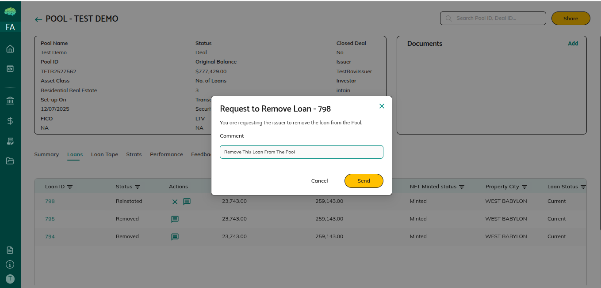
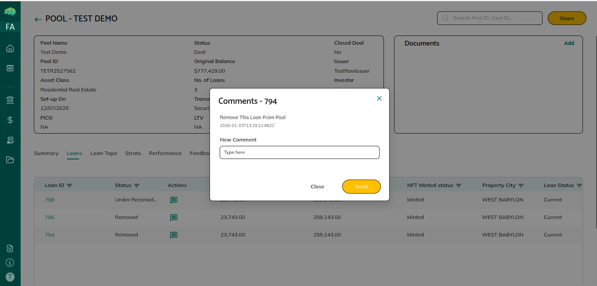

# Pool Feedback Workflow

## Who Can Do What

| Role | Pool-level feedback | Loan-level feedback | Request loan removal |
|---|---|---|---|
| Underwriter / Facility Agent / Investor | ✓ (after accepting mandate) | ✓ | ✓ |
| Rating Agency | ✓ | ✓ | ✗ |
| Issuer | View only | ✓ (respond via chat) | N/A (accept or reject requests) |

## Providing Pool-Level Feedback

1. Open pool details → scroll to **Feedback** section
2. Click to add feedback → type message → **Submit**
3. Issuer receives a notification

> Underwriters / Facility Agents must accept the mandate before feedback is available.

## Providing Loan-Level Feedback

1. Pool details → **Loans** tab → click the **chat box icon** for a loan
2. Type your message → send
3. All parties with access can see the conversation thread

## Requesting Loan Removal (Underwriters / Facility Agents and Investors)

1. **Loans** tab → click the **cross icon** on the loan
2. System records the request; issuer is notified
3. Issuer sees **tick** and **cross** icons on that loan:
   - **Tick** → loan status changes to **Removed**; excluded from pool metrics
   - **Cross** → removal rejected; loan stays in pool

## Responding to Feedback (Issuers)

- **Pool-level**: View in the Feedback section; respond via loan-level chat if needed
- **Loan removal requests**: Tick (accept) or Cross (reject) in the Loans tab
- **Changes**: Edit pool details, map/unmap loans, or upload updated loan tape as needed

## Key Rules

- Feedback permissions are set per organisation by the issuer (can be disabled)
- Issuers cannot add pool-level feedback — only view and respond through loan-level chat
- All feedback is stored with author, timestamp, and content for audit purposes
- When a loan is removed, pool metrics update automatically

→ See [Pool Creation and Sharing](41_Pool_Creation_and_Sharing.md) for sharing and permissions setup.
→ See [What Happens After Rejection](72_What_happens_after_rejection.md) for loan rejection outcomes.
