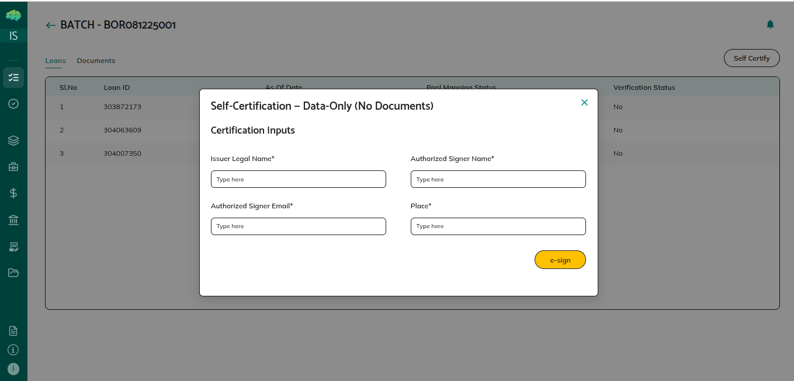

# Loans Overview

## Overview

Loans are individual credit agreements that serve as the building blocks for pools and credit facilities. As an issuer, you onboard loans into the platform, standardize them through field mapping, organize them in the Loan Registry, map them to pools, add them to batches for verification, and mint them as NFTs. This module covers the complete loan lifecycle from upload to tokenization.

## What Loans Are

A loan represents a single credit agreement containing detailed information about the borrower, loan amount, interest rates, payment terms, and performance data. Loans are stored in your organization's database after onboarding and are managed through the Loan Registry. Each loan has both mapped fields (standardized to Intain's format) and unmapped fields (original data that didn't match standard fields).

Loans progress through distinct stages: onboarding (via Imports), standardization (field mapping), registry management, pool mapping, batch verification, and NFT minting. Each stage has specific workflows and requirements that ensure loan data quality and enable downstream transactions.

## Purpose and Use Cases

**For Pool Creation** - Loans are the building blocks of pools. You select loans from the Loan Registry and map them to pools. Pool metrics automatically calculate from the mapped loans.

**For Credit Facilities** - Loans whose NFTs are minted can be mapped to master commitments for credit facility transactions. Only NFT-minted loans are eligible for facility mapping.

**For Verification** - Loans are grouped into batches for verification. The batch verification process validates loan data either through self-certification by the issuer or verification by a third-party verification agent.

**For Tokenization** - Loans can be minted as NFTs (Non-Fungible Tokens) on the blockchain after batch verification is complete. NFT minting creates a digital representation of each loan enabling secure tracking and transfer.

## Key Components

**Imports Section** - Where you upload loan tape files. You select the As Of Date, asset class, choose your file, and submit. The system creates a Job ID for tracking. From here, you trigger Loan Tape Standardization (LTS) to map your file columns to Intain standard fields.

**Loan Tape Standardization** - The process of mapping your loan tape column headers to Intain's standard fields. You can use:
- **Basic AI Mapping**: Standard AI-assisted field mapping
- **Intelligent AI Mapping**: Enhanced AI mapping for better accuracy
- **Delegation**: Submit to Admin to perform mapping on your behalf

After mapping, you can edit the field mappings using dropdowns, then click Save Mapping to store the loans.

**Loan Registry** - Your central view of all onboarded loans. Shows both mapped columns (standard Intain fields) first, followed by unmapped columns (in italic headers). From here, you can:
- Select loans and click **Map to Pool** to assign them to pools
- Select loans and click **Add to Batch** for batch verification
- View detailed loan information

**Batch Verification** - Where loans are grouped into batches for verification. The Batch Verification section shows all batches with their status. You can:
- Self Certify: Issuer self-certifies the loans with an e-signature (Adobe Sign)
- Submit to Verification Agent: Send to a third-party verification agent for review
- Provide Documents: Upload verification documents from your file share

**Certificates Section** - Where you view verified batches and mint NFTs. Shows batch details, verification status, and provides:
- **Mint NFT** button: Select loans and mint them as NFTs
- **View NFT** button: View already minted NFTs

## How Loans Work

**1. Uploading Loan Data**

You start by going to the **Imports** section from the left expandable menu. Here you select the As Of Date, asset class, and choose your loan tape file, then click Submit. The system creates a Job ID and adds it to the table below with the action **Trigger LTS**.

**2. Loan Tape Standardization**

Click **Trigger LTS** to open the Map Fields popup. Here your loan tape headers are mapped to Intain standard fields. You can:
- Use the **Delegation** button to submit this task to Admin (enter start date, end date, and required documents)
- Use the **Re-run** button to choose between Basic or Intelligent AI mapping
- Edit individual field mappings using the dropdown menus
- Click **Save Mapping** when done

After saving, the loans are stored in your organization's database. The **Trigger LTS** action changes to **View Mapped**.

**3. Accessing the Loan Registry**

Click **View Mapped** to see the standardized loans. Click **Open in Registry** to navigate to the Loan Registry section. In the Loan Registry, you see all your onboarded loans with:
- Mapped columns displayed first (standard Intain field names)
- Unmapped columns displayed after (headers shown in italic)
- **Add Loan** button: Navigate back to Imports to upload more loans
- **Map to Pool** button: Enabled when any selected loans aren't already mapped to a pool
- **Add to Batch** button: Enabled when any selected loans aren't already in a batch

**4. Mapping Loans to Pools**

In the Loan Registry, select the loans you want to map, then click **Map to Pool**. A popup appears with a dropdown showing all your pools. Select the target pool and confirm. The loans are mapped to that pool, and pool metrics update automatically.

**5. Adding to Batch and Verification**

Select loans in the Loan Registry and click **Add to Batch** to group them for verification. Go to the **Batch Verification** section from the left menu to see your batches.

Initial batch status is **Pending**. Click on a Batch ID to go to the batch details page with two tabs:
- **Loans Tab**: Shows all loans in the batch with the **Self Certify** button
- **Documents Tab**: Upload verification documents (select document type, verification template, and file from your file share)

**Self Certify Process**: Click Self Certify, enter your name, signer name, email, and place, then click E-Sign. An Adobe Sign popup opens showing the loan certification details for all loans in the batch. After signing, the verification moves forward.

**Verification Agent Process**: Submit to a verification agent who receives the batch in their dashboard. They verify loan details against the uploaded documents, then certify the batch.

**Verification Status Values**:
- **No**: Initial status, not verified
- **Certified**: Verified by third-party verification agent
- **Self Certified**: Issuer logged in as verification agent and verified
- **Self Certify (Data Only)**: Issuer used Self Certify button directly

After verification, the batch verification status changes to **Reviewed**.

**6. NFT Minting**

Go to the **Certificates** section from the left menu. Here you see the same batch details with verification status and action buttons:
- When batch verification status is **Pending**: Both View NFT and Mint NFT are disabled
- When batch verification status is **Reviewed**: Both View NFT and Mint NFT are enabled
- When batch verification status is **Verified**: Only View NFT is enabled

Click **Mint NFT** to see a screen with all loans listed with checkboxes. Select individual loans or use the select-all checkbox, then click **Mint Selected**. Minting runs in the background. After all loans are minted, the batch verification status becomes **Verified**.

## Important Points to Know

**One Pool Per Loan** - Loans can only belong to one pool at a time. To move a loan to a different pool, you must unmap it from the current pool first.

**Mapped vs Unmapped Columns** - In the Loan Registry and Loan Tape section, mapped columns (standard Intain fields) appear first, unmapped columns (original headers) appear after in italic format.

**As Of Date Selection** - When viewing loan data in pool details (Loan Tape section), you can select different As Of Date values to see loan data from different reporting periods. This is useful for monthly loan tape uploads.

**NFT Minting Prerequisite** - Loans must have batch verification status of Reviewed before NFT minting is enabled. After minting all loans, the status becomes Verified.

**Credit Facility Eligibility** - Only loans with minted NFTs can be mapped to master commitments for credit facility transactions.

**Automatic Pool Metric Updates** - When loans are mapped to or removed from pools, pool metrics recalculate automatically.

**Delegation Option** - During loan tape standardization, you can delegate the mapping task to Admin using the Delegation button.
