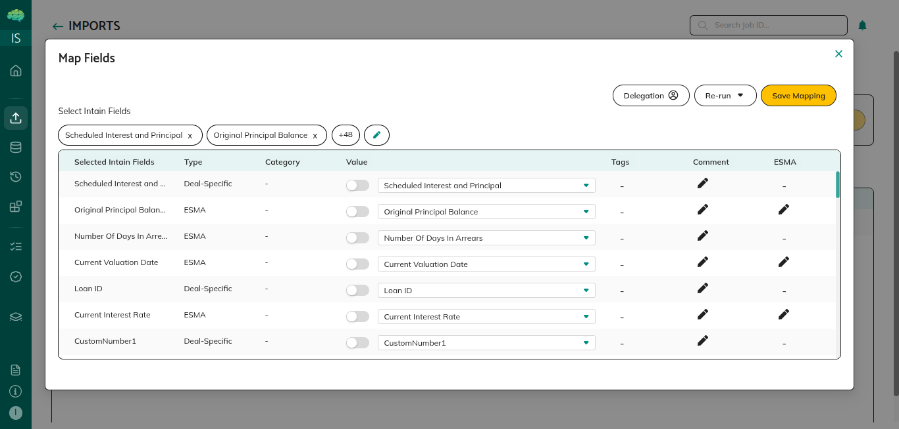
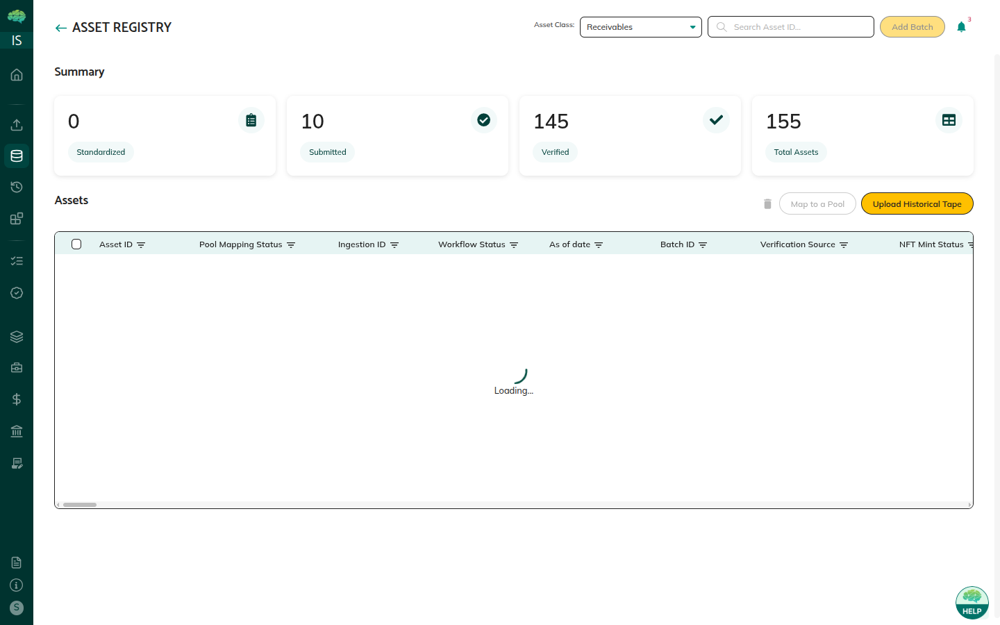
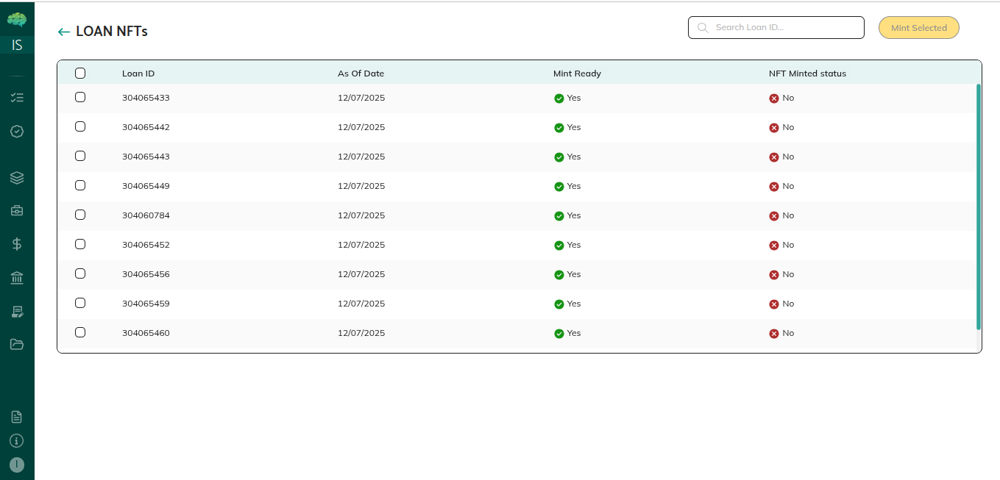

# Loans Overview

## Overview

Loans are the individual credit agreements that make up pools and credit facilities. As an issuer, you upload loans, match their columns to standard fields, manage them in the Loan Registry, map them to pools, verify them in batches, and mint them as NFTs.

## What Loans Are

A loan is one credit agreement. It holds borrower details, the loan amount, interest, payment terms, and performance data. After you onboard a file, the loans are saved for your organization and managed in the Loan Registry.

Matched columns use Intain’s standard field names. Unmatched columns keep the original headers from your file.

A loan moves through upload, field matching, the Loan Registry, pool mapping, batch verification, and NFT minting.

## Purpose and Use Cases

**For Pool Creation** — You select loans in the Loan Registry and map them to a pool. Pool metrics update from those loans.

**For Credit Facilities** — Only loans that already have an NFT can be mapped to a master commitment.

**For Verification** — You group loans into batches. You can self-certify the batch, or send it to a verification agent.

**For Tokenization** — After verification, you can mint each loan as an NFT. The NFT is the digital record used to track and transfer that loan.

## Key Components

**Imports** — Upload a loan tape. Choose the As Of Date and asset class, select the file, and submit. The platform assigns a Job ID. From that row you start Loan Tape Standardization (LTS) to match your columns to standard fields.

**Loan Tape Standardization** — Match your column headers to Intain standard fields:

* **Basic AI Mapping** — Standard suggested matches
* **Intelligent AI Mapping** — A stronger set of suggestions
* **Delegation** — Ask an admin to do the mapping for you

You can change any match in the dropdowns, then click **Save Mapping**.

**Loan Registry** — All onboarded loans. Standard columns appear first. Unmatched columns follow, with italic headers. From here you can:

* Select loans and click **Map to Pool**
* Select loans and click **Add to Batch**
* Open a loan for more detail

**Batch Verification** — Batches and their status. You can:

* **Self Certify** — Sign a certification with Adobe Sign
* **Submit to Verification Agent** — Send the batch for third-party review
* **Provide Documents** — Upload verification documents from your file share

**Certificates** — Verified batches and NFT actions:

* **Mint NFT** — Select loans and mint them
* **View NFT** — Open NFTs that are already minted

## How Loans Work

**1. Uploading Loan Data**

Open **Imports** from the left menu. Choose the As Of Date and asset class, select the loan tape, and click Submit. A Job ID appears in the table with the action **Trigger LTS**.

**2. Loan Tape Standardization**

Click **Trigger LTS** to open Map Fields.

* **Delegation** sends the task to an admin. Enter a start date, an end date, and the required documents.
* **Re-run** lets you choose Basic or Intelligent AI mapping.
* Dropdowns let you change individual matches.
* **Save Mapping** stores the loans.

After you save, **Trigger LTS** changes to **View Mapped**.

**3. Accessing the Loan Registry**

Click **View Mapped**, then **Open in Registry**. The Loan Registry shows:

* Standard columns first
* Unmatched columns next, with italic headers
* **Add Loan** — returns to Imports
* **Map to Pool** — on when a selected loan is not already in a pool
* **Add to Batch** — on when a selected loan is not already in a batch

**4. Mapping Loans to Pools**

Select loans and click **Map to Pool**. Choose the pool and confirm. Pool metrics update from the mapped loans.

.png>)

**5. Adding to Batch and Verification**

Select loans and click **Add to Batch**. Open **Batch Verification** from the left menu.

A new batch starts as **Pending**. Open the Batch ID. Two tabs appear:

* **Loans** — loans in the batch, and **Self Certify**
* **Documents** — upload a file from your file share. Choose the document type and verification template.

**Self Certify** — Enter your name, the signer’s name, email, and place, then click E-Sign. Adobe Sign opens with the certification for the loans in the batch. After you sign, verification moves forward.

**Verification Agent** — You can submit the batch to a verification agent. The agent reviews it and the result is recorded on the batch. You and the verification agent both receive email when the batch is submitted and when it is finished.

**Verification status values:**

* **No** — Not verified yet
* **Certified** — Verified by a third-party verification agent
* **Self Certified** — The issuer signed in as a verification agent and verified the batch
* **Self Certify (Data Only)** — The issuer used **Self Certify** on the batch

After verification, the batch status changes to **Reviewed**.

**6. NFT Minting**

Open **Certificates**.

* **Pending** — View NFT and Mint NFT are off
* **Reviewed** — View NFT and Mint NFT are on
* **Verified** — Only View NFT is on

Click **Mint NFT**, select loans, and click **Mint Selected**. Minting continues in the background. When every selected loan is minted, the batch status becomes **Verified**.

## Important Points to Know

**One Pool Per Loan** — A loan can be in only one pool. Unmap it before you map it to another pool.

**Mapped vs Unmapped Columns** — Standard columns come first. Original headers follow in italic.

**As Of Date** — In a pool’s Loan Tape section, change the As Of Date to see another reporting period. This is useful when you upload a tape each month.

**NFT Minting** — Mint NFT turns on when the batch is **Reviewed**. After every loan is minted, the batch is **Verified**.

**Credit Facility Eligibility** — Only loans with an NFT can be mapped to a master commitment.

**Pool Metrics** — Metrics recalculate when loans are mapped or removed.

**Delegation** — During standardization you can send mapping to an admin.

**IDA** — While you match fields, IDA suggests matches so onboarding takes fewer manual edits.

**Historical Tape** — You can upload tapes for past reporting periods as well as the current tape.

**Verification Agent** — From Batch Verification you can send a batch for certification. The result is recorded on the batch, and both you and the verification agent are emailed when it is submitted and when it is finished.
