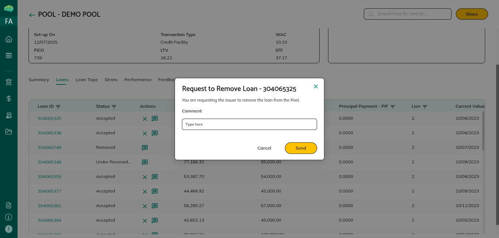

# Loan Rejection & Reinstatement

## Overview

Underwriters / Facility Agents and investors can request that a loan be removed from a pool. The issuer decides whether to accept or reject. Removed loans can be reinstated.

## Requesting Removal (Underwriter / Facility Agent / Investor)

1. Pool details → **Loans tab** → click **cross icon** on the loan
2. System sends removal request to issuer; your view shows loan as **Under Reconsider**
3. Loan remains in pool calculations until issuer decides

## Issuer Response

In the Loans tab, loans with removal requests show **Reconsider** status with tick and cross icons:

| Action | Result |
|---|---|
| Click **tick** | Loan status → **Removed**; excluded from pool calculations; metrics update |
| Click **cross** | Removal rejected; loan stays in pool; metrics unchanged |

## Reinstatement (Issuer)

Removed loans can be reinstated when circumstances change or the issue is resolved.

- Loan status → **Reinstated** → included in pool calculations again
- Pool metrics (balance, count, weighted averages) update automatically

## Key Rules

- Only underwriters / facility agents and investors can request removal; rating agencies cannot
- Only the issuer can accept or reject removal requests
- Removed loans remain visible in the Loans tab for record-keeping
- All actions (request, decision, reinstatement) are recorded for audit purposes
- Pool metrics recalculate automatically on every change

→ See [All Loan States Explained](66_All_loan_states_explained.md) for Reconsider/Removed/Reinstated status definitions.
→ See [Pool Feedback Workflow](09_Pool_Feedback_Workflow.md) for how to use the chat box alongside removal requests.
