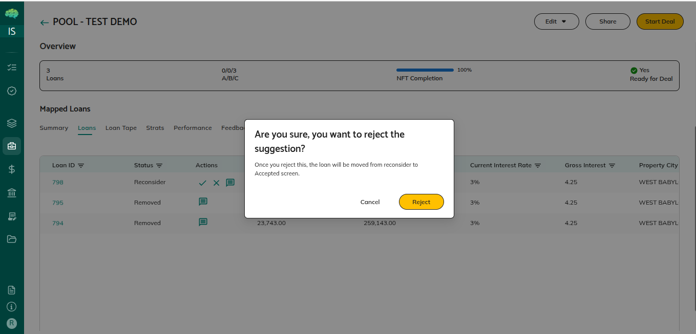

# Loan Rejection and Reinstatement

## Overview

Loans may need to be removed from pools temporarily or permanently, and later reinstated when appropriate. This process allows you to manage pool composition flexibly while maintaining data integrity and ensuring pools meet quality standards.

## Possible Outcomes

When you remove a loan from a pool, the loan enters a "Removed" status. When you reinstate a loan, it returns to active participation in the pool.

## What Each Outcome Means

**Removed Status** means the loan has been excluded from pool calculations but remains visible in the pool for tracking purposes. System calls API endpoint: GET /loans/updateLoanStatus?loanid=LOAN_ID&poolId=POOL_ID&status=Removed. System updates loan: sets loanPoolStatus field to "Removed", Status field remains "Mapped", poolid field remains set (loan stays in pool). System recalculates pool metrics via CalculateNoofLoansAndBalanceRefactored function: total balance decreases, loan count decreases, weighted averages recalculate without the removed loan. System deletes loan from PostgreSQL via deleteLoansFromPoolInPostgres function. Pool metrics automatically recalculate to exclude the removed loan. The loan is still visible in the pool list but marked as removed. This status is useful when loans don't meet pool criteria, have data quality issues, need correction, or when pool requirements change.

**Reinstated Status** means a previously removed loan has been put back into the pool and is included in calculations again. System calls API endpoint: GET /loans/updateLoanStatus?loanid=LOAN_ID&poolId=POOL_ID&status=Reinstated. System updates loan: sets loanPoolStatus field to "Reinstated", Status field remains "Mapped", poolid field remains set. System recalculates pool metrics via CalculateNoofLoansAndBalanceRefactored function: total balance increases, loan count increases, weighted averages recalculate with the reinstated loan included. Pool metrics automatically recalculate to include the reinstated loan. This status is useful when issues with removed loans have been resolved, data has been corrected, pool requirements change, or you decide to include loans that were removed earlier.

## Next Steps for Users

**After Removing a Loan** - Review the updated pool metrics to ensure they reflect the removal correctly. Verify that the loan shows as "Removed" in the pool list. If the loan was removed due to data issues, correct the data. If it was removed because it doesn't meet criteria, determine if criteria can be adjusted or if the loan should remain removed.

**After Reinstating a Loan** - Review the updated pool metrics to ensure they reflect the reinstatement correctly. Verify that the loan shows as active in the pool list. Confirm that the issues that caused removal have been resolved. Ensure the loan now meets pool criteria and requirements.

**Ongoing Management** - Monitor removed loans to see if they can be reinstated later. Track why loans were removed to help with future pool management decisions. Use removal and reinstatement to maintain pool quality and ensure pools meet requirements.
