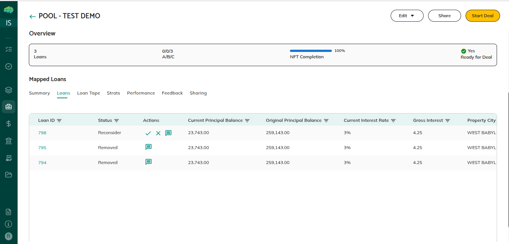

# Removed Loans and Calculations

## Overview

When loans are removed from pools, they're excluded from pool calculations but remain visible for tracking purposes. The platform automatically recalculates pool metrics when loans are removed or reinstated, ensuring that pool characteristics accurately reflect only active loans.

## Reference Details

**Removed Loans Are Excluded** - When a loan is removed from a pool, it's excluded from all pool-level calculations. The loan's balance, characteristics, and data are not included in any pool metrics. Pool metrics recalculate automatically to exclude the removed loan.

**Pool Metrics Recalculate Automatically** - When loans are removed, pool metrics recalculate immediately. Total balance decreases by the removed loan's balance, loan count decreases, weighted averages recalculate using only active loans, and all other metrics update to reflect only active loans.

**Removed Loans Remain Visible** - Removed loans remain visible in the pool's loan list, marked with "Removed" status. This allows you to track what was removed and why, maintaining complete records for audit purposes.

**Reinstatement Recalculates Metrics** - When removed loans are reinstated, pool metrics recalculate again to include them. Total balance increases, loan count increases, weighted averages recalculate with the reinstated loan included, and all metrics update to reflect the reinstated loan.

**Impact on Weighted Averages** - Weighted averages recalculate using only active loans. Removed loans don't affect these calculations.

**Geographic Distribution Updates** - Geographic distribution metrics update to exclude removed loans, ensuring that location-based statistics reflect only active loans.

**Loan Count Adjustments** - Loan count decreases when loans are removed and increases when loans are reinstated.

**Balance Calculations** - Total balance decreases when loans are removed and increases when loans are reinstated.

## Important Notes

**Automatic Recalculation** - Pool metrics recalculate automatically when loans are removed or reinstated. You don't need to manually recalculate—the system handles this automatically.

**Reinstatement Is Possible** - Removed loans can be reinstated if needed. When reinstated, they're included in calculations again, and metrics update automatically.

**Status Indicates Removal** - Removed loans show "Removed" status, making it clear which loans are excluded from calculations. The system automatically excludes removed loans when calculating pool metrics.

**Metrics Reflect Active Loans Only** - All pool metrics reflect only active loans, not removed ones.

**Impact Is Immediate** - When loans are removed or reinstated, the impact on pool metrics is immediate. Metrics update right away to reflect the change.
