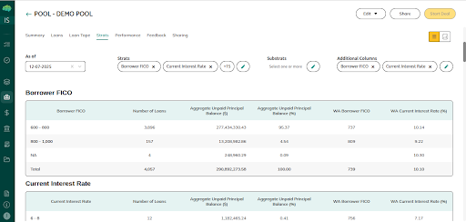
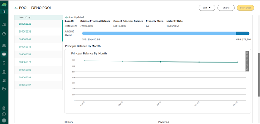

# Analytics

The Analytics section is within Pool Details. It lets you analyse one pool at a time across four tabs: **Summary**, **Strats**, **Performance**, and **Loans**.

## Summary Tab

High-level overview of loan tape performance and tranche characteristics. Interactive charts — zoom, pan, and autoscale.

## Strats Tab

Aggregated and weighted-average values for standard fields. Select a standard field to generate stratification tables; add sub-stratifications and extra columns using the second and third dropdowns. Filter by as-of date.

## Performance Tab

Analyse deal performance over a selected date range. Six multi-select filters display time-series data for the chosen items.

## Loans Tab

Loan-level view of all Loan IDs in the pool. Click any Loan ID for detailed attributes and loan-specific charts. Click again to return to the full list.

→ See [IDA Dashboard](15_IDA_Dashboard.md) for portfolio-level analytics across all pools.
