# Pool Details Analytics

## Analytics

The Analytics section is available within the Pool Details view and allows users to analyze one deal at a time. It provides in-depth insights into the selected pool’s deal, including summary, stratifications, performance metrics, and loan-level details.

## Tabs in the Pool Details Analytics View

The Pool Details Analytics view consists of four sub-tabs:

Summary
Strats
Performance
Loans

Each tab provides a different perspective on the selected deal.

## Summary Tab

The Summary tab provides a high-level overview of loan tape performance and tranche characteristics. It includes multiple interactive charts similar to those in the Portfolio tab. Users can zoom, pan, and autoscale charts to gain deeper insights into the data.

![[Summary]](images/14-analytics/SummaryAnalytics.png)

## Strats Tab

The Strats tab displays aggregated and weighted average values for standard fields. Users can generate stratification tables by selecting a standard field from the first dropdown. The second dropdown allows selecting up to two standard fields that appear as substratifications under each table. The third dropdown enables users to add additional fields as extra columns across all existing stratification tables. Users can also select the specific as-of date for which the analytics should be displayed.

![[Summary]](images/14-analytics/StratsAnalytics.png)

## Performance Tab

The Performance tab allows users to analyze deal performance over a selected time period.

**Filters in the Performance Tab**
Date Range – Users can select a start and end date to define the analysis period
Multi-Select Filters – Six multi-select filters are available, allowing users to analyze one or more items simultaneously

The selected filters display time-series data, helping users understand how different factors impact deal performance over time.

![[Summary]](images/14-analytics/PerformanceAnalytics.png)

## Loans Tab

The Loans tab provides a detailed, loan-level view of all loan IDs associated with the selected deal. It displays key loan attributes and performance indicators, along with customizable filters for sorting and analysis.

**Viewing Loan Details**
Users can click on any Loan ID in the left-most column to view detailed information for that loan. This includes comprehensive loan data along with loan-specific graphs and visualizations.
- Clicking the same Loan ID again returns the user to the general loans list, enabling easy navigation between individual loan details and the overall loan view.

![[Summary]](images/14-analytics/LoansAnalytics.png)

## Pool Analytics Screenshots

The following screenshots show the Pool Details Analytics views with updated data:

### Pool Summary

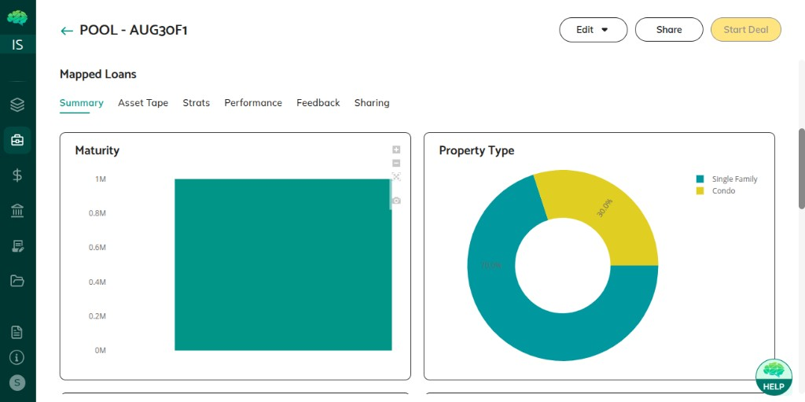

### Pool Strats

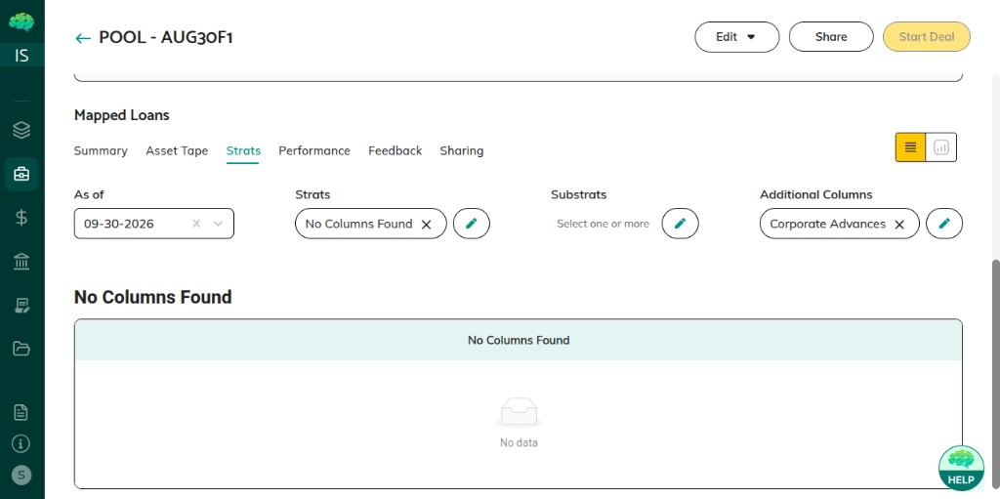

### Pool Performance

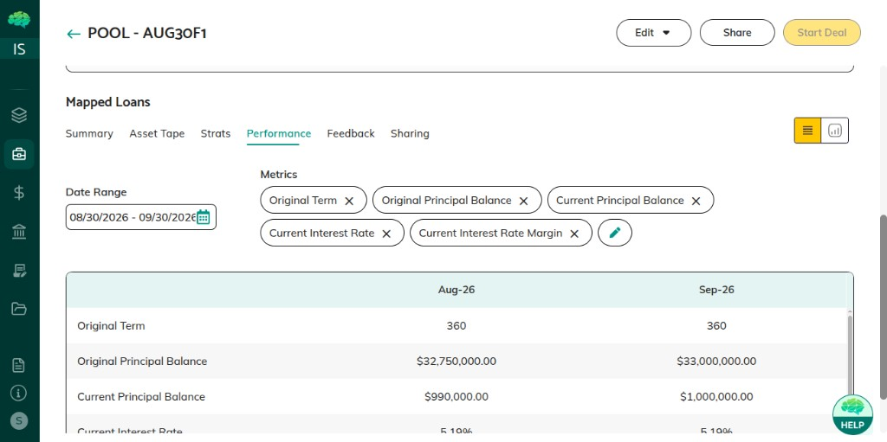

### Pool Asset Tape

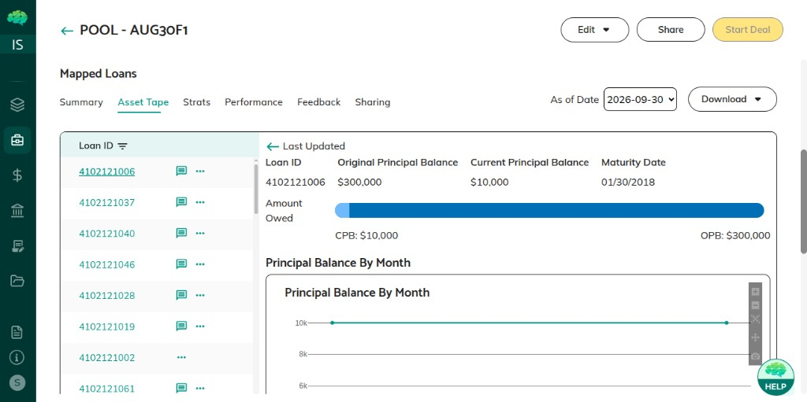

## Asset Analysis Screenshots

### Asset Analysis Overview

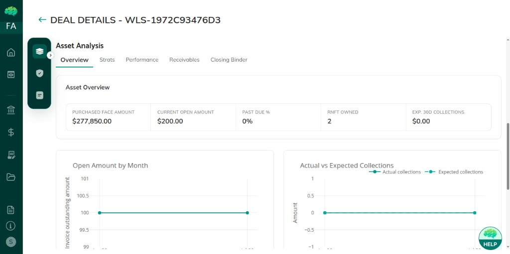

### Asset Analysis Strats

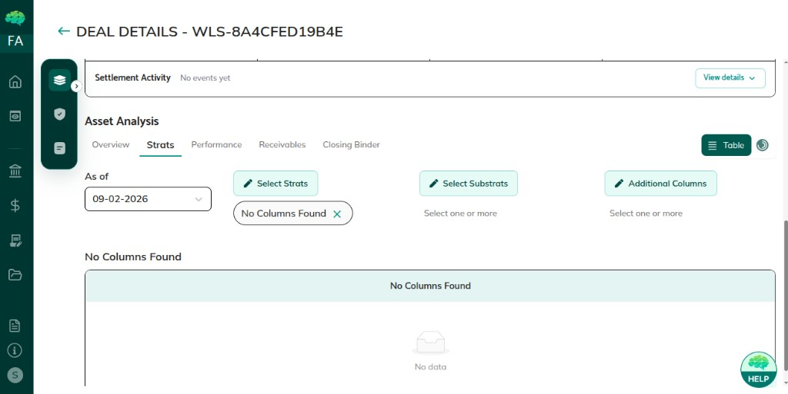

### Asset Analysis Performance

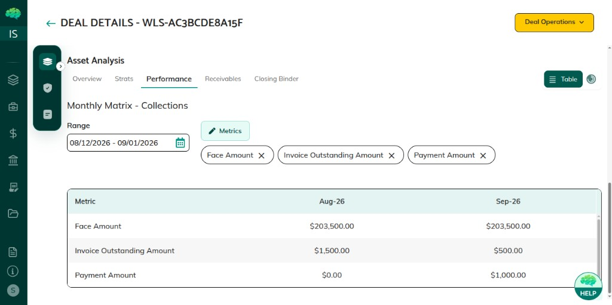

## Risk Analytics

### Risk Overview

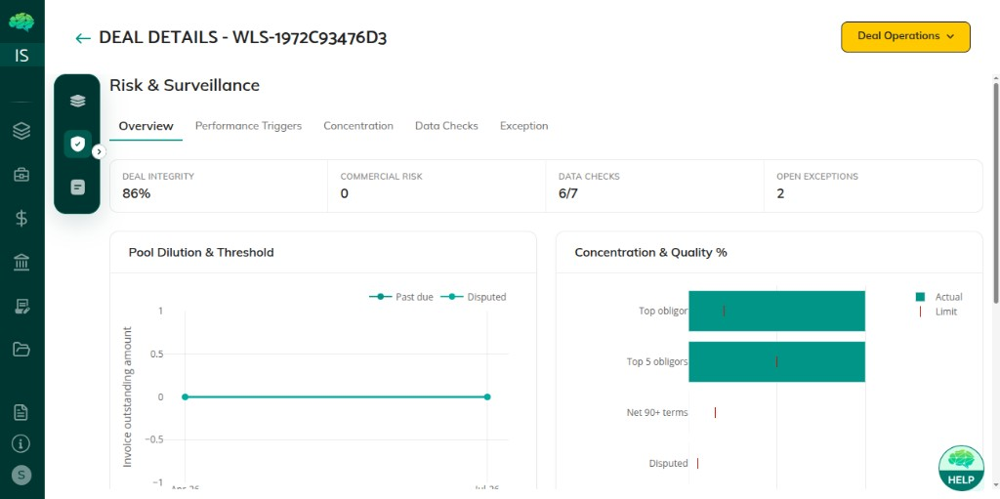

### Risk Concentration

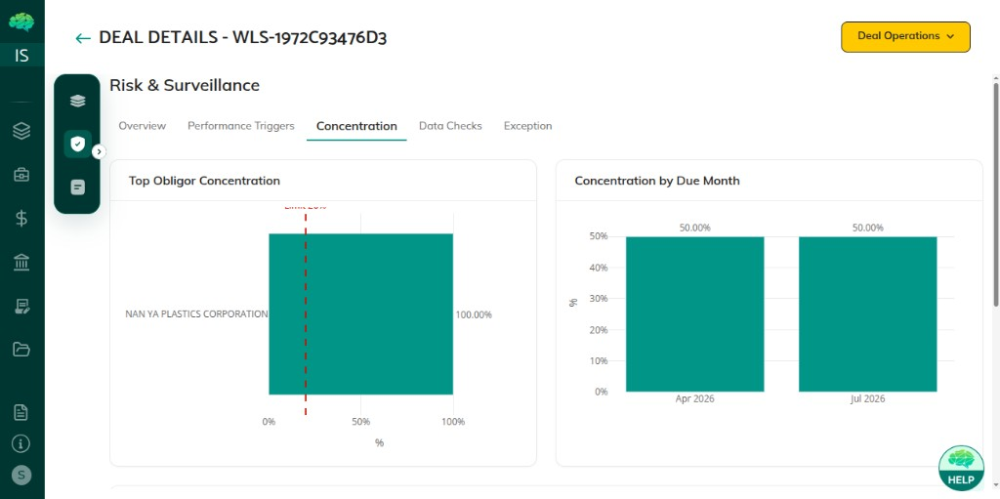

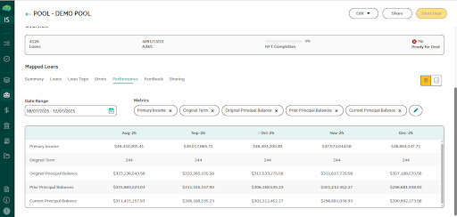

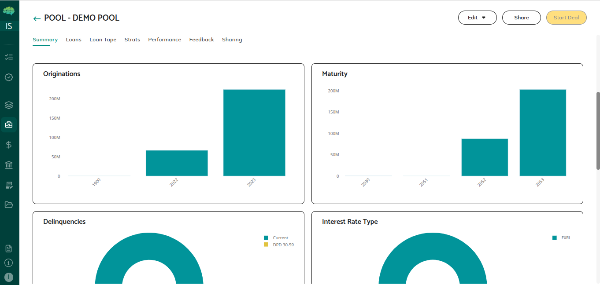

