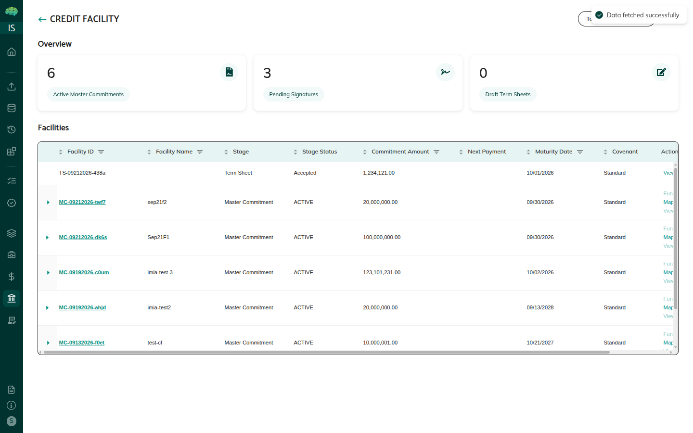
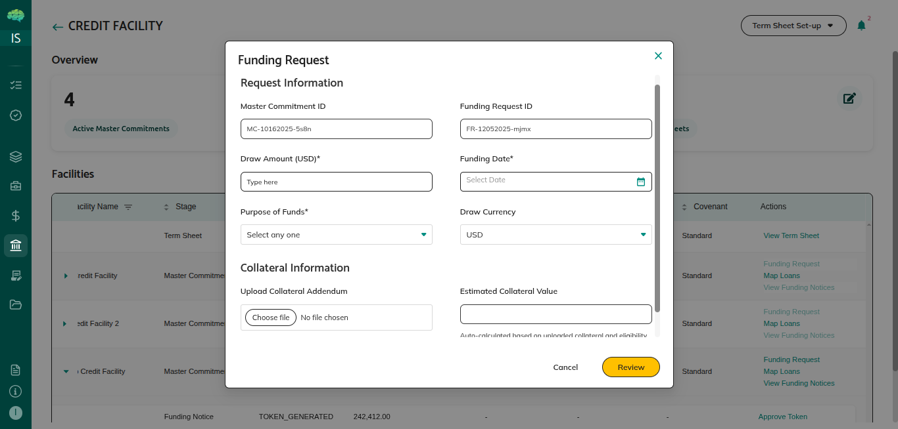

# Credit Facilities Overview

A credit facility lets a borrower draw funds up to a pre-approved limit, with each draw reviewed before funds move.

## Four Key Records

| Record | What it is |
|---|---|
| **Term Sheet** | Borrower proposes terms; signed via Adobe Sign |
| **Master Commitment** | Created automatically when term sheet is approved; holds facility structure and lenders |
| **Funding Request** | Borrower asks for a specific draw; reviewed by facility agent |
| **Funding Notice** | Created automatically when funding request is approved; e-signed per lender |

## End-to-End Workflow

1. **Borrower** — creates term sheet → signs (Adobe Sign) → submits to facility agent
2. **Facility agent** — approves → master commitment created automatically
3. **Facility agent** — configures facility, adds lenders → submits for lender approval
4. **Lender** — reviews in Opportunities → **Approve & E-Sign** → facility becomes **Active**
5. **Facility agent** — completes deal modelling → Facility Setup Status → **Completed**
6. **Borrower** — maps NFT-minted loans → creates funding request → submits
7. **Facility agent** — approves funding request → funding notice created automatically
8. **Facility agent** — approves notice → signs for each lender (E-sign 0/n → n/n)
9. **Lender** — sees notice after their signature done → transfers funds → **Confirm and Settle**

## Key Rules

- Only **NFT-minted loans** can be mapped to a master commitment
- Borrower cannot create funding requests until facility is **Active** and deal modelling is **Completed**
- **One lender's approval** activates the master commitment
- A lender sees the funding notice only after the facility agent signs for them
- Sub-facilities cannot share the same lenders; each lender belongs to one sub-facility
- An active facility can support multiple funding requests over its life

→ See [Term Sheet Workflow](18_Term_Sheet_Workflow.md) for step-by-step term sheet instructions.
→ See [Roles in Credit Facilities](17_Roles_in_Credit_Facilities.md) for role descriptions.
→ See [Token Approval](45_Token_Approval.md) for the token generation and transfer steps.
