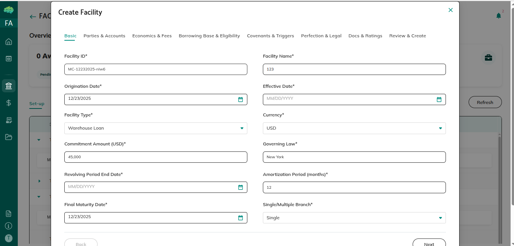
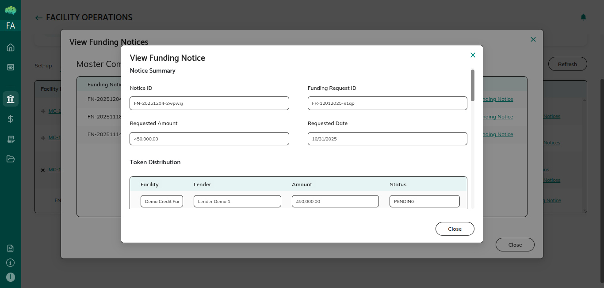
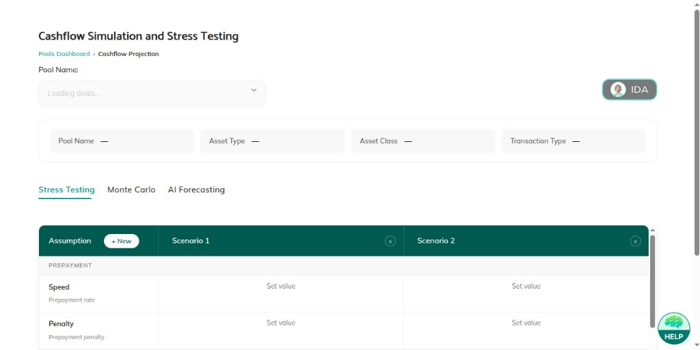
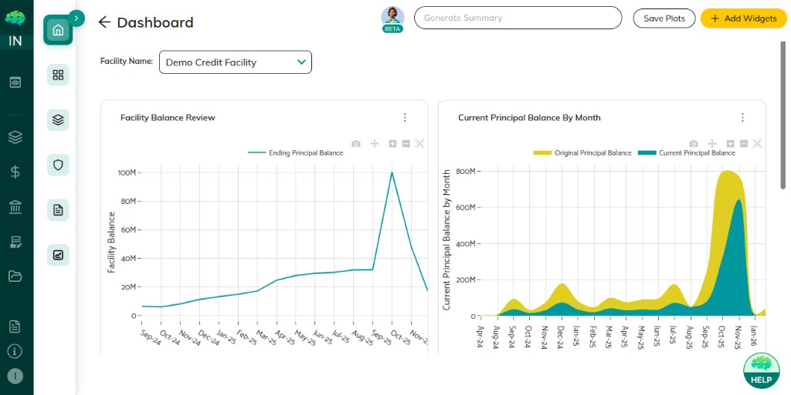
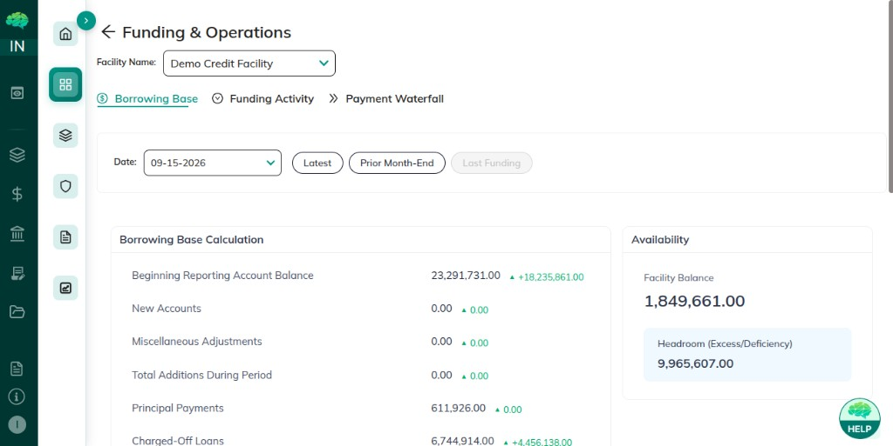
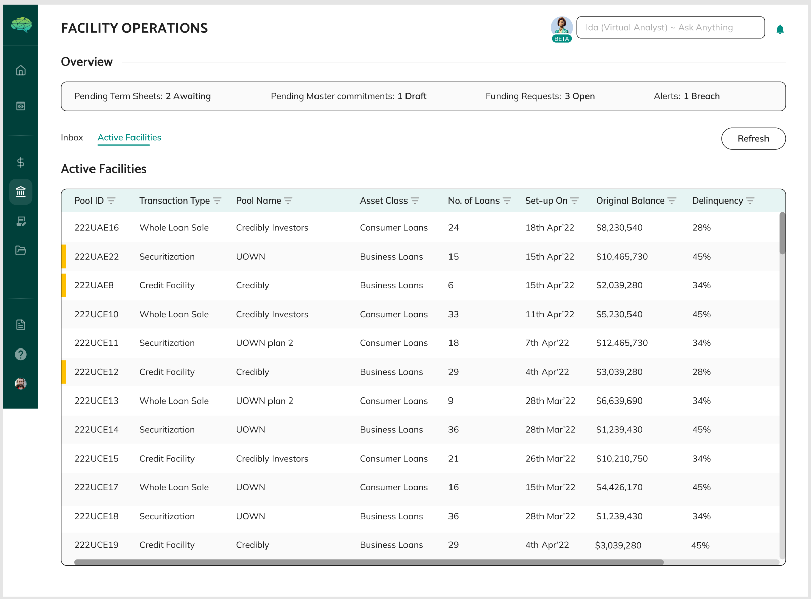

# Credit Facilities Overview

## Overview

A credit facility lets a borrower draw funds up to a pre-approved limit. The borrower proposes terms, the facility agent reviews and structures the facility, and lenders approve and fund each draw.

## What Credit Facilities Are

Unlike a loan paid in full at the start, a credit facility sets a limit. The borrower draws from that limit when funds are needed.

The workflow uses four records:

- **Term Sheets** propose the terms
- **Master Commitments** hold the finished facility structure
- **Funding Requests** ask for a specific draw
- **Funding Notices** document an approved draw and the fund transfer

## Purpose and Use Cases

**For Flexible Borrowing** — Borrowers draw only what they need.

**For Structured Lending** — Each draw is reviewed before funds move.

**For Ongoing Relationships** — An active facility can support more than one draw.

**For Controlled Disbursement** — Lenders approve each draw before they send funds.

## Key Components

**Term Sheets** — The borrower proposes the maximum amount, interest, repayment, and other conditions. The borrower signs with Adobe Sign, then submits the term sheet to the facility agent.

**Master Commitments** — Created automatically when the facility agent approves a term sheet. The facility agent adds lenders and facility rules, then sends the commitment to lenders.

**Funding Requests** — The borrower asks to draw a specific amount, with a funding date, a purpose, and a collateral addendum. The facility agent reviews each request.

**Funding Notices** — Created automatically when a funding request is approved. The facility agent e-signs for each lender. A lender sees the notice after the facility agent has signed for them.

**Deal Modelling** — After a master commitment is active, the facility agent finishes deal setup before the borrower can create funding requests.

## How Credit Facilities Work

**1. Term Sheet Creation (Borrower)**

Open **Credit Facility** from the left menu. The dashboard lists term sheets and master commitments.

Click **Term Sheet Setup**, then **Create via Wizard** or **Upload Signed**.

In the wizard, enter the requested commitment amount, advance rate, margin, pricing index, maturity date, drawdown frequency, and related terms. Click **Create Draft**. Adobe Sign opens. The status starts as **Draft** and becomes **Signed by the borrower** after you sign.

A **Submit to FA** prompt appears. If you submit, the status becomes **Under Review**. If you cancel, use **Submit Term Sheet** on the dashboard later.

**2. Term Sheet Review (Facility Agent)**

Open **Credit Facility**. Tiles sit above a table with **Set-up** and **Active Facilities**. Term sheets are listed under Set-up. Approved term sheets show master commitments in a dropdown.

For **Under Review**, the action is **Review Term Sheet**. The facility agent can download documents and choose:

- **Approve** — status becomes **Accepted**, and a master commitment is created
- **Reject** — status becomes **Rejected**
- **Request Changes** — status becomes **Changes Requested**. The borrower can edit and resubmit

**3. Master Commitment Configuration (Facility Agent)**

The new master commitment is **Draft**. The action is **Create Facility**.

**Create Facility** opens sections from Basic through Review & Create.

In **Basic**, choose a single facility or a multiple-branch facility.

In **Parties & Accounts**, add the lenders.

If you chose multiple branch, **Create Sub-Facility** appears in Review & Create. A dropdown switches between the main facility and each sub-facility. A sub-facility can only use lenders from the main facility. Two sub-facilities cannot share the same lenders.

Entries save as you go. Click **Create Facility** when finished. The status becomes **Pending Lender Approval**, and the selected lenders can see it.

**4. Lender Approval**

Lenders open **Opportunities**. They see the main master commitment, or the sub-facility assigned to them.

Click **Review & Approve**, review the tabs, then click **Approve & E-Sign**. Adobe Sign opens. After signing, the commitment moves to the lender’s **Credit Facility** tab.

When any one lender approves and signs, the master commitment becomes **Active**.

**5. Deal Modelling (Facility Agent)**

The active commitment appears under **Active Facilities**. Click **Set Up Deal**. **Delegation** sends this setup to an admin.

Complete the sections in the left menu, open Review, and click **Create**. **Facility Setup Status** changes from **In Progress** to **Completed**.

**6. Loan Mapping (Borrower)**

After deal modelling, the borrower sees **Map Loans** and **Funding Request**.

**Map Loans** shows mapped loans and totals. **Add Loans to Facility** lists loans. Only loans with an NFT can be selected. Select loans, click **Next**, then **Map**. You cannot map a loan that already belongs to another facility.

**7. Funding Request (Borrower)**

Click **Funding Request** and enter:

- Draw amount
- Funding date
- Purpose of funds
- Draw currency
- Collateral addendum

Click **Review** to save a **Draft**. Click **Submit** to send it to the facility agent. The status becomes **Under Review**.

**8. Funding Request Review (Facility Agent)**

The action is **Review Funding Request**.

- **Approve** — a funding notice is created with status **Pending Token Generated**
- **Reject** — status becomes **Rejected**
- **Request Changes** — status becomes **Changes Requested**

Approving a funding request does not require an e-signature. After **Approve**, click **Approve** on the funding notice.

**9. Funding Notice E-Sign (Facility Agent)**

The notice shows **E-sign (0/n)**, where n is the number of lenders.

The facility agent signs for each lender in Adobe Sign. The count moves to 1/n, 2/n, and so on. A lender sees the notice after the facility agent has signed for that lender.

**10. Lender Fund Transfer**

The lender opens **Review Funding Notice**, chooses a payment method, sends the funds, and clicks **Confirm and Settle**. Tokens transfer and the amount is sent to the borrower.

## Important Points to Know

**Term Sheet Signature** — The borrower signs with Adobe Sign before submitting to the facility agent.

**Master Commitment** — Approving a term sheet creates the master commitment. You do not create it yourself.

**Sub-Facilities** — On a multiple-branch facility, the facility agent can split lenders across sub-facilities. Two sub-facilities cannot share the same lenders.

**Deal Modelling** — The facility agent finishes deal modelling before the borrower can raise a funding request.

**NFT-Minted Loans Only** — Only loans with an NFT can be mapped to a master commitment.

**One Signature per Lender** — The facility agent signs the funding notice once for each lender. That lender sees the notice after their signature is done.

**Confirm and Settle** — After the lender sends funds, they click **Confirm and Settle**.

**Deal Setup Wizard** — The facility agent completes deal setup in a wizard with these sections: General, Facilities, Fees, Expenses, Manual Inputs, Accounts, Triggers, Borrowing Base, Calculations, Waterfall, and Review.

**Analytics** — Facility screens include Funding, Borrowing Base, Payments, Strats, Performance, Loans, Risk Overview, Covenants, Concentration, Data Checks, and Triggers.

**E-Signature** — Signing uses **Adobe Sign** or **ZohoSign**. DocuSign is no longer used. The steps are the same for both.
