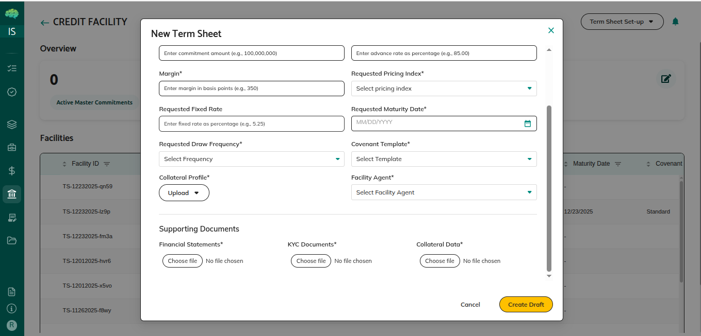
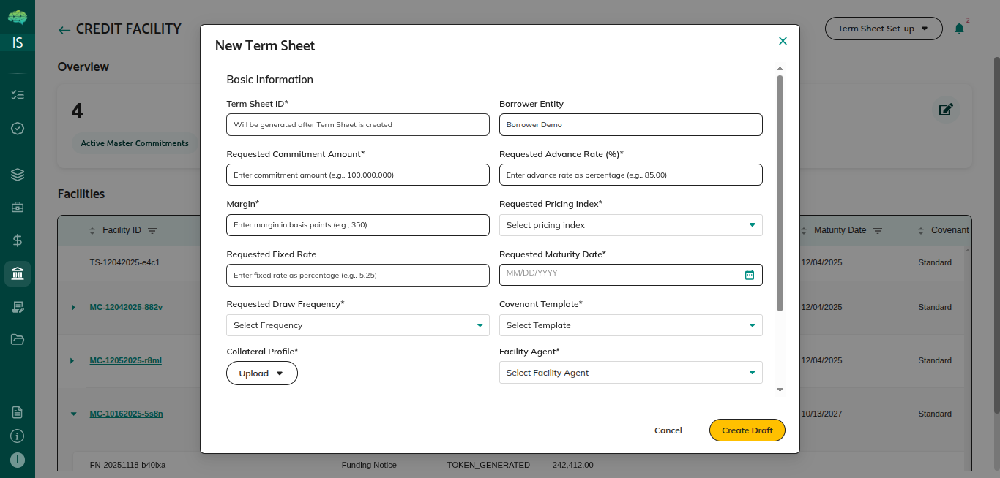
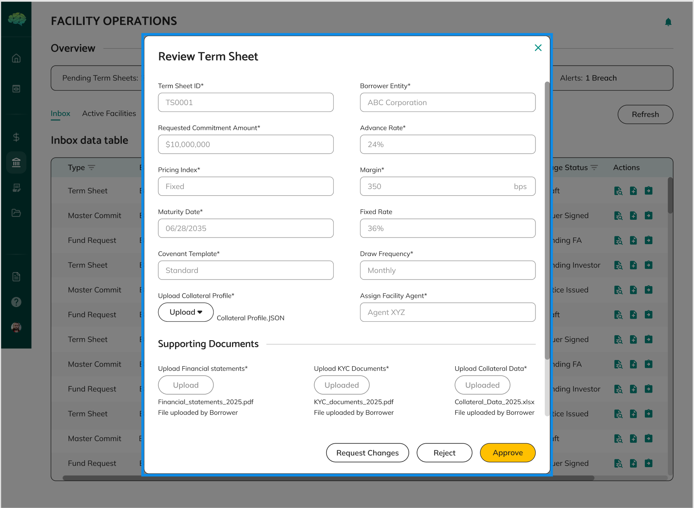

# Term Sheet Workflow

## Overview

The term sheet is the first step in creating a credit facility. It's the borrower's proposal outlining the key terms of the facility they want, including maximum facility amount, interest rates, repayment terms, and other conditions. Understanding the term sheet workflow helps you navigate this critical first phase from creation through approval.

## Who Can Use This

- Borrowers who create term sheets and want to propose new credit facilities
- Facility Agents who review term sheets and make approval decisions

## When This Is Used

Use term sheet workflow when:
- You want to propose a new credit facility to lenders
- You need to request flexible funding arrangements
- You want to understand how term sheets progress from creation to approval
- You need to review a borrower's proposal as a facility agent
- You want to know what happens after term sheet approval

## Step-by-Step Process

### Creating a Term Sheet

1. **Access Term Sheet Setup**
   - Navigate to the term sheets section
   - Click "Term Sheet Setup" button
   - Two options appear:
     - **Create Via Wizard**: Opens a pop-up form to create term sheet step-by-step
     - **Upload Signed**: Upload a signed term sheet document; the system extracts details and creates a term sheet from the document

2. **Enter Facility Information**
   - **Total Borrowing Limit**: Enter the maximum amount you want to borrow
   - **Advance Rate**: Specify what percentage of collateral value can be borrowed (e.g., 85%)
   - **Pricing Index**: Select the base interest rate index (e.g., SOFR, SOFR 1M)
   - **Margin**: Enter the spread to be added to the pricing index (e.g., 2.5%)
   - **Fixed Rate**: Enter a fixed interest rate if applicable (alternative to index + margin)
   - **Maturity Date**: Select when the facility will mature
   - **Drawdown Frequency**: Choose how often drawdowns are allowed (e.g., Monthly, Quarterly)
   - **Covenant Template**: Select the applicable covenant template

3. **Upload Required Documents**
   - **Collateral Profile**: Upload your collateral profile document
   - **Financial Statements**: Upload your financial statements
   - **KYC Documents**: Upload KYC documentation
   - **Collateral Data**: Upload collateral data files
   - **Funding Sheet**: Upload funding sheet if applicable
   - Documents are securely stored and tracked with complete history

4. **Create Draft**
   - Review all entered information for accuracy
   - Verify all required fields are filled
   - Ensure documents are uploaded correctly
   - Click "Create Draft" button

### Signing the Term Sheet

1. **E-Sign Popup Appears**
   - After clicking "Create Draft", issuer e-sign popup appears
   - Review the document you're signing
   - Complete the electronic signature process
   - Verify signature is complete

2. **Submit Term Sheet Popup**
   - After signing, "Submit Term Sheet" popup appears
   - Review submission details
   - Click "Submit" button to submit to facility agent
   - Status changes from Draft to FAReview
   - Facility agent receives notification

### Credit Facility Dashboard Actions

The credit facility dashboard displays different actions based on term sheet status:

- **Submit Term Sheet After Signing** - Available when term sheet is in Draft status and signed
- **Edit Term Sheet** - Available when status is CHANGES_REQUESTED
- **View Term Sheet** - Available when status is FAReview or Accepted

### Facility Agent Review and Decision

1. **Access Review**
   - Facility agent clicks "Review Term Sheet" action button
   - Review Term Sheet popup appears
   - Facility agent evaluates your term sheet
   - Reviews facility terms, amounts, and conditions
   - Checks supporting documentation
   - Assesses feasibility and compliance

2. **Facility Agent Makes Decision**
   - In the Review Term Sheet popup, facility agent sees three buttons:
     - **Approve**: Term sheet meets requirements
       - Status changes to "Approved"
       - Master commitment is automatically created
       - You receive notification of approval
     - **Reject**: Term sheet doesn't meet requirements
       - Status changes to "Rejected"
       - Rejection reason is provided
       - You receive notification of rejection
     - **Request Changes**: Modifications are needed
       - Status changes to "CHANGES_REQUESTED"
       - Change request details are provided
       - You receive notification of change request

3. **Wait for Review**
   - Facility agent reviews your term sheet
   - Facility agent clicks "Review Term Sheet" action button
   - Review Term Sheet popup appears with Approve, Reject, and Request Changes buttons
   - Review typically takes a few days
   - You receive notifications about status changes
   - You can monitor review progress

### Responding to Change Requests

1. **Review Change Request**
   - Read change request details carefully
   - Understand what needs to be modified
   - Note any deadlines or priorities
   - Navigate to term sheet to make changes

2. **Make Requested Changes**
   - Open term sheet for editing (status allows editing)
   - Update fields as requested
   - Modify documents if needed
   - Address all requested changes
   - Complete all changes before proceeding

3. **Update and Re-sign**
   - Click "Update" button in the changes popup
   - Issuer e-sign popup appears again
   - Complete electronic signature
   - Verify signed version is correct
   - Ensure all changes are reflected

4. **Submit Term Sheet**
   - After signing, "Submit Term Sheet" popup appears
   - Click "Submit" button
   - Status changes from CHANGES_REQUESTED to FAReview
   - Facility agent receives notification
   - Action displayed in dashboard: "Submit Term Sheet"

## Rules & Validations

- You can only edit term sheets while they're in Draft or Changes Requested status. Once submitted or approved, editing is restricted.

- You must sign the term sheet electronically before submitting. Unsigned term sheets cannot be submitted.

- Facility agents can approve, reject, or request changes. They cannot create term sheets themselves.

- Approved term sheets automatically create master commitments. You don't need to create master commitments manually.

- Rejected term sheets cannot be resubmitted. If rejected, you must create a new term sheet.

- Change requests allow iterative improvement. You can go through multiple rounds of changes until approved or rejected.

- Electronic signatures are legally binding. Once signed, term sheets represent formal proposals.

- Status controls what actions are available. You can only take actions allowed by the current status.

- All changes are recorded. Every edit, signature, and status change is tracked in the audit trail.

- Required fields must be completed. You cannot submit until all required information is provided.

## What Happens Next

After creating a term sheet:
- Click "Create Draft" button
- Issuer e-sign popup appears, complete signature
- Submit Term Sheet popup appears, click Submit
- Status changes from Draft to FAReview
- Facility agent clicks "Review Term Sheet" action button
- Review Term Sheet popup shows with Approve, Reject, and Request Changes buttons
- Facility agent makes a decision
- If approved, master commitment is automatically created
- If rejected, you can create a new term sheet
- If changes are requested, you can update and resubmit

After term sheet approval:
- Master commitment is automatically created
- Facility agent configures the complete facility structure
- Facility agent submits master commitment for lender approval
- Lenders review and approve the facility
- Facility becomes active, and you can create funding requests

Understanding the term sheet workflow helps you effectively navigate the first phase of credit facility creation, know what to expect at each stage, and successfully move from proposal to active facility.
