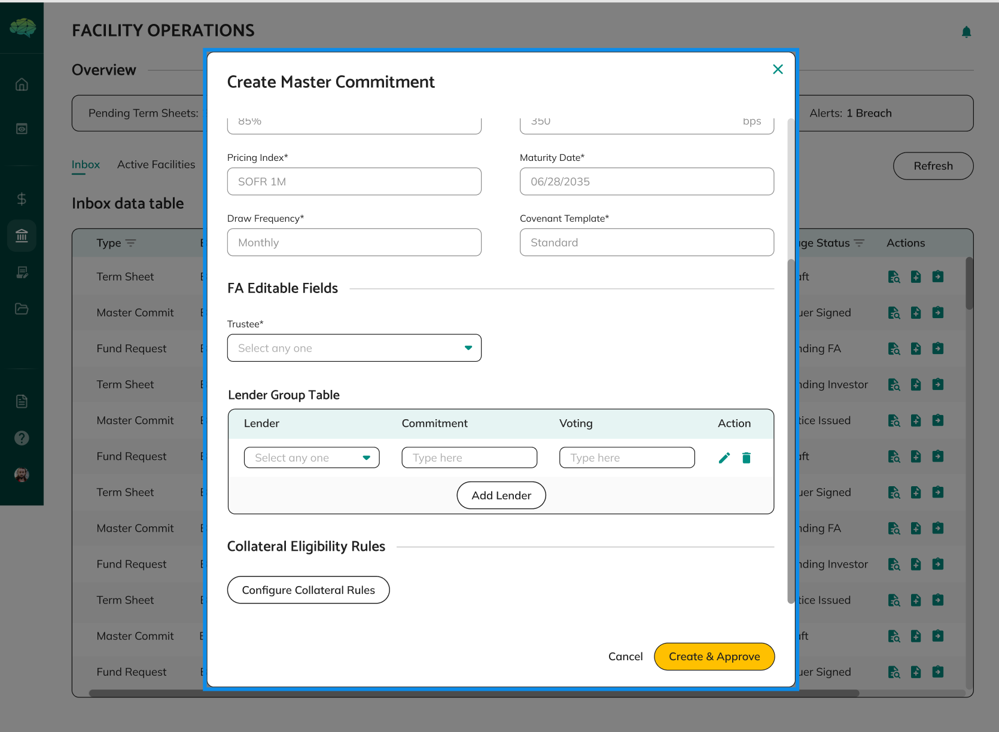
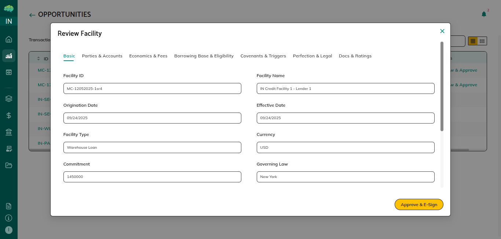

# Master Commitment Overview

## Overview

A master commitment is the finalized credit facility agreement that defines the complete facility structure. It's automatically created when a term sheet is approved and contains all the rules, parameters, lender information, borrowing base calculations, and other configurations needed to operate the facility.

## What Master Commitments Are

A master commitment is the complete, finalized agreement that defines how a credit facility will operate. It contains all the terms, rules, calculations, and configurations that govern every aspect of facility operations.

Master commitments are automatically created from approved term sheets. They start with information from your term sheet, then facility agents configure the complete structure including all rules, calculations, and lender groups. Once configured and approved by lenders, master commitments become active and enable funding requests.

## Purpose and Use Cases

Master commitments serve as the operational foundation for credit facilities:

**For Facility Structure** - Master commitments define the complete facility structure, including all rules, parameters, and configurations needed to operate the facility.

**For Rule Definition** - All facility rules are defined in master commitments, including borrowing limits, collateral eligibility, drawdown frequency, repayment terms, and other requirements.

**For Lender Configuration** - Master commitments configure lender groups, participation percentages, voting rights, and other lender-specific settings.

**For Borrowing Base Setup** - Borrowing base calculations are configured in master commitments, determining how much borrowers can borrow based on collateral, financial metrics, or other factors.

**For Facility Activation** - Master commitments must be approved by lenders before facilities become active. Once approved, facilities are operational and borrowers can create funding requests.

**For Operational Reference** - Master commitments serve as complete documentation of facility structure and rules, ensuring all parties understand how facilities operate.

## Key Components

**Facility Terms** - Basic facility information from the approved term sheet, including facility name, maximum facility amount, interest rates, repayment terms, and facility term. This information is pre-populated from the term sheet.

**Facility Rules** - Rules that govern how the facility operates, including borrowing limits, drawdown frequency rules, utilization limits, payment terms, interest rate structure, and fee calculations. These rules control all facility operations.

**Borrowing Base Calculations** - Formulas and rules that determine how much borrowers can borrow. This includes calculation methods, advance rates, collateral eligibility rules, and borrowing limits. Borrowing base calculations determine available borrowing capacity.

**Collateral Eligibility Rules** - Criteria that define what assets can be used as collateral and how they're valued. This includes collateral type requirements, quality standards, age limits, geographic limits, and valuation methods.

**Lender Groups** - Configuration of lenders who will participate in the facility, including their participation percentages, commitment amounts, voting rights, and roles. Each lender's participation is tracked individually.

**Operational Parameters** - Other settings needed to operate the facility, including reporting requirements, monitoring requirements, covenant templates, and other operational configurations.

## How Master Commitments Work

**Automatic Creation** - Master commitments are automatically created when term sheets are approved. The system takes information from your approved term sheet and pre-populates the master commitment, ensuring continuity from proposal to facility.

**Facility Agent Configuration** - Facility agents configure the complete facility structure by setting up facility rules, borrowing base calculations, collateral eligibility rules, lender groups, and other parameters. This configuration happens while the master commitment is in Draft status.

**Collateral Eligibility Configuration** - Facility agents configure collateral eligibility rules that define what assets can be used as collateral and how they're valued. This ensures proper collateral management throughout the facility lifecycle.

**Lender Approval** - After configuration, facility agents submit master commitments for lender approval. Lenders review the complete facility structure and approve or reject. Any lender approval activates the facility.

**Facility Activation** - Once at least one lender approves, the master commitment becomes Active, and the facility is operational. Borrowers can create funding requests, and the facility is ready for use.

**Ongoing Operations** - Active master commitments govern all facility operations. All funding requests must comply with facility rules defined in the master commitment. Borrowing capacity is calculated based on borrowing base rules, and all operations follow the configured structure.

**Rule Enforcement** - All facility rules defined in master commitments are enforced throughout the facility lifecycle. Funding requests are evaluated against these rules, borrowing capacity is calculated using configured formulas, and all operations must comply with the defined structure.

## Important Points to Know

**Automatic Creation** - Master commitments are automatically created when term sheets are approved. The system creates them with pre-populated term sheet data.

**Facility Agent Configuration Required** - Facility agents must configure the complete facility structure before submitting for lender approval, including all rules, calculations, and lender groups.

**Lender Approval Activates Facility** - Master commitments must be approved by at least one lender before facilities become active. Any lender approval activates the facility.

**Defines All Facility Rules** - All rules that govern the facility are defined in the master commitment, including borrowing limits, collateral eligibility, drawdown frequency, and other requirements.

**Becomes Active When Approved** - Once at least one lender approves, the facility becomes active, and borrowers can create funding requests.

**Complete Documentation** - Master commitments serve as complete documentation of facility structure and rules, ensuring all parties understand how facilities operate.

**Cannot Edit After Active** - Once a facility is active, the master commitment typically cannot be edited. All facility rules and configurations are locked in.
