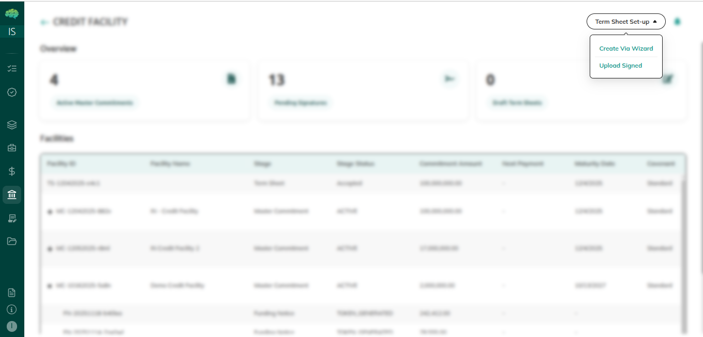
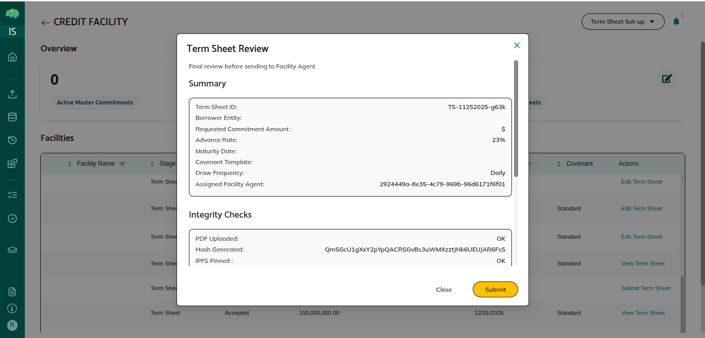
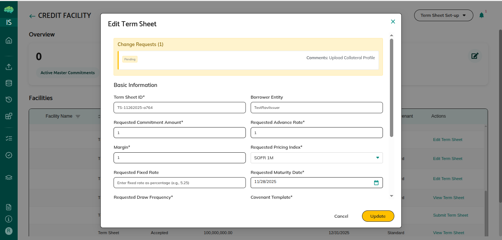

# Term Sheet Workflow

## Overview

The term sheet is the first step in creating a credit facility. As a borrower, you propose the key terms, sign the document with Adobe Sign, and send it to the facility agent. The facility agent then approves it, rejects it, or asks you to change it.

## Who Can Use This

* **Borrowers**: Create term sheets and submit them for facility agent review
* **Facility Agents**: Review term sheets and make approval decisions

## When This Is Used

Use the term sheet workflow when:

* You want to propose a new credit facility
* You need to understand how term sheets move from creation to approval
* You need to review and respond to change requests
* You want to know what happens after a term sheet is approved

## Step-by-Step Process

### Part 1: Creating a Term Sheet (Borrower)

#### Step 1: Access the Credit Facility Dashboard

1. **Navigate to Credit Facility**
   * Log in with your Borrower account
   * Hover over the left menu so it expands, then click **Credit Facility**
   * The dashboard lists term sheets you have created and any master commitments

#### Step 2: Start Term Sheet Setup

1. **Click Term Sheet Setup**
   * Click **Term Sheet Setup** at the top right of the dashboard
   * Two options appear:
     * **Create Via Wizard**: Opens a form so you can enter the term sheet step by step
     * **Upload Signed**: Upload a term sheet that is already signed
2. **Select Create Via Wizard**
   * Click **Create Via Wizard** to open the creation form

#### Step 3: Enter Term Sheet Details

1. **Fill in Facility Information**
   * **Requested Commitment Amount**: The maximum amount you want to borrow
   * **Advance Rate**: The share of collateral value you can borrow (for example, 85%)
   * **Pricing Index**: The base interest rate, such as SOFR or SOFR 1M. SOFR is a published reference rate.
   * **Margin**: The extra percentage added to the pricing index (for example, 2.5%)
   * **Fixed Rate**: A single interest rate, used instead of an index plus margin
   * **Maturity Date**: The date the facility ends
   * **Drawdown Frequency**: How often you may draw funds, such as Monthly or Quarterly
   * **Covenant Template**: The set of ongoing conditions that apply to the facility

#### Step 4: Upload Required Documents

1. **Upload Supporting Documents**
   * **Collateral Profile**: A description of the assets that support the facility
   * **Financial Statements**: Your financial statements
   * **KYC Documents**: Know Your Customer documents that identify your organization
   * **Collateral Data**: Files with collateral details

#### Step 5: Create Draft and Sign

1. **Create the Draft**
   * Check that every required field is filled and the documents uploaded correctly
   * Click **Create Draft**
   * The status becomes **Draft**

.png>)

2. **Sign via Adobe Sign**
   * An Adobe Sign window opens with the term sheet that contains the details you entered
   * Review the document and complete the signature
   * The status becomes **Borrower signed**

#### Step 6: Submit to Facility Agent

1. **Submit Term Sheet Popup Appears**
   * After you sign, a **Submit to FA** window opens. FA means facility agent.
   * Review the submission details
2. **Choose to Submit or Cancel**
   * Click **Submit** to send the term sheet to the facility agent
   * The status changes from **Borrower signed** to **In review (facility agent)**
   * The facility agent is notified
   * If you click **Cancel**, you can submit later from the dashboard

3. **Dashboard Actions After Signing**
   * If you closed the submit window, the action column shows **Submit Term Sheet**
   * Click that action when you are ready
   * After you submit, the action changes to **View Term Sheet**

### Part 2: Facility Agent Review

#### Step 1: Access Review

1. **Navigate to Credit Facility**
   * Log in as a facility agent
   * Open **Credit Facility** from the left menu
   * Find the term sheet on the **Set-up** tab
2. **Click Review Term Sheet**
   * In the Actions column, click **Review Term Sheet**
   * A window opens with the term sheet details and attached documents

#### Step 2: Make Decision

1. **Review Options**
   * Three buttons are available:
     * **Approve**: The term sheet meets your requirements
     * **Reject**: The term sheet does not meet your requirements
     * **Request Changes**: You need the borrower to change something
2. **Approve**
   * Click **Approve** when the terms and documents are acceptable
   * The status changes to **Accepted**
   * A master commitment is created automatically with status **Draft**
   * The borrower is notified
3. **Reject**
   * Click **Reject** and enter a reason
   * The status changes to **Rejected**. This is final.
   * The borrower is notified
   * A rejected term sheet cannot be sent again. The borrower must create a new one.
4. **Request Changes**
   * Click **Request Changes** and describe what must change
   * The status changes to **Changes Requested**
   * The borrower is notified and can edit the term sheet, sign it again, and resubmit

### Part 3: Responding to Change Requests (Borrower)

#### Step 1: Review Change Request

1. **Check Dashboard**
   * The term sheet status shows **Changes Requested**
   * The action column shows **Edit Term Sheet**
   * Read the facility agent's comments before you edit

#### Step 2: Make Changes

1. **Edit Term Sheet**
   * Click **Edit Term Sheet**
   * Update the fields the facility agent asked you to change
   * Replace documents if needed
   * Address every requested change before you continue

#### Step 3: Update and Re-sign

1. **Click Update**
   * Click **Update**
   * Adobe Sign opens again. Sign the updated document.
   * The status changes to **Borrower signed**
2. **Resubmit**
   * The **Submit to FA** window opens
   * Click **Submit**
   * The status changes to **In review (facility agent)**
   * The facility agent reviews the updated term sheet

## Term Sheet Statuses

| Status                         | Meaning                                        | Available Actions                           |
| ------------------------------ | ---------------------------------------------- | ------------------------------------------- |
| **Draft**                      | Created, not yet signed                        | Edit, sign                                  |
| **Borrower signed**            | Signed by the borrower, ready to submit        | Submit to the facility agent                |
| **In review (facility agent)** | Submitted, waiting for a decision              | View (borrower), Review (facility agent)    |
| **Accepted**                   | Approved by the facility agent                 | View. A master commitment has been created. |
| **Rejected**                   | Rejected by the facility agent. This is final. | View only                                   |
| **Changes Requested**          | The facility agent asked for changes           | Edit, sign, resubmit                        |

## Rules & Validations

* **Signing required**: You must sign with Adobe Sign before you can submit. An unsigned term sheet cannot be submitted.
* **Submit when it is signed**: After you sign, submit the term sheet. Until you submit, the facility agent does not review it.
* **No edit while it is in review**: You can edit a term sheet only when the status is **Draft** or **Changes Requested**.
* **Rejected is final**: A rejected term sheet cannot be sent again. Create a new term sheet.
* **Master commitment is created for you**: When the term sheet is accepted, a master commitment is created. You do not create it yourself.

## What Happens Next

**After you create and sign:**

* Submit the term sheet when you are ready
* Wait for the facility agent to review it

**After you submit:**

* The facility agent reviews the term sheet
* You are notified of the decision: Accepted, Rejected, or Changes Requested

**After approval:**

* A master commitment is created
* The facility agent sets up the facility, including lenders and rules
* The facility agent sends it to lenders for approval
* After a lender approves, the facility can become active

**After rejection:**

* Read the rejection reason
* Create a new term sheet that addresses the issues

**After changes are requested:**

* Edit the term sheet
* Sign it again and resubmit it for review

