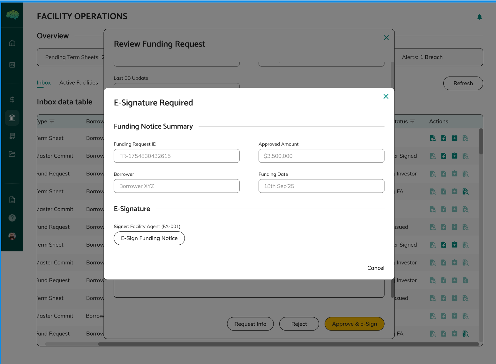

# Funding Request Review

## Overview

Funding request review is the process where facility agents evaluate borrower funding requests to ensure they comply with facility rules, have sufficient borrowing capacity, meet all requirements, and are properly documented before approval.

## Who Can Use This

- Facility Agents who review funding requests and make approval decisions
- Borrowers who want to understand how their requests are evaluated

## When This Is Used

Use funding request review when:
- Borrowers submit funding requests against active facilities
- You need to evaluate requests for compliance with facility rules
- You want to approve or reject drawdowns based on evaluation
- You need to ensure facility rules are followed
- You want to verify borrowing capacity and documentation

## Review Process

**Accessing Requests** - When borrowers submit funding requests, they appear in credit facility section in active facilities tab. It appears under the facility it belongs to. Each request shows the amount, purpose, documents uploaded and current status.

**Review Interface** - The review interface provides a comprehensive view of the funding request, including all details, documentation, and facility context. You can review the complete request information to make informed decisions.

**E-Signature Process** - When approving funding requests, you may need to complete e-signature requirements. The system guides you through the signing process to ensure proper documentation.

**Reviewing Request Details** - Open each request to review complete information including request amount, purpose, funding date, supporting documentation, collateral information (if applicable), and facility context.

**Documentation Review** - Check that all required documents are provided, verify document quality and completeness, ensure documents are readable and properly formatted, verify documents support the request, and assess documentation quality and accuracy.

**Making Evaluation** - Evaluate all factors including compliance with facility rules, borrowing capacity availability, documentation quality and completeness, collateral (if applicable), and borrower's history and performance. Consider all aspects before making decisions.

## Making Decisions

**Approve Request** - Approve when all requirements are met: request meets facility rules, sufficient borrowing capacity available, documentation is complete and adequate, collateral is acceptable (if applicable), and no compliance issues identified. After Approve and E-sign Funding notice is automatically created.

**Reject Request** - Reject when requirements are not met: request violates facility rules, insufficient borrowing capacity, incomplete or inadequate documentation, collateral issues (if applicable), or other compliance problems. After Rejection, Borrower can create new request (rejected requests cannot be resubmitted).

**Request Changes** - Request changes when improvements are needed: minor issues that can be addressed, additional documentation needed, clarifications required, or modifications needed to meet requirements. Click "Request Changes" button. Provide specific change request details. Borrower can update and resubmit, and process can repeat until approved or rejected.

## Rules & Validations

- Requests must comply with all facility rules. Any violation results in rejection or change request.

- Request amount cannot exceed available borrowing capacity. Capacity is calculated based on facility rules and current utilization.

- All required documentation must be provided. Missing or inadequate documentation results in rejection or change request.

- Collateral must meet eligibility criteria if applicable. Ineligible collateral results in rejection or change request.

- Approved requests automatically generate funding notices. You don't need to create notices manually.

- Rejected requests cannot be resubmitted. Borrowers must create new requests if rejected.

- Change requests allow editing and resubmission. Borrowers can update requests and resubmit without creating new ones.

- Decisions are final once submitted. You cannot easily reverse decisions after submission.

- Status controls workflow. Request status determines what actions are available and what happens next.

## What Happens Next

After reviewing a funding request:
- **If Approved**: Funding notice is automatically created with PENDING_TOKEN_GENERATION status, notice is sent to lenders for review, and you proceed with token generation and signing.

- **If Rejected**: Borrower receives rejection reason, borrower can create new request addressing issues, new request goes through same review process, and process can start over with improvements.

- **If Changes Requested**: Borrower receives change request details, borrower can update request with requested changes, borrower resubmits for your review, you review again and make new decision, and process can repeat until approved or rejected.

After approval:
- Funding notice is generated automatically
- You generate tokens and configure distribution to lenders
- You sign funding notice for each lender individually
- Lenders review and approve drawdowns
- After lender approval, lenders transfer funds and confirm
- Borrower receives the funds

Understanding funding request review helps facility agents effectively evaluate requests, ensure facility rules are followed, maintain proper oversight, and make informed approval decisions.
