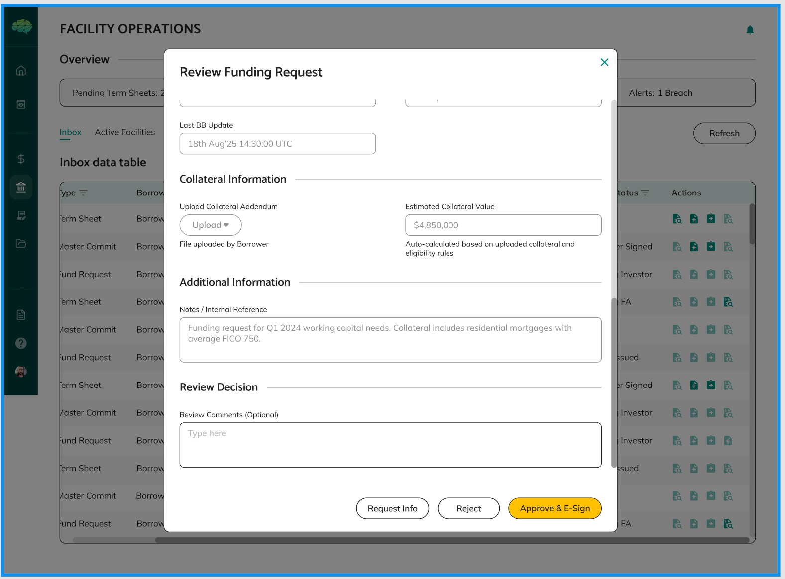

# Funding Request Review

## Overview

Funding request review is the process where facility agents evaluate borrower funding requests to ensure they comply with facility rules, have sufficient borrowing capacity, meet all requirements, and are properly documented before approval. This review process ensures proper oversight and control over fund disbursement while maintaining facility integrity.

## Who Can Use This

- Facility Agents who review funding requests and make approval decisions
- Borrowers who want to understand how their requests are evaluated

## When This Is Used

Use funding request review when:
- Borrowers submit funding requests against active facilities
- You need to evaluate requests for compliance with facility rules
- You want to approve or reject drawdowns based on evaluation
- You need to ensure facility rules are followed
- You want to verify borrowing capacity and documentation

## Review Process

**Accessing Requests** - When borrowers submit funding requests, they appear in your review queue. You can access requests through notifications or by navigating to the funding requests section. Each request shows the borrower, facility, amount, purpose, and current status.

**Review Interface** - The review modal provides a comprehensive view of the funding request, including all details, documentation, and facility context. You can scroll through the complete request information to make informed decisions.

**E-Signature Process** - When approving funding requests, you may need to complete e-signature requirements. The system guides you through the signing process to ensure proper documentation.

**Reviewing Request Details** - Open each request to review complete information including request amount, purpose, funding date, supporting documentation, collateral information (if applicable), and facility context. Review all information provided by the borrower to understand the full request.

**Checking Facility Context** - Review which facility the request is against, view facility rules and parameters, check borrower's borrowing history, verify available borrowing capacity, and understand request timing and frequency. This context helps you evaluate requests appropriately.

**Documentation Review** - Check that all required documents are provided, verify document quality and completeness, ensure documents are readable and properly formatted, verify documents support the request, and assess documentation quality and accuracy.

**Making Evaluation** - Evaluate all factors including compliance with facility rules, borrowing capacity availability, documentation quality and completeness, collateral (if applicable), and borrower's history and performance. Consider all aspects before making decisions.

## Evaluation Criteria

**Facility Rules Compliance** - Verify request amount is within facility limits, check if request complies with borrowing base calculations, verify drawdown frequency rules are followed, ensure request meets all facility-specific requirements, and check if any facility restrictions apply.

**Borrowing Capacity Verification** - Calculate available borrowing capacity, check if request amount exceeds available capacity, review current facility utilization, verify borrower hasn't exceeded limits, and ensure sufficient capacity exists for the request.

**Request Amount Assessment** - Verify amount is reasonable and justified, check if amount aligns with stated purpose, ensure amount doesn't violate facility rules, and verify amount is within approved facility limit.

**Documentation Quality** - Check all required documents are provided, verify document quality and completeness, ensure documents support the request, verify documents meet facility requirements, and assess documentation accuracy and relevance.

**Collateral Evaluation** (if applicable) - Verify collateral eligibility criteria are met, check collateral type is allowed, ensure collateral quality standards are met, review collateral valuation for accuracy, confirm collateral is available and not already pledged, and check collateral concentration is within limits.

**Overall Request Quality** - Assess whether request is well-justified, evaluate if purpose is appropriate, check if timing is reasonable, verify borrower's track record, and consider facility utilization impact.

## Making Decisions

**Approve Request** - Approve when all requirements are met: request meets facility rules, sufficient borrowing capacity available, documentation is complete and adequate, collateral is acceptable (if applicable), and no compliance issues identified. When approved, funding notice is automatically created, status changes to APPROVED, and borrower receives notification.

**Reject Request** - Reject when requirements are not met: request violates facility rules, insufficient borrowing capacity, incomplete or inadequate documentation, collateral issues (if applicable), or other compliance problems. Provide detailed rejection reason, status changes to REJECTED, borrower receives notification with reason, and borrower can create new request.

**Request Changes** - Request changes when improvements are needed: minor issues that can be addressed, additional documentation needed, clarifications required, or modifications needed to meet requirements. Provide specific change request details, status changes to CHANGES_REQUESTED, borrower can update and resubmit, and process can repeat until approved or rejected.

**Decision Documentation** - Enter approval notes if approving, provide rejection reason if rejecting, specify change request details if requesting changes, include any relevant comments or explanations, and ensure all decisions are properly documented for audit purposes.

## Rules & Validations

- Requests must comply with all facility rules. Any violation results in rejection or change request.

- Request amount cannot exceed available borrowing capacity. Capacity is calculated based on facility rules and current utilization.

- All required documentation must be provided. Missing or inadequate documentation results in rejection or change request.

- Collateral must meet eligibility criteria if applicable. Ineligible collateral results in rejection or change request.

- Approved requests automatically generate funding notices. You don't need to create notices manually.

- Rejected requests cannot be resubmitted. Borrowers must create new requests if rejected.

- Change requests allow editing and resubmission. Borrowers can update requests and resubmit without creating new ones.

- Decisions are final once submitted. You cannot easily reverse decisions after submission.

- All reviews are recorded. Every decision, reason, and action is tracked in the audit trail.

- Status controls workflow. Request status determines what actions are available and what happens next.

## What Happens Next

After reviewing a funding request:
- **If Approved**: Funding notice is automatically created with PENDING_TOKEN_GENERATION status, notice is sent to lenders for review, borrower is notified of approval, and you proceed with token generation and signing.

- **If Rejected**: Borrower receives rejection reason, borrower can create new request addressing issues, new request goes through same review process, and process can start over with improvements.

- **If Changes Requested**: Borrower receives change request details, borrower can update request with requested changes, borrower resubmits for your review, you review again and make new decision, and process can repeat until approved or rejected.

After approval:
- Funding notice is generated automatically
- You generate tokens and configure distribution
- You sign funding notice for each lender
- Borrower approves token transfer
- Funding notice becomes visible to lenders
- Lenders review and approve drawdowns
- After lender approval, funds are transferred
- Borrower receives the funds

Understanding funding request review helps facility agents effectively evaluate requests, ensure facility rules are followed, maintain proper oversight, and make informed approval decisions that protect facility integrity while serving borrower needs.
