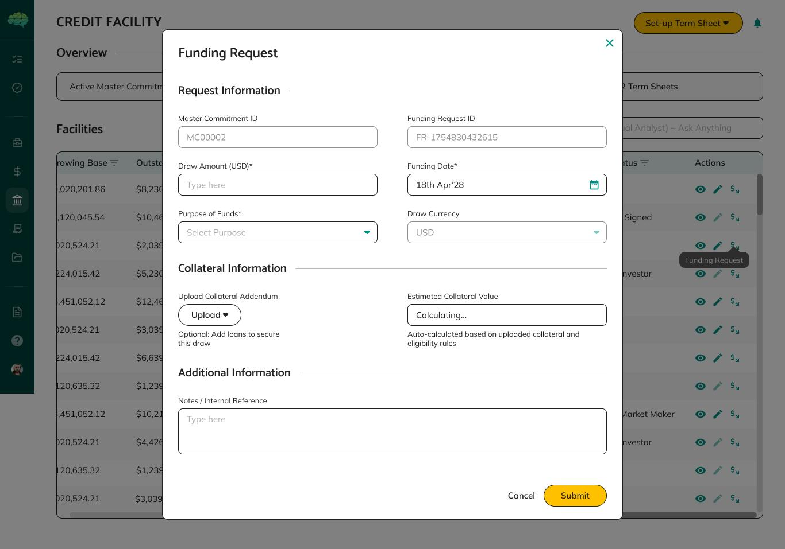

# Funding Requests Overview

A funding request is how a borrower draws from an active credit facility. The facility agent reviews each request before funds are paid out.

## How It Works

1. **Borrower creates request** — enters draw amount, funding date, purpose, currency, and uploads collateral addendum
2. **Borrower submits** → status **In review (facility agent)**
3. **Facility agent reviews** → Approve, Reject, or Request Changes
4. **If Approved** → funding notice created automatically; facility agent signs for each lender; lenders confirm and settle

## Statuses

| Status | Who acts next |
|---|---|
| **Draft** | Borrower (submit or edit) |
| **In review (facility agent)** | Facility agent |
| **Approved** | Facility agent (process notice) |
| **Rejected** | Borrower (create new request) |
| **Changes Requested** | Borrower (edit and resubmit) |

## Prerequisites

| Requirement | Who ensures it |
|---|---|
| Master commitment = **Active** | Lender (approval) |
| Facility Setup Status = **Completed** | Facility agent (deal modelling) |
| Loans with NFTs mapped (if required) | Borrower |

## Key Rules

- One request at a time — wait for the current one to be resolved
- Draw amount must fit remaining borrowing capacity
- Rejected requests are final — create a new one
- Borrowers do not sign funding requests; signatures apply on the funding notice

.png>)

→ See [Funding Requests](44_Funding_Requests.md) for borrower creation steps.
→ See [Funding Request Review (FA)](24_Funding_Request_Review.md) for facility agent review steps.
→ See [Funding Request Outcomes](25_Funding_Request_Outcomes.md) for what each decision means.
