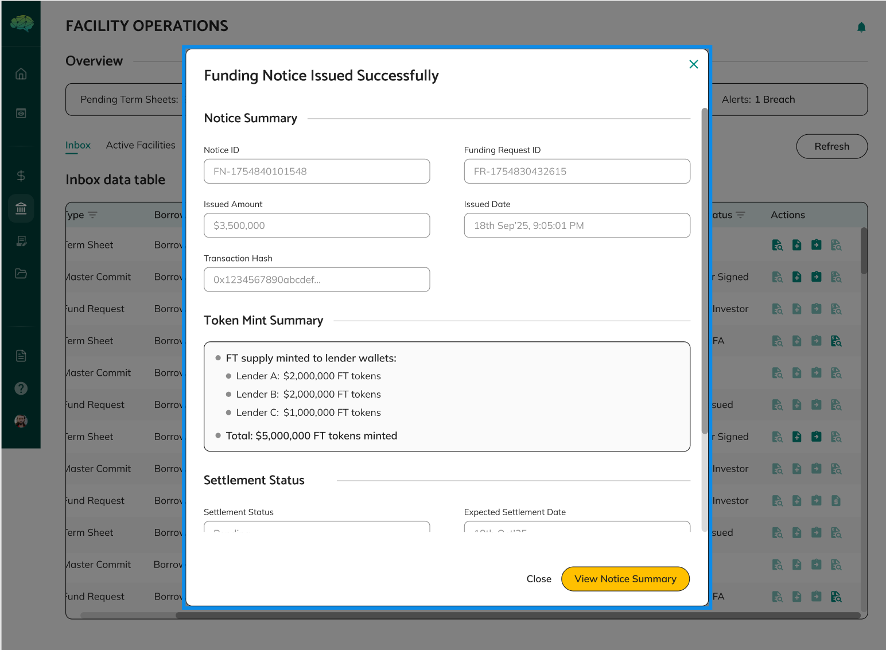

# Funding Notices Overview

## Overview

A funding notice is the official documentation for each drawdown from a credit facility. It's automatically generated when a funding request is approved by the facility agent and contains all the details needed for the drawdown, including token distribution to lenders, drawdown amounts, and fund transfer instructions. Funding notices serve as the bridge between approved funding requests and actual fund disbursement.

## What Funding Notices Are

A funding notice is the formal document that represents an approved drawdown from a credit facility. Think of it as the official paperwork for withdrawing funds—it documents the approved amount, how it will be distributed to lenders, and provides instructions for fund transfer. Funding notices are automatically created when facility agents approve funding requests, so you don't need to create them manually.

Funding notices contain all the information needed to complete the drawdown process. They include the approved amount, purpose, funding date, token distribution to lenders, and other details. Once created, funding notices go through token generation, borrower approval, lender review, and fund transfer confirmation before funds are disbursed.

## Purpose and Use Cases

Funding notices serve several important purposes:

**For Drawdown Documentation** - Funding notices provide complete documentation of approved drawdowns, ensuring all parties have proper records. They serve as official documentation for audit and compliance purposes.

**For Token Distribution** - Funding notices facilitate token generation and distribution to lenders. Tokens represent drawdown amounts and enable tracking of lender participation and fund transfers.

**For Lender Coordination** - Funding notices coordinate lender participation by showing each lender their allocated portion and enabling individual lender decisions. Each lender can approve or reject their participation independently.

**For Fund Transfer Process** - Funding notices provide instructions and documentation for the fund transfer process. They enable lenders to understand their obligations and confirm transfers.

**For Process Tracking** - Funding notices track the complete drawdown process from approval through fund disbursement. Status shows where each notice is in the process and what needs to happen next.

**For Audit and Compliance** - Funding notices provide complete audit trails of drawdowns, including approvals, token generation, lender decisions, and fund transfers. This supports compliance and accountability.

## Key Components

**Approved Drawdown Details** - Information from the approved funding request, including request amount, purpose, funding date, and facility details. This information is pre-populated from the approved request.

**Token Distribution** - Configuration of how tokens are distributed to lenders based on their participation percentages in the facility. Each lender receives their allocated portion, clearly showing their contribution amount.

**Token Status** - Status of token generation and distribution, such as PENDING_TOKEN_GENERATION, TOKEN_GENERATED, or TOKEN_APPROVED. Status tracks where tokens are in the generation and approval process.

**Per-Lender E-Signature Status** - Individual tracking of facility agent's e-signature status for each lender. Facility agents sign funding notices for each lender individually, with each lender's signature status tracked separately.

**Lender Approval Status** - Individual tracking of each lender's approval or rejection decision. Each lender can approve or reject their participation independently, and decisions are tracked separately.

**Fund Transfer Confirmation** - Tracking of lender fund transfer confirmations. Lenders confirm when they've transferred funds, completing their participation in the drawdown.

**Borrowing Base Impact** - Information about how the drawdown affects borrowing base and available capacity. This helps all parties understand facility utilization and remaining capacity.

## How Funding Notices Work

**Automatic Creation** - Funding notices are automatically created when funding requests are approved via generateFundingNotice function. System takes information from approved funding request (drawAmount, purposeOfFunds, fundingDate, drawCurrency) and master commitment (lenderGroups, facilityName, advanceRate, contractType). System generates fundingNoticeId (format: FN-YYYYMMDD-random). System creates tokenDistribution array: filters lenderGroups where lenderStatus === 'esignature_completed', calculates tokensAllocated = (votingPercentage / 100) * drawAmount for each lender, initializes each lender with esignatureStatus: 'pending', lenderApprovalStatus: 'PENDING', mintingStatus: 'pending', amountTransferred: 'pending'. System sets eSignatureTotalCount = tokenDistribution.length, eSignaturePendingCount = tokenDistribution.length, eSignatureStatus = 'pending'. System creates funding notice with PENDING_TOKEN_GENERATION status, ready for token generation.

**Token Generation** - Facility agents call API: PATCH /cf/funding-notices/:fundingNoticeId/token-distribution. System validates funding notice is in PENDING_TOKEN_GENERATION status. System validates tokenDistribution array (lenderOrgId, lenderName, commitmentAmount, tokensAllocated, votingPercentage). System calls createFTTokensForBorrower function: deploys FT contract with totalSupply = requestAmount * 10^6 (6 decimals), transfers FT tokens to borrower wallet address, transfers FT contract ownership to borrower, updates funding notice with ftContractAddress, totalTokensMinted, ftTotalSupply, ftCreatedAt, ftCreationTransactionHash. System updates borrowing base and available capacity via IA calculation (iaBBCalculationReq, extractCalculatedValues). System updates status to TOKEN_GENERATED. Tokens represent the drawdown amount and are allocated to lenders based on their participation percentages. Status changes to TOKEN_GENERATED.

**Per-Lender E-Signature** - Facility agents sign funding notices for each lender individually. Each lender's signature status is tracked separately, and the system tracks overall completion. Status remains TOKEN_GENERATED during this process.

**Borrower Token Approval** - Borrowers review token allocation and approve token transfers. Approval makes funding notices visible to lenders and enables lender review. Status changes to TOKEN_APPROVED.

**Funding Notice Details** - After approval, you can view complete funding notice details including token distribution, lender allocations, and fund transfer instructions. This provides complete visibility into the drawdown process.

**Lender Review and Approval** - Lenders review funding notices and approve or reject their participation. Each lender makes independent decisions, and participation is tracked individually. Lenders can see their allocated portion and make decisions accordingly.

**Fund Transfer Confirmation** - After approving, lenders transfer funds and confirm transfers. Each lender confirms their transfer independently, completing their participation in the drawdown. The system tracks individual lender confirmations.

**Process Completion** - Once lenders confirm transfers, the drawdown process is complete. Funds have been disbursed, and the drawdown is documented with complete audit trails.

## Important Points to Know

**Automatic Creation** - Funding notices are automatically created when funding requests are approved. You don't need to create them manually—the system creates them with pre-populated request data, ensuring consistency and completeness.

**Token Generation Required** - Facility agents must generate tokens and configure distribution before borrowers can approve transfers. Tokens represent drawdown amounts and enable tracking and distribution to lenders.

**Borrower Approval Required** - Borrowers must approve token transfers before funding notices become visible to lenders. This ensures borrowers verify allocations before proceeding and enables lender review.

**Individual Lender Tracking** - Each lender's participation is tracked individually, allowing for independent decisions and flexible participation. Lenders can approve or reject based on their own criteria.

**Per-Lender E-Signature** - Facility agents sign funding notices for each lender individually, with each lender's signature status tracked separately. This ensures proper documentation for each lender's participation.

**Complete Documentation** - Funding notices serve as complete documentation of drawdowns, ensuring all parties have proper records. All actions, approvals, and transfers are documented with complete audit trails.

**Status Tracks Process** - Funding notice status shows where each notice is in the drawdown process, from creation through token generation, borrower approval, lender review, and fund transfer. Understanding status helps you track progress.

Understanding funding notices helps you appreciate how approved funding requests become documented drawdowns, know what happens during token generation and distribution, understand when notices become visible to lenders, track the drawdown process through to fund disbursement, and understand how individual lender participation is coordinated and tracked.
