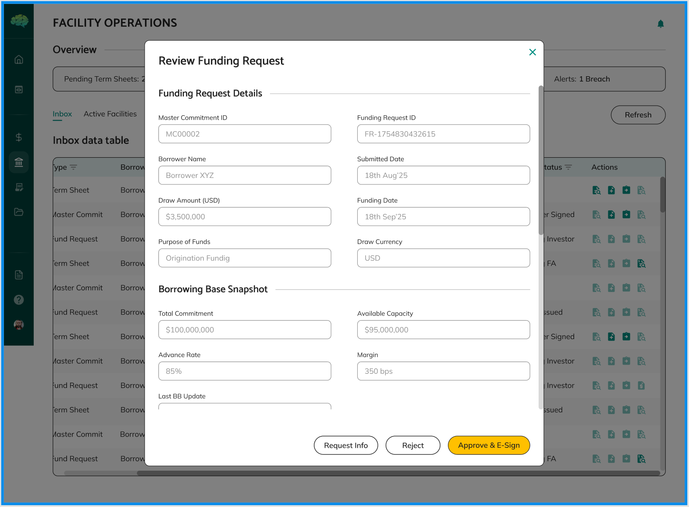

# Funding Request Review

When a borrower submits a funding request, the facility agent reviews and Approves, Rejects, or Requests Changes. No signature is required at this stage.

## Steps

1. **Credit Facility → Active Facilities tab** → open the master commitment → find request with status **In review (facility agent)** → **Review Funding Request**
2. Check:
   - Draw amount, funding date, purpose, draw currency
   - Collateral addendum (uploaded by borrower)
   - Remaining borrowing capacity vs. the draw amount

3. Choose your decision:

## Decisions

| Decision | When to use | Status changes to | What happens next |
|---|---|---|---|
| **Approve** | Amount within capacity, docs complete | Approved | Funding notice created (Pending token generation) |
| **Reject** | Does not meet terms, or capacity issue | Rejected (final) | Borrower creates a new request |
| **Request Changes** | Minor issue that can be fixed | Changes Requested | Borrower edits and resubmits |

## After Approval

1. **Funding notice** is created automatically with status **Pending token generation**
2. Click **Approve** on the notice → then **E-sign (0/n)** for each lender in Adobe Sign
3. Lenders see the notice once the signature for their portion is done
4. Lenders send funds and click **Confirm and Settle**

## Key Rules

- No signature for this approval step — signatures are on the funding notice
- Rejection is final — the borrower must create a new request
- The funding notice is created automatically; do not create it manually

→ See [Funds Transfer Confirmation](31_Funds_Transfer_Confirmation.md) for lender steps.
→ See [Funding Request Outcomes](25_Funding_Request_Outcomes.md) for what each decision means.
