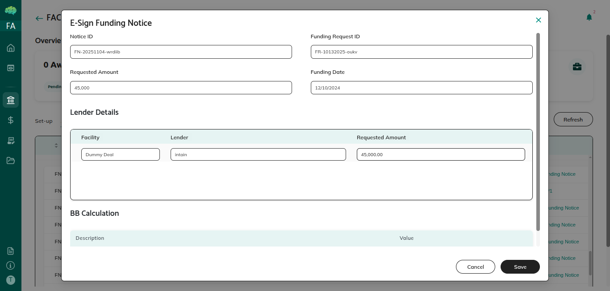
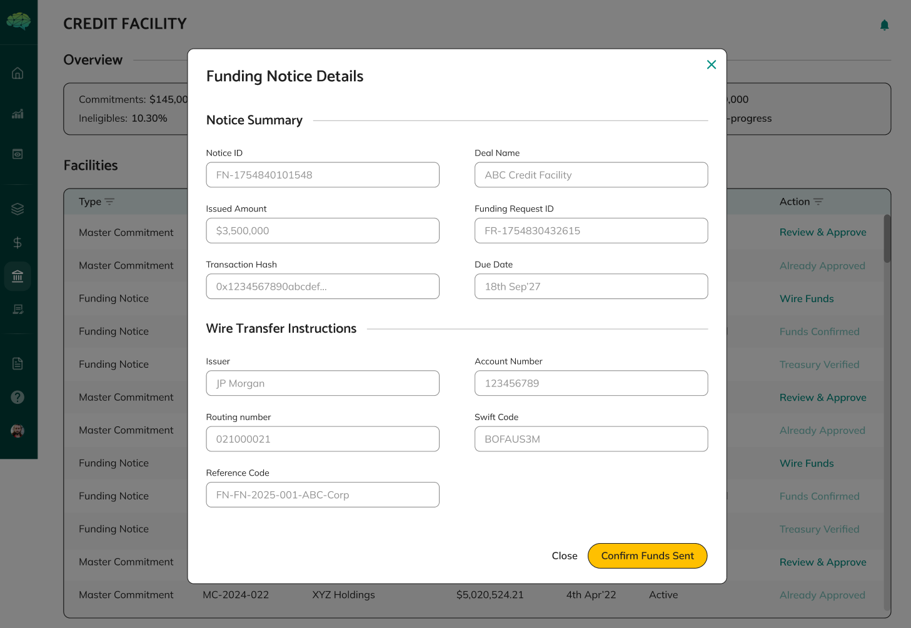

# Token Generation and Issuance

## Overview

Token generation and issuance is the complete workflow for creating and distributing tokens that represent drawdown amounts in funding notices. These tokens serve as digital representations of the drawdown that enable tracking, distribution, and management of funds across multiple lenders.

## Workflow Overview

The token generation and issuance workflow begins when a funding request is approved and a funding notice is automatically created. Facility agents generate tokens representing the drawdown amount, configure distribution to lenders based on their participation percentages, and sign funding notices. Borrowers then approve token transfers, making funding notices visible to lenders who can review and approve their participation.

## Key Stages

**Stage 1: Funding Notice Creation** - When a funding request is approved, a funding notice is automatically created with PENDING_TOKEN_GENERATION status. The notice contains all information from the approved request and is ready for token generation.

**Stage 2: Token Generation** - Facility agents generate tokens for the borrower, representing the total drawdown amount. Tokens are created digitally and linked to the funding notice. The system updates the funding notice status to TOKEN_GENERATED.

**Stage 3: Token Distribution Configuration** - Facility agents configure how tokens are distributed to lenders based on their participation percentages in the facility. Each lender's allocation is calculated automatically, showing their portion of the drawdown. Distribution is set up in the tokenDistribution array.

**Stage 4: Per-Lender E-Signature** - Facility agents sign funding notices for each lender individually. Each lender's signature status is tracked separately in the tokenDistribution array. The system tracks overall completion, and status remains TOKEN_GENERATED during this process.

**Stage 5: Borrower Token Approval** - Borrowers review the token allocation to verify amounts and distribution are correct. Once verified, borrowers approve the token transfer, which changes the funding notice status to TOKEN_APPROVED and makes the notice visible to lenders.

**Stage 6: Lender Visibility** - After borrower approval, funding notices become visible to lenders. Lenders can see their allocated token portions and review drawdown details. This enables lender review and decision-making.

**Stage 7: Lender Review and Approval** - Lenders review funding notices and approve or reject their participation. Each lender makes independent decisions, and participation is tracked individually. Lenders can see their allocated portion and make decisions accordingly.

**Stage 8: Fund Transfer Confirmation** - After approving, lenders transfer funds and confirm transfers. Each lender confirms their transfer independently, completing their participation in the drawdown. The system tracks individual lender confirmations.

## How the Workflow Progresses

**From Approval to Token Generation** - The workflow starts automatically when funding requests are approved. Facility agents initiate token generation, creating tokens for borrowers and configuring distribution. This stage transforms approved requests into tokenized drawdowns ready for distribution.

**From Token Generation to Borrower Approval** - After tokens are generated and distributed, facility agents sign funding notices for each lender. Once all signatures are complete, borrowers can review and approve token transfers. Borrower approval is required before lenders can see notices.

**From Borrower Approval to Lender Review** - Once borrowers approve token transfers, funding notices become visible to lenders. Lenders can review their allocations and drawdown details, enabling informed decision-making about participation.

**From Lender Review to Fund Transfer** - After lenders review and approve, they transfer funds and confirm transfers. Each lender completes their participation independently, and the system tracks all confirmations. Once all lenders confirm, the drawdown process is complete.

**Status Progression** - The workflow progresses through statuses: PENDING_TOKEN_GENERATION → TOKEN_GENERATED → TOKEN_APPROVED. Each status represents a specific stage and determines what actions are available. Understanding status helps you know where you are in the process.

**Individual Lender Tracking** - Throughout the workflow, each lender's participation is tracked individually. Token allocations, signature status, approval decisions, and transfer confirmations are all tracked separately, enabling flexible participation and independent decisions.

## Important Points to Know

**Automatic Notice Creation** - Funding notices are automatically created when funding requests are approved. The system creates them with pre-populated request data.

**Token Generation Required** - Facility agents must generate tokens before borrowers can approve transfers. Tokens represent drawdown amounts digitally and enable tracking and distribution to lenders.

**Distribution Based on Participation** - Token distribution is calculated automatically based on lender participation percentages in the facility. Each lender receives their allocated portion.

**Per-Lender E-Signature** - Facility agents sign funding notices for each lender individually, with each lender's signature status tracked separately.

**Borrower Approval Required** - Borrowers must approve token transfers before funding notices become visible to lenders.

**Individual Lender Decisions** - Each lender makes independent decisions about participation. Lenders can approve or reject based on their own criteria, and decisions are tracked separately.

**Complete Documentation** - All token generation, distribution, approvals, and transfers are documented with complete audit trails.

**Status Tracks Progress** - Funding notice status shows where each notice is in the workflow, from token generation through borrower approval to lender review and fund transfer.
