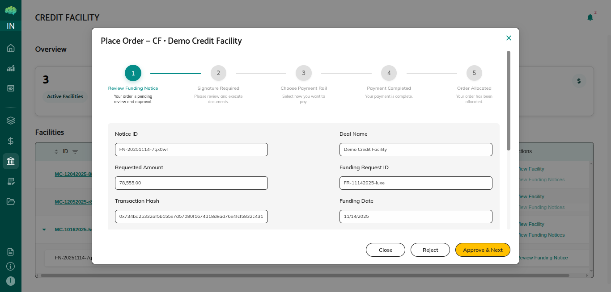

# Lender Approval and Rejection

## Overview

Lenders review funding notices and can approve or reject individual drawdowns. Each lender makes their own independent decision, and the system tracks individual lender participation separately.

## Who Can Use This

- Lenders who receive funding notices after Facility Agent e-signed the funding requests

## When This Is Used

Use lender approval when:
- Funding notice becomes visible after Facility Agent e-signed the funding requests
- You need to review a drawdown request
- You want to approve or reject participation in a drawdown
- You need to make a decision on whether to fund your portion

## Step-by-Step Process

### Reviewing Funding Notice

1. **Access Funding Notice**
   - Navigate to Credit Facility section
   - View funding notices available for your review
   - Open the notice you want to review
   - Review complete drawdown information

2. **Review Drawdown Details**
   - **Total Drawdown Amount**: Check the total drawdown amount
   - **Your Allocated Portion**: Review your allocated token portion
   - **Purpose of Funds**: Understand what the funds will be used for
   - **Funding Date**: Check when funds are needed
   - **Facility Details**: Review facility terms and conditions
   - **Token Distribution**: Review how tokens are distributed to all lenders

3. **Evaluate Drawdown**
   - Assess borrowing base impact
   - Review facility utilization after this drawdown
   - Evaluate borrower's purpose and justification
   - Consider your risk and exposure
   - Review your allocated token amount

4. **Review Supporting Information**
   - Check any supporting documentation provided
   - Review borrower's financial information if available
   - Assess collateral if applicable
   - Evaluate overall facility health

### Making Decision - Approve

1. **Evaluate Approval Criteria**
   - Drawdown meets facility rules
   - Sufficient borrowing capacity available
   - Your risk tolerance allows participation
   - Drawdown aligns with your investment criteria

2. **Approve Drawdown**
   - Click the "Approve & Next" button
   - Review next sections
   - At Final confirm your approval decision

3. **After Approval**
   - Your approval status is updated
   - Your participation is confirmed
   - You can proceed with fund transfer
   - Your portion of the drawdown is committed
   - You can transfer funds when ready

### Making Decision - Reject

1. **Evaluate Rejection Reasons**
   - Drawdown doesn't meet your criteria
   - Risk concerns
   - Facility utilization concerns

2. **Reject Drawdown**
   - Click the "Reject" button
   - Enter any comments explaining your decision
   - Confirm your rejection
   - Your rejection is recorded

3. **After Rejection**
   - Your rejection status is updated
   - Your participation is declined
   - You will not fund your portion
   - Other lenders make independent decisions
   - Borrower can see which lenders approved or rejected
   - Your rejection doesn't affect other lenders

### Tracking Decisions

1. **View Your Decision Status**
   - See your approval status (Pending/Approved/Rejected)
   - Review when you made your decision
   - Check any comments you provided
   - Verify your decision is recorded

2. **Monitor Other Lenders**
   - See which other lenders have approved
   - View which lenders have rejected
   - See which lenders are pending
   - Track overall lender participation

## Rules & Validations

- Each lender makes independent decision. Your decision doesn't affect other lenders' choices.

- Your decision doesn't affect other lenders. Other lenders can approve or reject independently.

- You can approve or reject based on your evaluation. Make decisions based on your own criteria and risk tolerance.

- Approved lenders can proceed with fund transfer. If you approve, you can transfer your portion of funds.

- Rejected lenders don't participate in that drawdown. If you reject, you won't fund your portion, but other lenders can still participate.

- Decisions are final once submitted. You cannot easily change your decision after submitting.

- Individual tracking. Each lender's decision is tracked separately with approval status.

- Borrower visibility. Borrowers can see which lenders approved and which rejected.

## What Happens Next

After making your decision:
- **If Approved**: You can proceed with fund transfer, transfer your allocated portion to the borrower, confirm the transfer, and your participation is complete.

- **If Rejected**: You don't participate in this drawdown, other lenders make their own decisions independently, borrower can see your rejection, and you can participate in future drawdowns.

After all lenders decide:
- Approved lenders transfer funds and confirm transfers
- Borrower receives funds from approved lenders
- Drawdown process completes as transfers are confirmed
- Borrower can track which lenders participated

Understanding lender approval and rejection helps you make informed decisions on drawdowns, participate effectively in credit facilities, and manage your participation based on your own evaluation criteria and risk tolerance.
