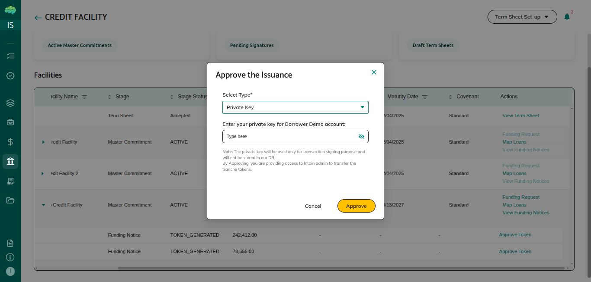

# Borrower Token Approval

## Overview

After the facility agent approves a funding notice, digital tokens are created for that drawdown. A token here is a digital record of the draw that can be split among the lenders. You must approve the transfer of those tokens before the facility agent can sign the notice for each lender. Your wallet grants the platform permission to move the tokens to lenders when they settle.




## Who Can Use This

- **Borrowers** who have an active credit facility and an approved funding request
- You need the private key for your blockchain wallet. The wallet is the account that holds the tokens. The private key is the secret that lets you approve the transfer.

## When This Is Used

Use this process when all of the following are true:

1. The facility agent has **approved** your funding request
2. A funding notice has been created and is **Pending token generation**
3. The facility agent has clicked **Approve** on the funding notice, which creates the tokens
4. The funding notice status is **Tokens generated**
5. You can see each lender's share of the tokens
6. You need to allow the platform to transfer those tokens to the lenders

Finish this step **before** the facility agent starts signatures for the lenders.

## Borrower Token Approval Flow

Token approval sits in this order:

```
Funding request Approved
       ↓
Funding notice created (Pending token generation)
       ↓
Facility agent clicks Approve → tokens are created
       ↓
Status: Tokens generated
       ↓
Borrower approves the token transfer
       ↓
Facility agent signs for each lender (E-sign 0/n through E-sign n/n)
       ↓
Each lender can see the notice after their signature is done
       ↓
Lenders review → send funds → Confirm and Settle
       ↓
Tokens are transferred → Tokens transferred
```

## Step-by-Step Process

### Step 1: Access the Credit Facility

1. Log in with your **Borrower** account
2. From the left menu, click **Credit Facility**
3. Open the **Active Facilities** tab
4. Find the master commitment that contains the funding notice
5. The notice shows **Tokens generated** when the tokens are ready for your approval

### Step 2: Review Token Details

Check the funding notice before you approve.

**Funding notice:**

| What you see | What to verify |
|--------------|----------------|
| Funding notice | This is the notice for the draw you expect |
| Draw amount | The amount matches your approved funding request |
| FT contract | The blockchain address of the token you are approving. FT means the digital token for this draw. |
| Total token supply | The number of tokens created for the draw amount |

**Each lender's share:**

| What you see | What it means |
|--------------|----------------|
| Lender | The lender who will receive tokens |
| Tokens allocated | How many tokens that lender receives |
| Share of the commitment | That lender's percentage of the facility |
| Commitment amount | That lender's amount on the master commitment |
| Signature status | **Pending signature** at this stage |
| Lender approval | **Pending** at this stage |

Confirm the lender names, shares, and amounts before you continue.

### Step 3: Approve the Token Transfer

1. Click **Approve Token** on the funding notice
2. A window asks for your wallet details
3. Enter your **Wallet Private Key**
4. Click **Approve**

**What the approval does:**
Your wallet approves the platform to transfer the tokens for this draw. That approval is recorded on the blockchain, the shared digital ledger that tracks the tokens. The funding notice keeps a record of the approval.

**What you see on the platform:**
- The funding notice history shows your approval and the time
- The notice shows that you have approved the transfer
- The facility agent can now use **E-sign**

### Step 4: Confirmation

After a successful approval:
- You see a message that the token transfer has been approved
- The notice history shows your approval and the time
- The facility agent can sign for each lender

If the approval fails, you see an error. A wrong private key or a network problem can cause this. You can try again. If the approval is already in place, a second attempt does not create another approval.

## What Happens After Approval

1. **The facility agent signs for each lender** — The action shows **E-sign (0/n)**. The facility agent signs for each lender in Adobe Sign or ZohoSign. The count moves from **E-sign (0/n)** to **E-sign (n/n)**.

2. **Each lender sees the notice in turn** — A lender can open the funding notice after their signature is **signed**. Lenders who are still **pending signature** cannot act yet.

3. **Lenders send funds** — Each lender reviews the notice, sends the funds through their bank, and clicks **Confirm and Settle**.

4. **Tokens are delivered** — As each lender confirms, their tokens are transferred. The notice records that lender's transfer as completed.

5. **The funding notice is complete** — When every lender's transfer is completed, the status becomes **Tokens transferred**.

## Rules & Validations

| Rule | Details |
|------|---------|
| **Timing** | You can approve only after the status is **Tokens generated** |
| **Required before signatures** | The facility agent cannot start lender signatures until you approve |
| **Wallet required** | You must enter a valid wallet private key |
| **Cannot be undone** | After you approve, the approval stays in place |
| **Do not approve twice** | If the approval is already recorded, repeating it does not create a second one |

## Key Points

**After the tokens exist** — You approve only after the facility agent has approved the funding notice and the tokens have been created.

**Before the facility agent signs** — Lender signatures cannot start until you approve the transfer.

**This is a wallet approval** — You are allowing the platform to move the tokens. It is not only a button click with no effect.

**When the draw is finished** — After lenders confirm settlement, the notice reaches **Tokens transferred**. You receive the funds. Lenders hold the tokens for their share.

**A record is kept** — The approval time and who approved it stay on the funding notice and on the blockchain.
