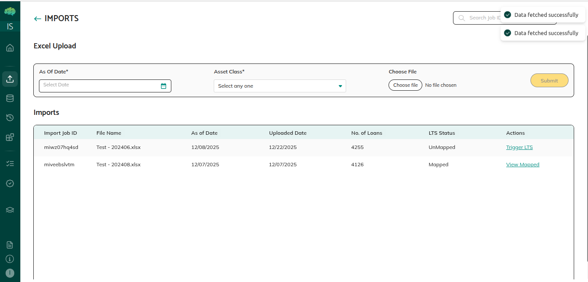
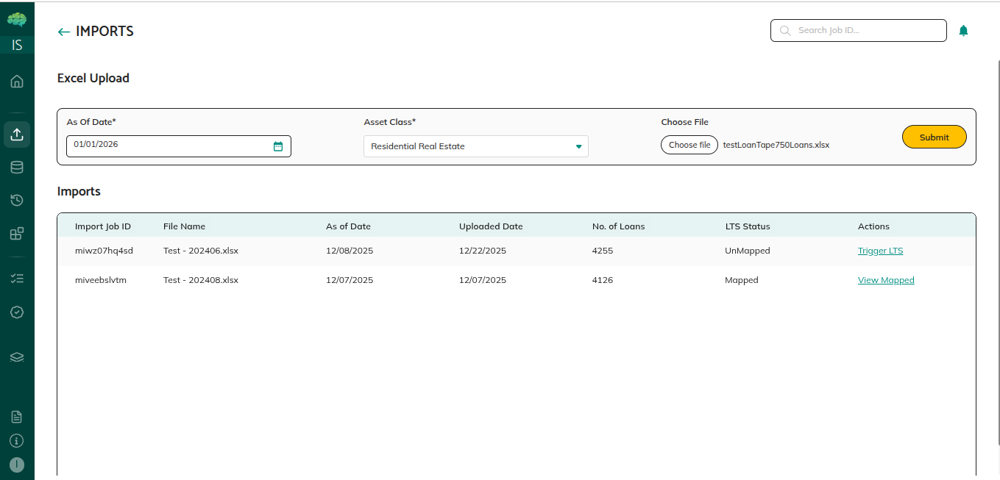
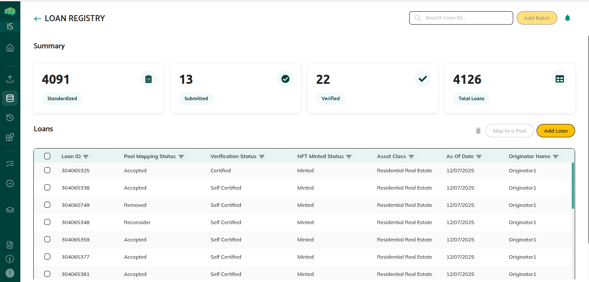
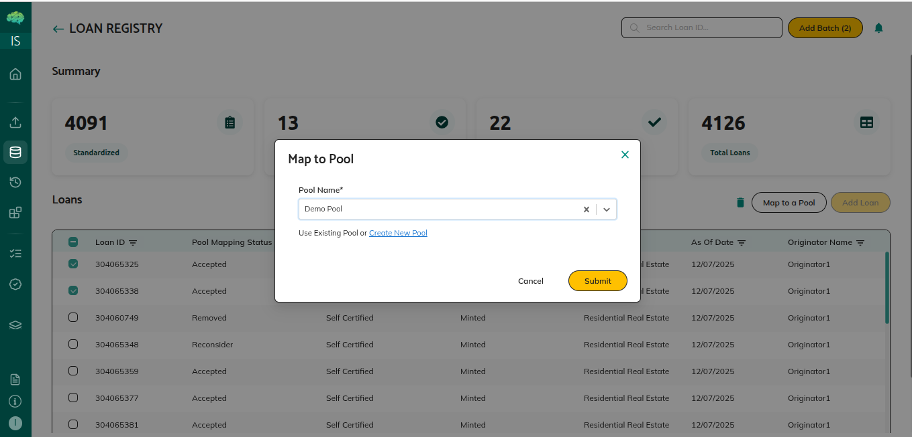

# Loan Management

## Overview

Loan management covers all the tasks issuers perform to manage loans in the platform, including uploading loans, mapping them to pools, updating loan information, managing loan statuses, and tracking loans through their lifecycle.

## Who Can Use This

- Issuers who manage loans and create pools

## When This Is Used

Use loan management when:
- You need to upload loan data into the system
- You want to map loans to pools for structured finance transactions
- You need to update loan information or correct data
- You want to manage loan statuses (map, unmap, remove, reinstate)
- You need to track loans through their lifecycle
- You want to organize loans for pool creation

## Step-by-Step Process

### Uploading Loans

1. **Prepare Loan Data**
   - Organize loan data in a file (Excel, CSV, or other supported format)
   - Ensure all required fields are included
   - Verify data accuracy and completeness
   - Check data format matches system requirements
   - Include borrower information, financial details, and loan characteristics

2. **Access Imports**
   - Navigate to "Imports" section

3. **Select and Upload File**
   - Click to browse for your loan file
   - Select the file containing loan data
   - Review file selection
   - Click "Submit" to start the upload process

4. **System Processing**
   - System processes and standardizes the loan data
   - The File Uploaded is validated and checked for errors
   - The Excel is stored in the system and appears in the below table with action "Trigger LTS"
   - Click on Trigger LTS

5. **Review Standardized Loans**
   - "Map Fields" pop up will show up
   - Check that data mapped correctly
   - Verify loan information is accurate
   - Review any validation messages or errors
   - Correct any issues if needed
   - Loans are ready for mapping to pools
   - Click on "Save Mapping" to save the loans

### Mapping Loans to Pools

1. **Access Loan Registry**
   - Navigate to the Loans section
   - View list of available loans
   - Filter loans if needed (by status, unmapped, etc.)
   - Select loans you want to map

2. **Select Loans to Map**
   - Choose individual loans or use bulk selection
   - Can select multiple loans at once
   - Verify loans are not already mapped to another pool
   - Review selected loans

3. **Choose Target Pool**
   - Select the pool you want to map loans to
   - Choose from your available pools
   - Verify correct pool is selected
   - Ensure pool is in appropriate status (Created or Preview)

4. **Confirm Mapping**
   - Review your selection (loans and pool)
   - Confirm the mapping action
   - Click "Submit" button
   - Mapping is processed

5. **Verify Mapping**
   - Loans are mapped to the pool
   - Pool metrics update automatically
   - Pool loan count increases
   - Pool balances increase
   - Verify metrics updated correctly

## Rules & Validations

- Loans can only belong to one pool at a time - you must unmap a loan from one pool before mapping it to another.

- You must unmap a loan from one pool before mapping to another - the system prevents mapping loans that are already mapped.

- Removed loans are excluded from pool calculations - they don't contribute to metrics but remain visible for tracking.

- Pool metrics update automatically when loans are mapped or removed - you don't need to manually recalculate.

- Some statuses restrict certain actions - for example, you may not be able to map loans if the pool is in Deal status.

- Loan data must be in correct format - upload files must match system requirements for successful processing.

- Required fields must be included - missing required fields may cause upload errors or validation issues.

- Status changes are recorded - all status changes are tracked with who changed what and when.

- Pool status affects loan management - some pool statuses may restrict loan mapping, removal, or other actions.

- Complete audit trail - all loan management actions are recorded for audit and compliance purposes.

## What Happens Next

After uploading loans:
- Loans are available for mapping to pools
- You can create pools and map loans to them
- Loans contribute to pool metrics when mapped
- You can manage loans throughout their lifecycle

After mapping loans:
- Pool metrics calculate automatically
- Loans contribute to pool characteristics
- Pool is ready for sharing or further configuration
- You can add or remove loans as needed

After managing loan statuses:
- Pool metrics reflect current loan status
- Removed loans don't affect calculations
- Reinstated loans are included again
- Unmapped loans become available for other pools

Understanding loan management helps you effectively organize your loan portfolios, create successful pools, maintain loan data quality, and manage loans throughout the structured finance transaction process.
