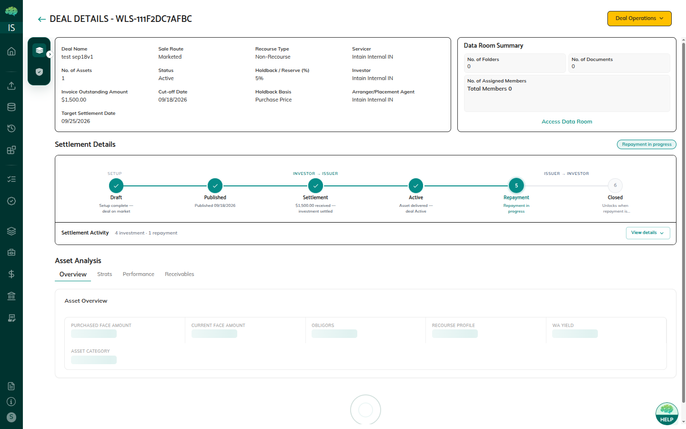
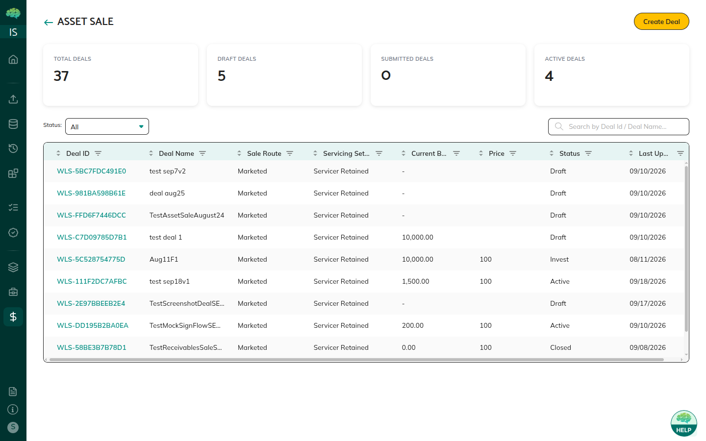

# Asset Sale Overview

## Overview

An **Asset Sale** is a transaction where an issuer sells a portfolio of loans or receivables to one or more investors. On Intain Markets, the module covers the full path: create the deal, publish it for underwriter review, allocate investors, settle ownership, then manage repayment and closure.

Internally this product line is also called Whole Loan Sale (WLS). In the UI, the label is **Asset Sale**.

## What Asset Sale Is

Unlike securitization, where loans are pooled and sliced into tranches, an Asset Sale transfers the loans themselves from the issuer (seller) to the investor (buyer).

The deal is the unit of work. It packages loans, sale terms, and documents, then moves through a status-driven workflow:

| Component | What it does |
|-----------|--------------|
| **Deal** | Packages loans with sale terms |
| **Commitment** | Captures how much each investor wants to buy |
| **Settlement** | Exchanges funds and transfers NFT ownership |
| **Repayment** | Passes borrower payments through to investors |
| **Receivables NFT** | On-chain proof of ownership after settlement |

## Purpose and Use Cases

- **Issuers** package and sell loan portfolios with a clear review and settlement trail.
- **Investors** review, commit, sign, settle, and hold tokenized ownership.
- **Underwriters (Market Makers)** review terms, allocate investors, and oversee publication.
- **Servicers** keep loan tapes current after the deal is Active.

## Key Components

**Deals** — Created by the issuer, reviewed by the underwriter, then shown to investors. Status controls who can act.

**Loan assignment** — Add individual loans or map an entire pool. Only minted loans are eligible.

**Sale terms** — Pricing (Par / Premium / Discount), cutoff and settlement dates, commit window, and optional recourse.

**Investor agreements** — Signed via Adobe Sign, or uploaded as a signed PDF. Signing is allowed only when the deal is in **Invest**.

**Settlement** — Bank wire (default) or stablecoin (USDC via Wormhole). After funds and NFT transfer, the deal becomes **Active**.

**Repayment and NFT burn** — The issuer records repayment; the investor confirms receipt and burns the NFT so the deal can close.

## How Asset Sale Works

1. **Create** — Issuer opens **Asset Sale** in the sidebar, clicks **Create Deal**, and completes the 3-step wizard (Basics → Pool Selection → Sale Terms). The deal is saved as **Draft**.
2. **Publish** — Issuer submits the deal. Status becomes **Pending Review**.
3. **Review** — Underwriter approves (→ **Published**) or rejects (→ **Draft**).
4. **Commit and allocate** — Investors submit amounts. The underwriter finalizes allocation (→ **Invest**).
5. **Sign** — The selected investor signs the agreement.
6. **Settle** — Funds move and receivables NFTs transfer. Deal becomes **Active**.
7. **Repay and close** — Issuer records repayment. Investor confirms and burns the NFT. Deal becomes **Closed**.

## Important Points to Know

- Each role sees a different dashboard. Issuers see Draft deals and **Create Deal**. Underwriters see deals from Pending Review onward. Investors see deals from Published onward.
- Actions are enabled only at the matching status. If a button is disabled, the deal is not at the required stage.
- Settlement can use bank wire or stablecoin. Repayment currently supports bank wire only.

See also: [Deal Lifecycle & Statuses](33_Asset_Sale_Deal_Lifecycle_and_Statuses.md) · [Settlement](36_Settlement_and_NFT_Transfer.md) · [Repayment Flow](37_Repayment_Flow.md)
