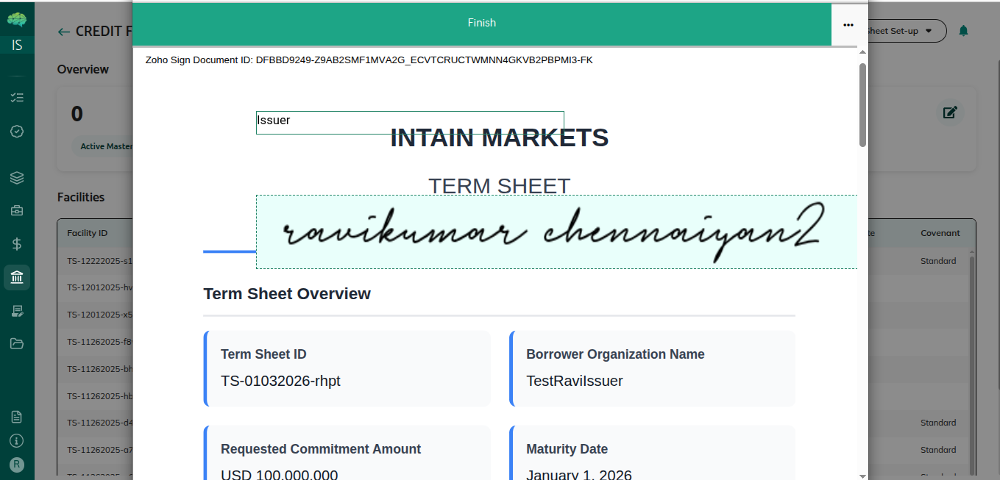

# Term Sheet Submission

## Overview

Term sheet submission is the process where borrowers submit their term sheets to facility agents for review. This guide covers how to prepare term sheets, complete electronic signatures, and submit them effectively to move forward with credit facility setup.

## Who Can Use This

- Borrowers who create term sheets and want to propose credit facilities

## When This Is Used

Use term sheet submission when:
- You've completed your term sheet with all required information
- You're ready to submit for facility agent review
- You want to propose a credit facility to lenders
- You need to move forward with facility setup
- You've reviewed and verified all term sheet information

## Step-by-Step Process

### Preparing for Submission

1. **Access Term Sheet Setup**
   - Navigate to the Term Sheets section
   - Click "Term Sheet Setup" button
   - Select creation method:
     - **Create Via Wizard**: Opens form to enter facility details step-by-step
     - **Upload Signed**: Upload a signed term sheet document; system extracts details and creates term sheet

2. **Complete Term Sheet Information**
   - **requestedCommitmentAmount**: Total borrowing limit requested (numeric value in USD, parsed using parseFloat)
   - **advanceRate**: Percentage of collateral value that can be borrowed (numeric, e.g., 85.0, parsed using parseFloat)
   - **pricingIndex**: Base rate index selection (string, e.g., "SOFR", "SOFR 1M")
   - **margin**: Spread added to pricing index (numeric, e.g., 2.5, parsed using parseFloat)
   - **fixedRate**: Fixed interest rate if applicable (numeric, parsed using parseFloat, alternative to index + margin)
   - **maturityDate**: Facility maturity date (date format, converted to UTC using DateUtils.toUTCDate)
   - **drawFrequency**: Frequency of allowed drawdowns (string, e.g., "Monthly", "Quarterly")
   - **covenantTemplate**: Select applicable covenant template (string)

3. **Upload Required Documents**
   - **collateralProfile**: Upload collateral profile document (fileType: 'collateralProfile', stored in IPFS)
   - **financialStatements**: Upload financial statements (fileType: 'financialStatements', stored in IPFS)
   - **kycDocuments**: Upload KYC documentation (fileType: 'kycDocuments', stored in IPFS)
   - **collateralData**: Upload collateral data files (fileType: 'collateralData', stored in IPFS)
   - **fundingSheet**: Upload funding sheet if applicable (fileType: 'fundingSheet', stored in IPFS)
   - Documents can only be uploaded when status is 'DRAFT' or 'CHANGES_REQUESTED'. Documents are uploaded to IPFS and IPFS hashes are stored. Document history arrays track upload history.

4. **Review and Save**
   - Review all entered information for accuracy
   - Verify all required fields are filled
   - Ensure documents are uploaded correctly
   - Save as draft to continue later or proceed to signing

### Signing the Term Sheet

1. **Initiate Electronic Signature**
   - Ensure term sheet is complete and ready
   - Click "Sign" button or similar
   - Electronic signature process begins
   - Signature interface opens

2. **Review Documents Before Signing**
   - Review the complete term sheet document
   - Verify all terms and conditions are correct
   - Check that all information is accurate
   - Ensure you understand what you're signing
   - Review all attached documents

3. **Complete Electronic Signature**
   - Follow the signature interface instructions
   - Apply your electronic signature
   - Complete all required signature fields
   - Confirm your signature
   - Verify signature is recorded

4. **Verify Signature Completion**
   - Confirm signature is complete
   - Review the signed version
   - Verify signature is recorded correctly
   - Status changes to show term sheet is signed (e.g., "BorrowerSigned")
   - You can preview the signed version

5. **Review Signed Version**
   - Preview the signed term sheet
   - Verify all information is still correct
   - Check that signature is included
   - Confirm document is ready for submission

### Submitting the Term Sheet

1. **Final Review Before Submission**
   - Review signed term sheet one final time
   - Verify all information is correct
   - Check documents are attached
   - Ensure signature is complete
   - Confirm you're ready to submit

2. **Submit for Facility Agent Review**
   - Click "Submit" button or similar
   - System calls API: POST /cf/submitTermSheet/:termSheetId
   - System validates term sheet status is 'DRAFT' or 'BorrowerSigned' (if status is FAReview, returns success without changes)
   - System updates term sheet: sets status to "FAReview", sets submittedAt timestamp, updates updatedAt and updatedBy
   - System adds entry to statusHistory array: status: 'FAReview', userId, timestamp, comments: 'Term sheet submitted for facility agent review', sequence, revisionNumber
   - System adds entry to actionHistory array: action: 'Submit', userId, timestamp, comments: 'Term sheet submitted for facility agent review', details: { previousStatus, newStatus: 'FAReview' }
   - Review any confirmation messages
   - Understand that submission moves term sheet to review
   - Confirm the submission action

3. **Submission Processing**
   - Term sheet is submitted to facility agent
   - Status changes to "FAReview"
   - Facility agent receives notification
   - You receive confirmation of submission

4. **Wait for Facility Agent Decision**
   - Facility agent reviews your term sheet
   - Review typically takes a few days
   - You receive notifications about status changes
   - You can monitor review progress

5. **Handle Facility Agent Decision**
   - **If Approved**: Master commitment is automatically created, you receive notification
   - **If Rejected**: You receive rejection reason, you can create a new term sheet
   - **If Changes Requested**: You receive change request details, you can update and resubmit

## Rules & Validations

- You can submit term sheet in DRAFT or BorrowerSigned status - system validates status is 'DRAFT' or 'BorrowerSigned' before allowing submission.

- All required fields must be filled - incomplete term sheets cannot be submitted.

- Required documents must be uploaded - missing documents may prevent submission or cause rejection.

- You can submit from DRAFT status without signing - signing is optional, but BorrowerSigned status allows preview before submission.

- Status must be DRAFT or BorrowerSigned before submission - system validates status before allowing submission.

- Once submitted, editing is restricted - you cannot edit term sheets while they're under review.

- Submission moves term sheet to review - status changes to indicate it's under facility agent review.

- Facility agent makes decision - you must wait for facility agent to review and decide.

- Complete audit trail - all submissions and status changes are recorded with timestamps.

- Notifications are sent - you receive notifications when term sheet is submitted and when decisions are made.

## What Happens Next

After submitting term sheet:
- Term sheet is sent to facility agent for review
- Facility agent evaluates your proposal
- You receive notification of decision
- If approved, master commitment is automatically created
- If rejected, you receive reason and can create a new term sheet
- If changes requested, you receive details and can update and resubmit

After facility agent approval:
- Master commitment is automatically created
- Facility agent configures the complete facility structure
- Facility agent submits master commitment for lender approval
- Lenders review and approve the facility
- Facility becomes active, and you can create funding requests

Understanding term sheet submission helps you effectively propose credit facilities, complete the submission process correctly, and move through the approval workflow to active facility setup.
