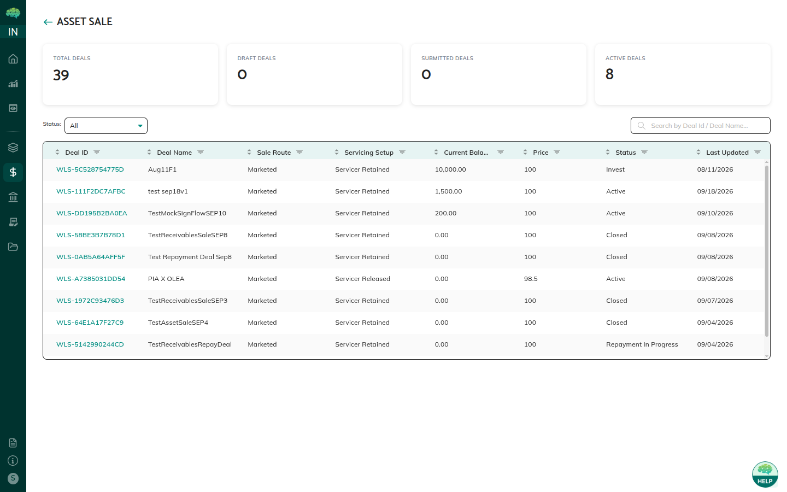

# Investor Commitment & Allocation

## Overview

After a deal is **Published**, investors submit a commitment amount. The underwriter reviews those amounts, fits them to deal capacity, and finalizes allocation. The deal then moves to **Invest** so the investor agreement can be signed. This stage does not move money yet — it only locks who is buying and for how much.

## Who Can Use This

- **Investors** — review the deal and submit or update a commitment
- **Underwriters (Market Makers)** — see all commitments and finalize allocation

Issuers can watch progress on deal details but do not enter or change commitment amounts.

## When This Is Used

Use this when:

- The underwriter has approved the deal and status is **Published** or **Commit**
- You are an investor deciding how much to buy
- You are an underwriter and commitments need to be reduced so they fit the deal
- Allocation must be locked before agreement signing and settlement

## Step-by-Step Process

### Investor: review the deal

1. Log in as Investor and open **Asset Sale**. Draft, Pending Review, and Approved deals are hidden.
2. Open the deal. Review the loan list, sale terms (price basis, cutoff, settlement date, commit window), recourse, and documents.
3. Use **Asset Analysis** if you need stratifications or risk checks before you commit.

### Investor: submit a commitment

1. Open the commitment section on the deal.
2. Enter the amount you want to invest. It cannot be higher than the remaining available amount.
3. Review the amount and click **Submit**.
4. The underwriter sees your commitment immediately. You can change the amount until allocation is finalized.

If the commit window has ended, new or updated commitments are not accepted.

### Underwriter: review and allocate

1. Open the deal and the commitment list (investor name and amount).
2. Compare **total committed** to deal size:
   - Under-subscribed — you can wait for more commitments or allocate what you have.
   - Fully subscribed — amounts already fit.
   - Over-subscribed — reduce amounts so they fit capacity.
3. Confirm the final allocation. Status becomes **Invest**. Investors are notified of their locked amount.

### Agreement signing

Signing is allowed only in **Invest**. The selected investor signs in Adobe Sign, or the issuer uploads a signed PDF. Status must be **Signed** before settlement. Details: [Investor Agreement & E-Signature](40_Investor_Agreement_and_E-Signature.md).

### What you will see

On the investor dashboard, committed deals show your amount and whether allocation is still open. On the underwriter view, the Investor(s) column and commitment list show every submitted amount so you can see over-subscription before you lock allocation. After **Invest**, amounts are read-only and the agreement action becomes the next step.

If you cannot find a deal, check Buyer Visibility and that status is at least **Published**. Draft deals never appear for investors.

## Rules & Validations

- Only **Published** or **Commit** deals accept commitments.
- One commitment per investor per deal; the amount can change until allocation is locked.
- Allocation cannot exceed deal capacity.
- After finalize, amounts cannot be edited.
- Settlement cannot start until the agreement is **Signed**.
- Buyer Visibility (**All** or **Selected**) controls which investors can see the deal.

## What Happens Next

After allocation and signing, the deal is ready for [Settlement & NFT Transfer](36_Settlement_and_NFT_Transfer.md). Investors prepare the selected rail (bank wire or stablecoin). The issuer and underwriter watch settlement from the same deal page.

If allocation must change after **Invest**, that is not an in-place edit — the deal would need a controlled unwind with your operations team. Do not assume you can reopen commitments from the UI.
