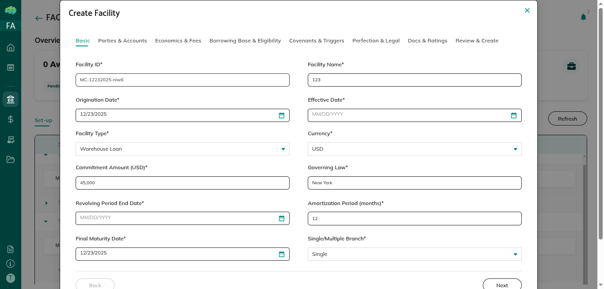
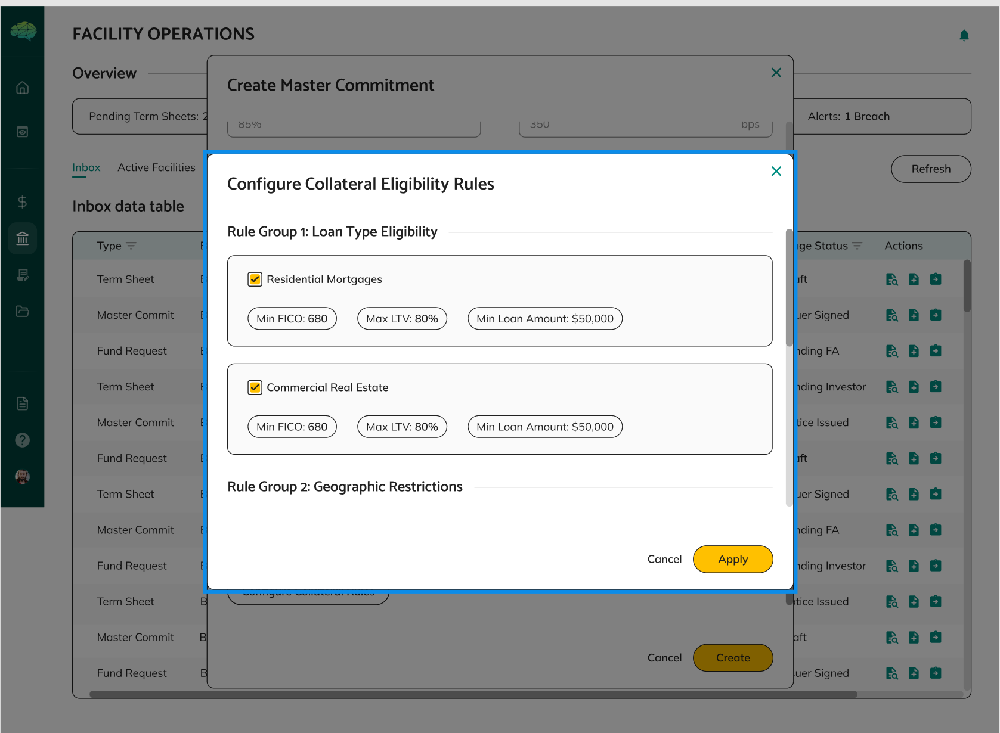
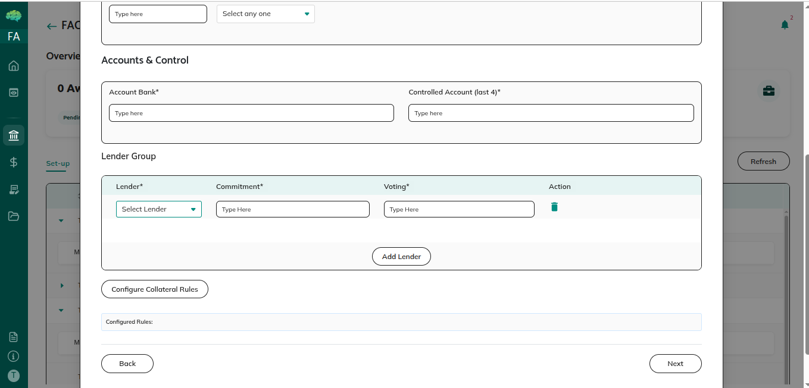
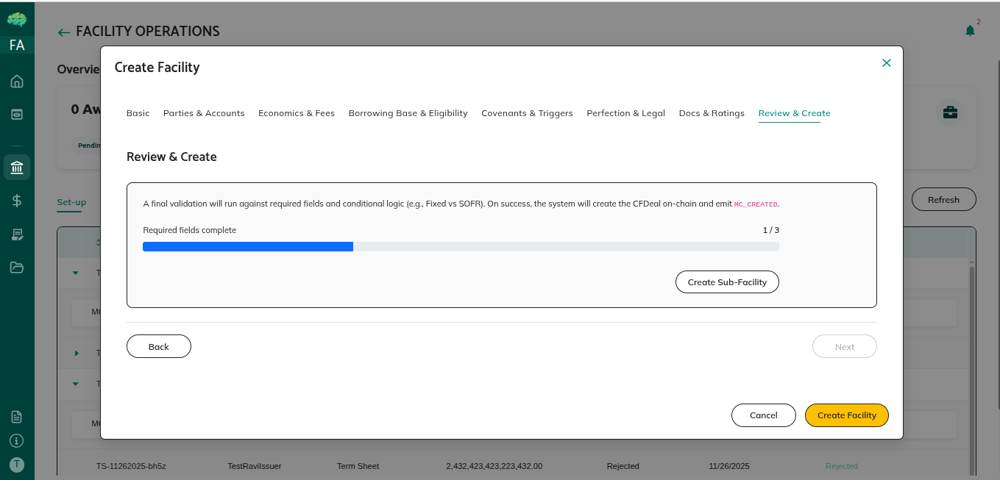

# Facility Creation

## Overview

Facility creation is the process where facility agents configure master commitments after they're automatically created from approved term sheets. This guide covers how to set up facility rules, configure lender groups, define borrowing base calculations, and complete facility setup.

## Who Can Use This

- Facility Agents who configure master commitments after term sheet approval

## When This Is Used

Use facility creation when:
- Term sheet has been approved by you
- Master commitment is automatically created
- You need to configure facility rules and parameters
- You want to set up lender groups and participation
- You're preparing facility for lender approval

## Step-by-Step Process

### Accessing Master Commitment

1. **Locate Master Commitment**
   - Navigate to master commitments section
   - Find master commitment created from approved term sheet
   - Status shows as "Draft"
   - Master commitment is pre-populated with term sheet data

2. **Review Pre-populated Information**
   - Review term sheet data that was transferred
   - Verify facility name, amount, and basic terms
   - Check that information is correct
   - Understand what needs to be configured
   - **Check Contract Type** - Review whether the facility uses a single contract or multiple contracts. This determines whether you'll configure one master commitment or create sub-commitments for different lenders.

### Understanding Contract Types

**Single Contract Type** - When the facility uses a single contract, all lenders participate under one master commitment. You configure one set of lender groups, and all lenders review and approve the same master commitment. This is the standard approach for most facilities where all lenders work together under a single agreement.

**Multiple Contract Type** - When the facility uses multiple contracts, you can create separate sub-commitments from the parent master commitment. This is useful when different lenders need separate legal contracts or when the facility needs to be split into multiple sub-facilities under one master facility. Each sub-commitment inherits all terms from the parent but starts with empty lender groups, allowing you to configure different lenders for each sub-commitment. Each sub-commitment can be independently submitted to lenders and activated.

**When to Use Multiple Contracts** - Use multiple contracts when:
- Different lenders require separate legal contracts
- The facility structure needs to be split into multiple sub-facilities
- Different lender groups need separate agreements under one master facility
- Legal or regulatory requirements necessitate separate contracts

**Working with Multiple Contracts** - If the contract type is "multiple", you'll first configure the parent master commitment with all facility rules and parameters. Then you can create sub-commitments from the parent, each with its own lender groups. When you submit the parent master commitment, all associated sub-commitments are also submitted for lender approval.

### Configuring Facility Rules

1. **Set Up Borrowing Base Calculations**
   - Navigate to Borrowing Base section
   - Select calculation method
   - Define how borrowing base is calculated
   - Set calculation parameters and formulas
   - Configure advance rates
   - Set borrowing limits

2. **Define Collateral Eligibility Rules**
   - Go to Collateral Rules section
   - Set eligibility criteria for collateral
   - Define collateral quality requirements
   - Set age and geographic limits
   - Configure other eligibility criteria
   - Define valuation methods

3. **Configure Facility Parameters**
   - Go to Facility Parameters section
   - Set operational parameters
   - Configure reporting requirements
   - Set up covenant templates
   - Define monitoring requirements
   - Complete all required parameters

4. **Set Up Other Rules**
   - Configure drawdown frequency rules
   - Set utilization limits
   - Define payment terms
   - Set interest rate structure
   - Configure fee calculations
   - Complete all facility rules

### Setting Up Lender Groups

1. **Add Lenders**
   - Navigate to Lender Groups section
   - Click "Add Lender" button or similar
   - Select lender organization from available options
   - Enter lender details
   - Add lender to group
   - Repeat for all lenders

2. **Configure Lender Details**
   - Set commitment amount for each lender
   - Configure voting percentages
   - Set lender-specific terms if applicable
   - Define participation percentages
   - Complete lender configuration
   - Verify all lenders are configured

3. **Review Lender Configuration**
   - Review all lender details
   - Verify commitment amounts total correctly
   - Check participation percentages
   - Ensure all lenders are included
   - Confirm configuration is complete

### Creating Sub-Commitments (Multiple Contract Type Only)

1. **Create Sub-Commitment**
   - If contract type is "multiple", navigate to create sub-commitment option
   - Click "Create Sub-Commitment" or similar button
   - System creates a new sub-commitment from the parent
   - Sub-commitment inherits all facility rules and parameters
   - Sub-commitment starts with empty lender groups

.png)

2. **Configure Sub-Commitment Lender Groups**
   - Navigate to the sub-commitment you created
   - Add lenders specific to this sub-commitment
   - Configure commitment amounts and participation percentages
   - Set lender-specific terms if applicable
   - Complete lender configuration for this sub-commitment

3. **Repeat for Additional Sub-Commitments**
   - Create additional sub-commitments as needed
   - Configure lender groups for each sub-commitment
   - Each sub-commitment can have different lenders
   - All sub-commitments share the same facility rules from parent

4. **Review All Sub-Commitments**
   - Review all sub-commitments you've created
   - Verify lender groups are correctly configured
   - Ensure all sub-commitments are ready for submission
   - Check that all required fields are complete

### Completing Facility Setup

1. **Review All Configuration**
   - Review facility rules and parameters
   - Check borrowing base configuration
   - Verify collateral eligibility rules
   - Review lender group configuration
   - Ensure all required fields are complete
   - If multiple contract type, review all sub-commitments

2. **Validate Configuration**
   - Check that validation passes
   - Verify all required fields are filled
   - Ensure calculations are correct
   - Confirm setup status shows "Completed"
   - Review everything one final time

3. **Submit for Lender Approval**
   - Click "Submit" or "Create" button
   - Confirm submission action
   - Status changes to "Pending Lender Approval"
   - If multiple contract type, all sub-commitments are also submitted
   - Lenders receive notifications
   - Facility is ready for lender review

## Rules & Validations

- You must complete all required fields before submission - incomplete configurations cannot be submitted.

- At least one lender must be configured - facilities require at least one lender to proceed.

- Facility rules must be complete - all rules, calculations, and parameters must be configured.

- Validation must pass before submission - system validates configuration before allowing submission.

- Once submitted, editing is restricted - make sure configuration is correct before submission.

- Setup status must show "Completed" - you cannot submit until setup is complete.

- Master commitment is pre-populated - term sheet data is automatically transferred, so you don't need to re-enter it.

- You can save multiple times - save your progress as you configure, status remains "Draft" until submission.

- Status controls actions - you can only edit while status is "Draft".

- Complete audit trail - all configuration changes are recorded with timestamps.

- Contract type determines structure - single contract type uses one master commitment, multiple contract type allows sub-commitments.

- Sub-commitments require parent - you can only create sub-commitments if the parent master commitment has contract type "multiple".

- Sub-commitments inherit parent rules - all facility rules and parameters are inherited from parent, but lender groups start empty.

- All sub-commitments submit together - when you submit a parent master commitment with multiple contract type, all associated sub-commitments are also submitted.

## What Happens Next

After configuring master commitment:
- You submit for lender approval
- Status changes to "Pending Lender Approval"
- Lenders receive notifications
- Lenders review master commitment
- Any lender approval activates the facility
- Facility becomes active when approved
- Borrowers can create funding requests

After lender approval:
- Facility status changes to "Active"
- Facility is operational and ready for use
- Borrowers can create funding requests
- Facility agent can manage active facility
- Drawdowns can begin

Understanding facility creation helps facility agents effectively configure master commitments, set up complete facility structures, and prepare facilities for lender approval and activation.
