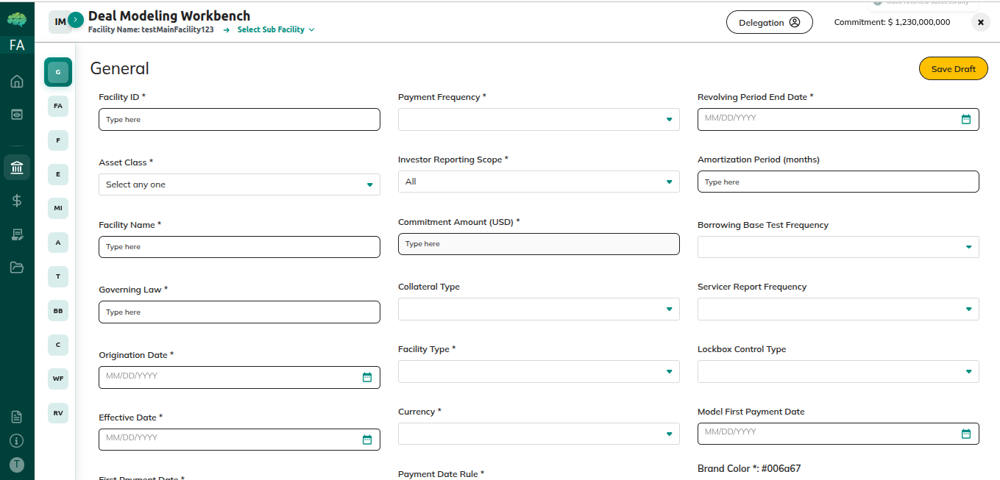
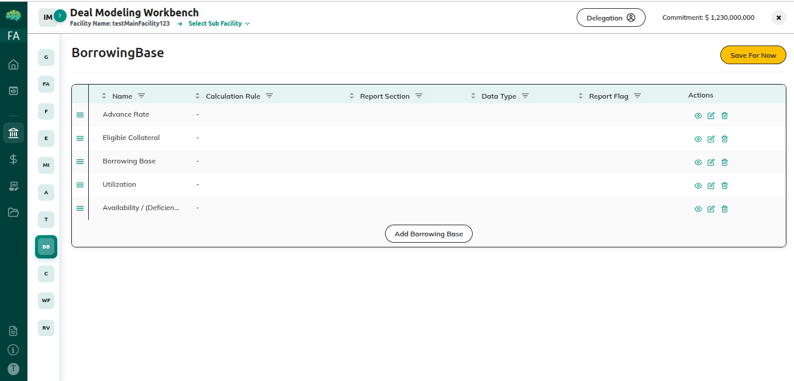
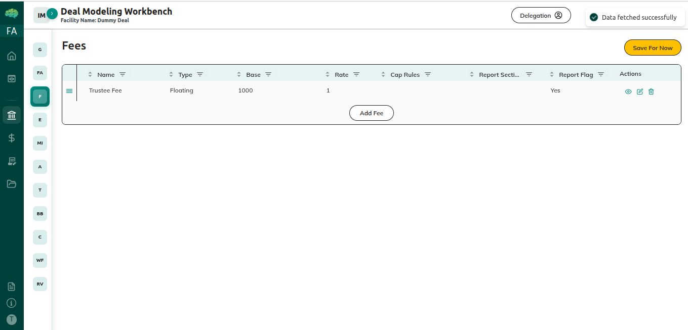
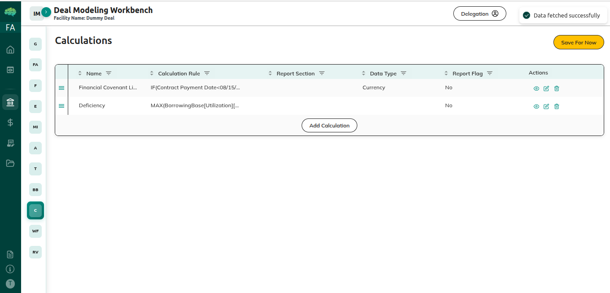

# Deal Setup and Calculations

## Overview

Deal setup and calculations involve configuring the financial modeling, borrowing base calculations, and facility parameters that determine how the credit facility operates. This guide covers how facility agents set up these calculations.

**Deals Management** - The deals table provides a comprehensive view of all deals, allowing you to review deal details, track progress, and manage deal-related activities.

## Who Can Use This

- Facility Agents who configure facility calculations and parameters

## When This Is Used

Use deal setup and calculations when:
- You're configuring a master commitment
- You need to set up borrowing base calculations
- You want to define facility parameters
- You're setting up financial modeling
- You're preparing facility for operation

## Step-by-Step Process

### Setting Up Borrowing Base Calculations

1. **Configure Calculation Method**
   - Navigate to Borrowing Base section
   - System uses Investment Agent (IA) integration for borrowing base calculations
   - System calculates values including available capacity, borrowing base, utilization percentage, and collateral value
   - Master commitment is updated with calculated values
   - All calculations are recorded with complete history

2. **Define Collateral Eligibility**
   - Set what types of collateral qualify
   - Define collateral quality requirements
   - Set age limits for collateral
   - Configure geographic limits
   - Set other eligibility criteria
   - Define how collateral is evaluated

3. **Set Advance Rates**
   - Set advance rate per collateral type
   - Configure rate adjustments based on quality
   - Set maximum and minimum advance rate limits
   - Define rate calculation methods
   - Save rate configuration
   - Verify rates are appropriate

4. **Configure Borrowing Limits**
   - Set maximum borrowing limits
   - Define concentration limits
   - Configure utilization limits
   - Set other borrowing restrictions
   - Complete borrowing base setup

### Configuring Facility Parameters

1. **Set Financial Parameters**
   - Configure interest rate structure
   - Set fee calculations (commitment fees, facility fees, etc.)
   - Define payment terms and schedules
   - Set drawdown limits and restrictions
   - Configure other financial parameters

2. **Configure Utilization Tracking**
   - Set up utilization calculations
   - Define available capacity tracking
   - Configure utilization percentage calculations
   - Set up capacity monitoring
   - Define how utilization is reported

3. **Set Up Reporting Requirements**
   - Configure reporting frequency
   - Define required reports
   - Set up report templates
   - Configure reporting deadlines
   - Complete reporting setup

4. **Configure Monitoring Requirements**
   - Set up covenant monitoring
   - Define monitoring frequency
   - Configure alert thresholds
   - Set up monitoring reports
   - Complete monitoring setup

### Validating Calculations

1. **Review Calculation Setup**
   - Review all calculation configurations
   - Verify formulas are correct
   - Check parameters are appropriate
   - Ensure calculations are complete

2. **Test Calculations**
   - System automatically calculates borrowing base when tokens are generated for funding notices
   - Calculation results are validated
   - Calculated values are extracted including available capacity, borrowing base, utilization percentage, and collateral value
   - Master commitment is updated with calculated values
   - All calculation logic is validated
   - Ensure calculations produce expected results

3. **Verify Configuration**
   - Verify all required fields are complete
   - Check that validation passes
   - Ensure setup status shows "Completed"
   - Review everything one final time

## Rules & Validations

- Borrowing base calculations must be configured - facilities need borrowing base to determine available capacity.

- Collateral eligibility rules must be defined - you must specify what collateral qualifies.

- Advance rates must be set for each collateral type - rates determine how much can be borrowed against collateral.

- Facility parameters must be complete - all operational parameters must be configured.

- Calculations must be validated before submission - calculations are validated before allowing submission.

- Setup status must show "Completed" - you cannot submit until setup is complete.

- Calculations affect borrowing capacity - borrowing base determines how much borrowers can draw down.

- Parameters control facility operation - facility parameters govern how the facility operates.

- Complete audit trail - all calculation configurations are recorded.

- Can save multiple times - save your progress as you configure.

## What Happens Next

After setting up calculations:
- Facility is ready for lender approval
- Borrowing base determines available capacity
- Facility parameters control operations
- Calculations are used for funding request reviews
- Facility becomes operational when approved

After facility activation:
- Borrowing base calculations determine available capacity
- Facility parameters govern operations
- Calculations are used when reviewing funding requests
- Utilization is tracked based on calculations
- Facility operates according to configured rules

Understanding deal setup and calculations helps facility agents effectively configure credit facilities, ensure proper operation, and set up accurate borrowing capacity determination for successful facility management.
