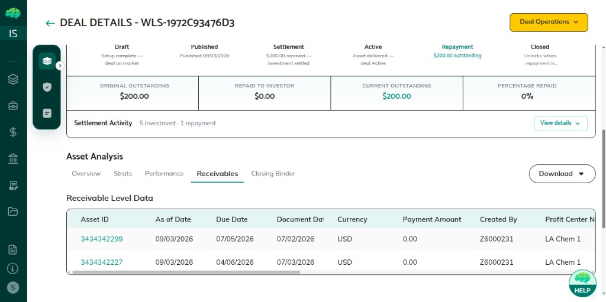

# Receivables & NFT Burn

## Overview

After settlement, investors hold receivables NFTs as on-chain proof that they own the loan assets in the deal. Each NFT is minted when settlement completes and transferred to the investor’s wallet. After a full repayment is accepted, the investor burns those NFTs to close the position. Burn is a blockchain transaction and cannot be undone.

## Who Can Use This

- **Investors** — view receivables and burn NFTs they hold
- **Issuers** — monitor receivable and NFT status on the deal

Only the investor who holds the token can burn it. Servicers and underwriters may see the same tab for monitoring.

## When This Is Used

Use this after the deal is **Active** (NFTs already transferred) and, for burn, after you have accepted repayment. Do not burn because a wire arrived if you have not accepted on the platform — accept first, then burn. Accept/reject steps live in [Repayment Flow](37_Repayment_Flow.md).

## Step-by-Step Process

### What the NFT represents

The NFT is tied to the deal’s loan portfolio. It is not a payment instruction. It is proof of ownership after **Settled** / **Active**. Until it is burned, the investor’s position stays open even if cash has already moved. Each row shows an asset ID and token ID so you can match the screen to the wallet that holds the token.

### View receivables

1. Open **Asset Sale** and the deal.
2. Go to **Asset Analysis** → **Receivables**.
3. Review asset IDs, amounts, tokenization status, and NFT status.

### Burn after repayment

1. Confirm repayment is accepted and NFT status is **Retirement pending**.
2. On **Receivables**, click **Burn** next to the token. You can select one or more asset IDs.
3. Review the confirmation and click **Yes, Burn NFT**.
4. The NFT is removed from your wallet. When every NFT on the deal is burned, NFT status becomes **Retired** and the deal becomes **Closed** (Fully Repaid).

On a partial repayment, only assets with a zero outstanding balance can be burned. If some tokens remain, status stays **Retirement pending** so you can finish later.

| NFT status | Meaning |
|------------|---------|
| **Transferred** | You hold the NFT; deal is Active |
| **Retirement pending** | Repayment accepted; burn is available |
| **Retired** | All NFTs burned; deal can close |

### After a failed or partial burn

If the burn job does not finish, wait and refresh **Receivables**. Do not assume the token is gone until status is no longer **Transferred**. If some assets burned and others did not, burn the remaining IDs when they are eligible. The deal does not close until every token on the deal is **Retired**.

Issuers watching the same tab see status only — they cannot click **Burn**.

## Rules & Validations

- Burn is available only after repayment is accepted.
- Only the investor on the settlement can burn.
- Burn is irreversible.
- The full selected receivable is burned in one action.
- The deal reaches **Closed** only after all NFTs on the deal are retired, not after a subset.
- A declared default does not use the same burn-to-close path as a full repayment. Follow the default confirmation on the repayment modal.

## What Happens Next

The deal stays on the dashboard for reporting. Settlement Details keep the burn timestamp and transaction hash. No operational actions remain on a **Closed** deal.

If repayment was only partial, do not expect **Closed** after one burn. Wait for the next installment, then burn remaining eligible assets.

Investor-facing clicks: [Repayment Receipt & NFT Burn](64_Repayment_Receipt_and_NFT_Burn_Investor.md).
