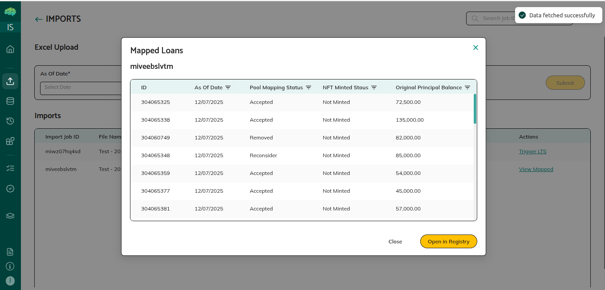

# Loan Management

## Part 1 — Upload and Standardize Loans

**1. Imports → upload**
- Select **As Of Date** and **Asset Class**
- Click **Choose File** (Excel or CSV) → **Submit**
- System creates a Job ID; file appears in the table with action **Trigger LTS**

**2. Trigger LTS (Loan Tape Standardization)**
- Click **Trigger LTS** → **Map Fields** popup opens
- AI pre-populates column mappings; review and correct using the dropdowns
- Optional: **Delegation** — delegate mapping to Admin; **Re-run** — choose Basic or Intelligent AI mapping
- Click **Save Mapping** → loans saved; action changes to **View Mapped**

.png>)

**3. View Mapped Loans**
- Click **View Mapped** → see standardized loans → **Open in Registry**
- Or navigate directly to **Loan Registry** from the sidebar

## Part 2 — Loan Registry

The Loan Registry shows all onboarded loans. Mapped columns appear first; unmapped columns have italic headers.

| Button | When enabled |
|---|---|
| **Map to Pool** | Selected loans are not already mapped to a pool |
| **Add to Batch** | Selected loans are not already in a batch |

**Mapping loans to a pool:**
1. Select loans (checkbox) → **Map to Pool**
2. Choose pool from dropdown → **Submit**
3. Status column updates to the pool name; pool metrics recalculate automatically

## Part 3 — Batch Verification

**Add to batch:** Select loans in the Loan Registry → **Add to Batch**

**Batch Verification** (sidebar) → click a **Batch ID** → two tabs: **Loans** and **Documents**

**Self Certification:**
1. Loans tab → **Self Certify** → fill in Name, Signer Name, Email, Place → **E-Sign**
2. Adobe Sign popup opens; complete signature
3. Verification Status → **Self Certify (Data Only)**; Batch Verification Status → **Reviewed**

**Verification Agent process:**
1. Documents tab → upload document type and verification template
2. Submit for verification agent review
3. Agent certifies → Verification Status → **Certified**

| Verification Status | Meaning |
|---|---|
| **Certified** | Third-party verification agent certified |
| **Self Certified** | Issuer logged in as verification agent |
| **Self Certify (Data Only)** | Issuer used Self Certify directly |

## Part 4 — NFT Minting

**Certificates** (sidebar) — same batches as Batch Verification with minting actions.

| Batch Verification Status | Buttons available |
|---|---|
| **Pending** | Both disabled |
| **Reviewed** | **Mint NFT** and **View NFT** enabled |
| **Verified** | **View NFT** only |

**Minting:**
1. **Mint NFT** → select loans → **Mint Selected** (top right)
2. Minting runs in the background
3. On completion: Batch Verification Status → **Verified**; loans have on-chain NFT representations

## Key Rules

- Loan tape must be Excel (.xlsx) or CSV with headers in row 1
- One pool per loan — unmap before reassigning
- Loans must not already be in a batch before adding to a new batch
- Batch must be **Reviewed** before NFT minting is available
- Only NFT-minted loans are eligible for credit facility mapping

→ See [Pool Creation and Sharing](41_Pool_Creation_and_Sharing.md) for mapping loans to pools.
