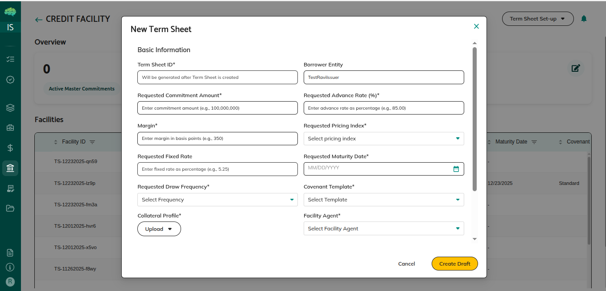
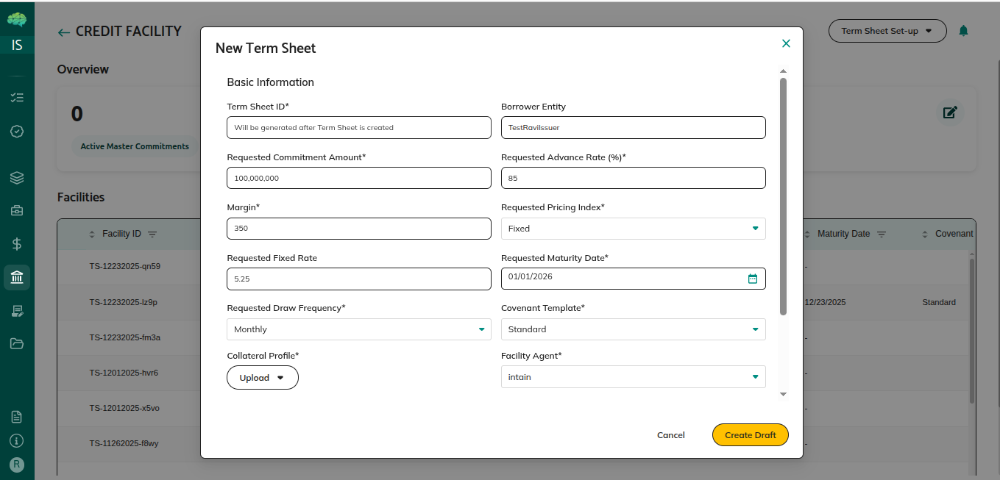

# Term Sheet Submission

## Overview

Term sheet submission is how you request a credit facility. As a borrower, you enter the key terms, sign the document with Adobe Sign, and send it to the facility agent. This guide covers creation and submission only. Review decisions are covered in the facility agent guide.

## Who Can Use This

- **Borrowers**: Create and submit term sheets for a new credit facility

## When This Is Used

Use term sheet submission when:
- You want to request a new credit facility
- You need to propose terms to a facility agent
- You are starting the credit facility workflow

## Step-by-Step Process

### Step 1: Access Credit Facility Dashboard

1. **Navigate to Credit Facility**
   - Log in with your Borrower account
   - Hover over the left menu so it expands, then click **Credit Facility**
   - Your Credit Facility dashboard opens

### Step 2: Start Term Sheet Setup

1. **Click Term Sheet Setup**
   - Click **Term Sheet Setup** at the top right
   - Two options appear:
     - **Create Via Wizard**: Enter the term sheet step by step
     - **Upload Signed**: Upload a document that is already signed

2. **Select Create Via Wizard**
   - Click **Create Via Wizard**
   - A window opens for the term sheet details

### Step 3: Enter Term Sheet Details

1. **Fill in Facility Information**
   - **Requested Commitment Amount**: The maximum amount you want to borrow
   - **Advance Rate**: The share of collateral value you can borrow
   - **Pricing Index**: The base interest rate, such as SOFR or SOFR 1M. SOFR is a published reference rate.
   - **Margin**: The extra percentage added to the pricing index
   - **Fixed Rate**: A single interest rate, if you are not using an index plus margin
   - **Maturity Date**: The date the facility ends
   - **Drawdown Frequency**: How often you can draw funds, such as Monthly or Quarterly
   - **Covenant Template**: The set of ongoing conditions for the facility

### Step 4: Upload Supporting Documents

1. **Upload Required Documents**
   - **Collateral Profile**: A description of the assets that support the facility
   - **Financial Statements**: Your financial statements
   - **KYC Documents**: Know Your Customer documents that identify your organization
   - **Collateral Data**: Files with collateral details

### Step 5: Create Draft

1. **Review Information**
   - Check that required fields are filled
   - Check that the documents uploaded
   - Correct anything that is wrong before you continue

2. **Click Create Draft**
   - Click **Create Draft**
   - The status is **Draft**

### Step 6: Sign the Term Sheet

1. **Adobe Sign Popup Opens**
   - After you click **Create Draft**, an Adobe Sign window opens
   - It shows the term sheet with the details you entered

2. **Complete E-Signature**
   - Review the document
   - Sign it
   - The status changes to **Borrower signed**

### Step 7: Submit to Facility Agent

1. **Submit Popup Appears**
   - After you sign, a **Submit to FA** window opens. FA means facility agent.

2. **Submit or Cancel**
   - Click **Submit** to send the term sheet
   - The status changes to **In review (facility agent)**
   - If you click **Cancel**, you can submit later

3. **After Submission**
   - The facility agent is notified
   - The dashboard action changes to **View Term Sheet**
   - Wait for the facility agent's decision. You cannot edit the term sheet while it is in review.

### If You Cancelled the Submit Popup

1. **Submit Later from Dashboard**
   - The term sheet shows **Borrower signed**
   - The action column shows **Submit Term Sheet**
   - Click **Submit Term Sheet** when you are ready
   - The status changes to **In review (facility agent)**

## Rules & Validations

- **Required fields**: Fill in the required fields before you create the draft.

- **Documents**: Upload the supporting documents the form asks for.

- **Signature**: Sign with Adobe Sign before you submit. An unsigned term sheet cannot be submitted.

- **One submission, then you wait**: After you submit, wait for the facility agent's decision.

- **No edit while it is in review**: You cannot change the term sheet while the status is **In review (facility agent)**.

## What Happens Next

**After you submit:**
- The facility agent reviews the term sheet
- You are notified of the decision

**If it is approved:**
- The status changes to **Accepted**
- A master commitment is created for you
- Facility setup begins

**If it is rejected:**
- The status changes to **Rejected**
- Create a new term sheet if you still want a facility. This term sheet cannot be sent again.

**If changes are requested:**
- The status changes to **Changes Requested**
- Edit the term sheet, sign it again, and resubmit it

