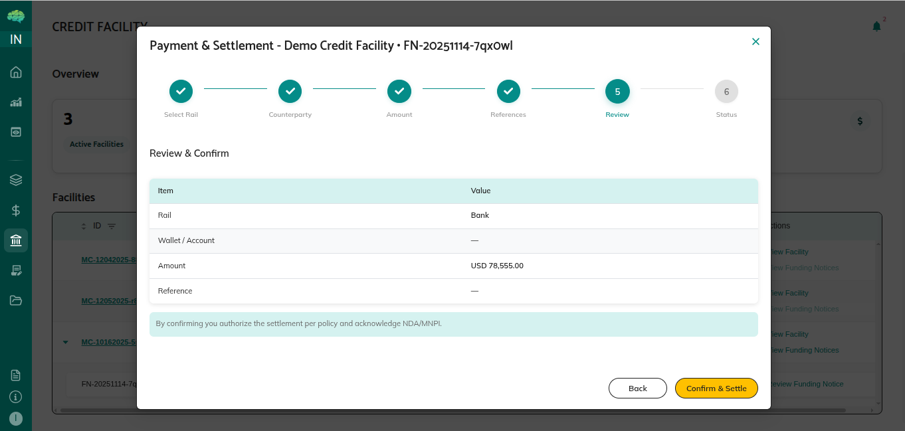

# Funds Transfer Confirmation

## Overview

This guide explains the funds transfer confirmation process in the credit facility module. After lenders review a funding notice and transfer their allocated funds, they confirm the transfer through the platform.

## Who Can Use This

- **Lenders** who have reviewed funding notices and transferred funds

## When This Is Used

Use this process when:
- You have received a funding notice
- You have reviewed the drawdown details
- You have transferred your allocated funds
- You need to confirm the transfer in the platform

## Prerequisites

Before confirming funds transfer:
1. Funding notice is visible in your Credit Facility section
2. You have reviewed the funding notice details
3. You have selected your payment method
4. You have completed the fund transfer externally

## Step-by-Step Process

### Step 1: Access the Funding Notice

1. **Navigate to Credit Facility**
   - Log in with your Lender credentials
   - From the left expandable menu, click on **Credit Facility**
   - Find the funding notice

2. **Click Review Funding Notice**
   - In the Actions column, click **Review Funding Notice**

### Step 2: Review Drawdown Details

1. **Check the Information**
   - Total drawdown amount
   - Your allocated portion
   - Purpose of funds
   - Funding date

2. **Verify Your Allocation**
   - Confirm your amount is correct
   - Matches your facility participation

### Step 3: Select Payment Method

1. **Choose Payment Method**
   - Review available options
   - Select your preferred method
   - Note transfer instructions

### Step 4: Transfer Funds Externally

1. **Complete the Transfer**
   - Transfer funds using your banking system
   - Use the designated accounts and references
   - Ensure transfer completes successfully
   - Keep transfer confirmation for records

### Step 5: Confirm the Transfer

1. **Click Confirm and Settle**
   - After completing the external transfer
   - Click **Confirm and Settle** in the platform
   - This records your confirmation



### After Confirmation

**What Happens:**
- Your transfer confirmation is recorded
- Tokens are transferred
- Borrower receives the funds
- Your participation is complete

## Flow Summary

```
Funding Notice visible to Lender
       ↓
Lender clicks Review Funding Notice
       ↓
Reviews drawdown details and allocation
       ↓
Selects payment method
       ↓
Transfers funds externally (bank transfer)
       ↓
Clicks Confirm and Settle in platform
       ↓
Confirmation recorded → Tokens transferred
```

## Rules & Validations

- **Transfer First**: Always complete the actual fund transfer before clicking Confirm and Settle
- **Accurate Amount**: Transfer the exact allocated amount
- **Correct References**: Use the provided transfer references
- **Timely Confirmation**: Confirm promptly after transferring

## Important Points

| Point | Description |
|-------|-------------|
| **External Transfer** | Fund transfer happens outside the platform via banking |
| **Platform Confirmation** | Confirm and Settle records your completion |
| **Individual Process** | Each lender confirms their transfer separately |
| **Final Step** | Confirmation triggers token transfer to borrower |

## What Happens Next

**After Confirmation:**
- Your participation in this drawdown is complete
- Borrower receives your portion
- Transaction is recorded on blockchain

**Ongoing:**
- Borrower may create additional funding requests
- New funding notices will appear for future drawdowns
- Process repeats for each funding request
