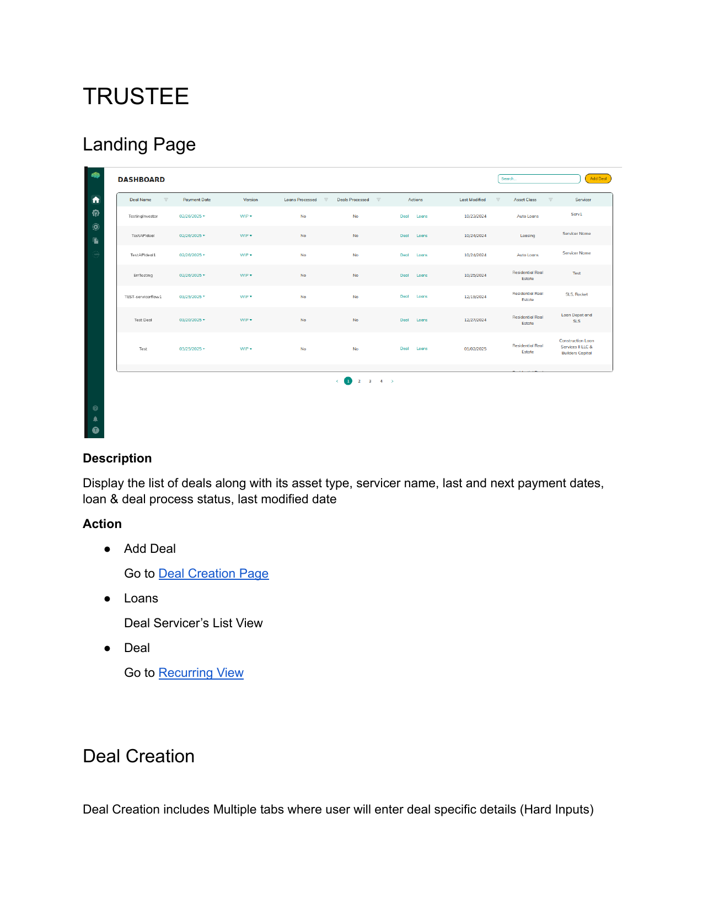
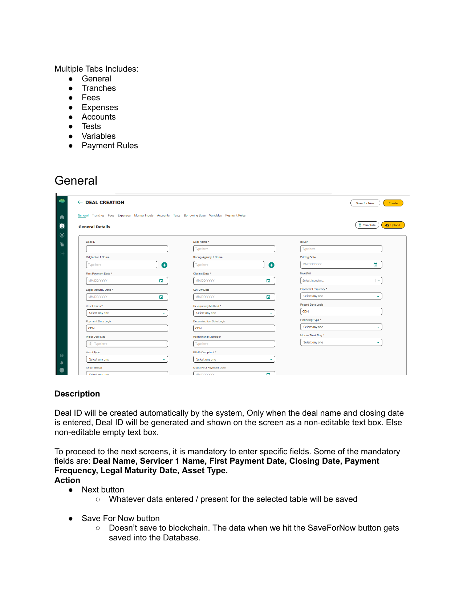
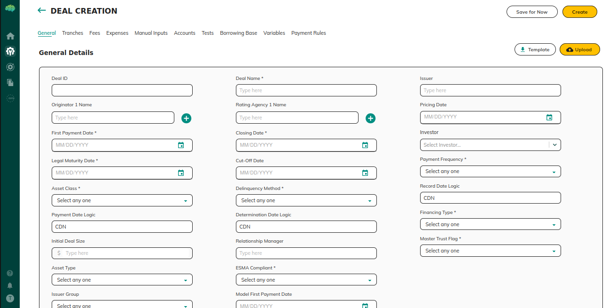
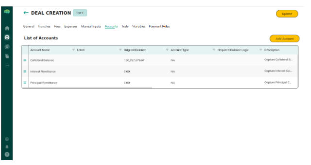
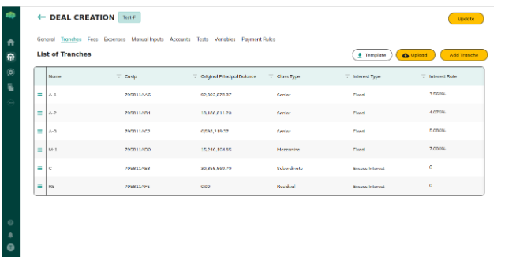
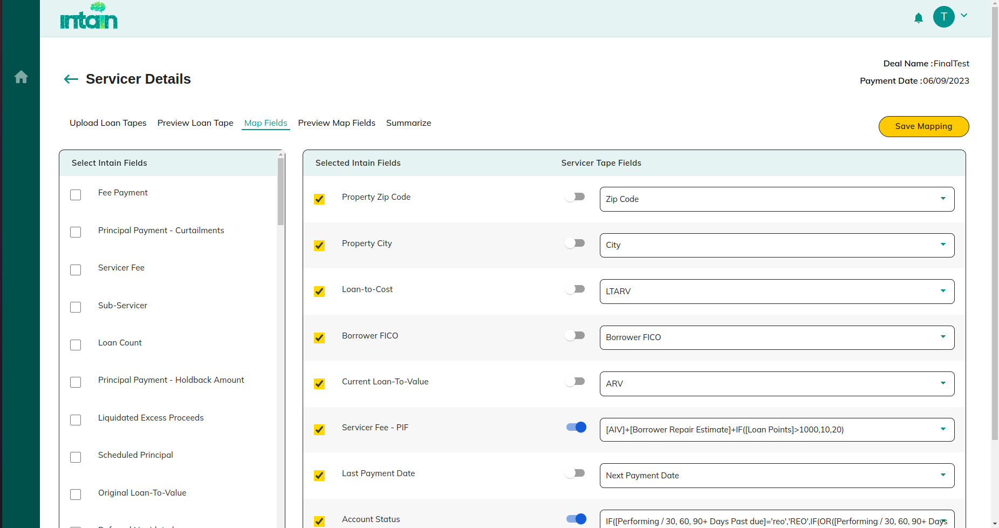

# Understanding Platform Syntax

## Overview

Deal configuration uses a shared expression format called **platform syntax**. An expression lets one part of a deal read a value from another part. A payment waterfall rule can read a tranche balance or an account balance and use that amount in the payment.

## How to Navigate the Platform

Open the deal configuration tables for the deal you are setting up. Expressions are entered in the fields that accept a formula, including payment rules. Use the table name, the row name, and the column name exactly as they appear on those screens.

## What You Will See

### Expression format

Every expression has three parts:

TabName\[EntityName]\[SubFieldName]

* **TabName** — The table that holds the value. Examples: Tranches, Fees, Accounts.
* **EntityName** — The row. Examples: tranche ID A-1, or a fee name such as Trustee Fee.
* **SubFieldName** — The column. Examples: Beginning Principal Balance, Interest Rate.

To read the Beginning Principal Balance of Tranche A-1:

Tranches\[A-1]\[Beginning Principal Balance]

If that balance changes, the expression updates.

### System variables

These shortcuts are most useful on the **General** and **Payment Rules** tabs.

| Variable            | Description                                                                                                           |
| ------------------- | --------------------------------------------------------------------------------------------------------------------- |
| CurrentPaymentDate  | The scheduled payment date. If that date is a weekend or a U.S. holiday, it moves to the next business day.           |
| ContractPaymentDate | The date in the deal documents, with no holiday adjustment.                                                           |
| PeriodCounter       | The number of months from the first payment date to the current payment date, using the frequency on the General tab. |
| DIM                 | The number of days in the current payment month.                                                                      |

| Variable | Description                                             |
| -------- | ------------------------------------------------------- |
| MP       | One month earlier                                       |
| MP3      | Three months earlier                                    |
| MP6      | Six months earlier                                      |
| LBM      | The last business day of the month                      |
| CDN      | The next business day when the current day is a holiday |

The same variable can show a different amount depending on which waterfall step is being calculated.

* **Tranches** — Current Principal and Interest Paid reflect that tranche at the current step.
* **Accounts** — Current Balance is the balance at the step being calculated.
* **Fees** — Current Fee is the fee due in this payment cycle.

### Queries for loan data

To total or filter standardized loan data, put the query between double angle brackets:

<< SQL STATEMENT >>

A query can use standardized loan data, other table data, system variables, and built-in functions.

* Put column names in backticks.
* Put specific values in double quotes.

To sum Beginning Loan Balance for one servicer:

<\<SELECT SUM(`Beginning Loan Balance`) FROM Table WHERE `Servicer`="Shellpoint">>

You can use the result in an expression, a test, or a payment rule.

## Helpful Tips

* Row names, such as tranche IDs and fee names, must match the source table exactly.
* Expressions stay live. A change in the source table updates every rule that uses it.
* You can place system variables and queries inside larger formulas.
* Use platform syntax for payment waterfalls, tests, and other deal rules so each rule reads the current values.
