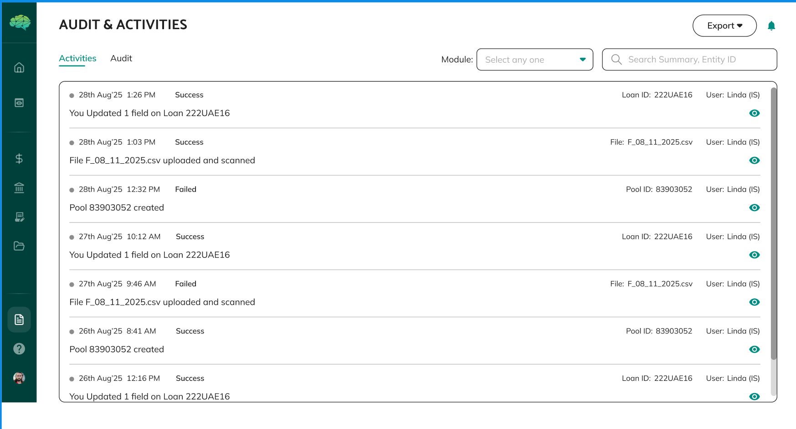
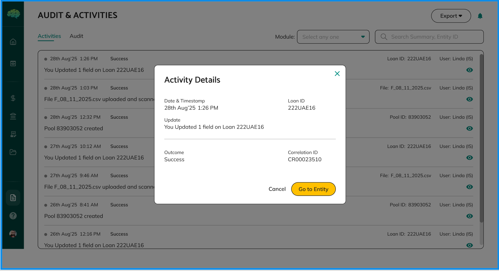
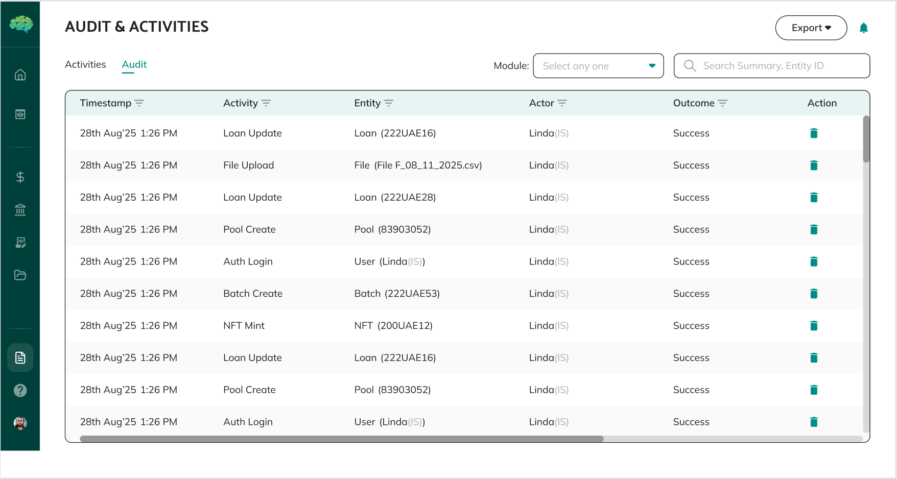
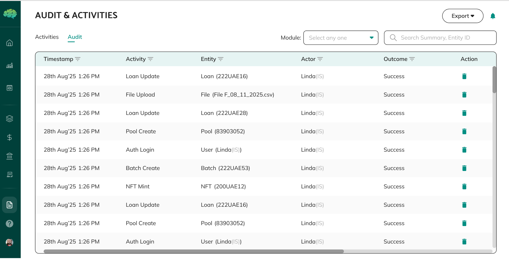

# End-to-End Traceability

## Overview

End-to-end traceability means that every action, status change, and decision in Intain Markets can be tracked from beginning to end, with complete records of who did what, when they did it, and what changed as a result. This traceability is built into the platform's architecture, ensuring full transparency, accountability, and compliance support for all transactions. Understanding traceability helps you appreciate how the platform maintains accountability, supports compliance, and provides transparency throughout the transaction lifecycle.

## How the Platform Is Designed

The platform is designed with the principle that complete traceability is essential for structured finance transactions. Every action, status change, approval decision, document upload, and data modification is automatically recorded with attribution, timestamps, and context. This creates comprehensive audit trails that support compliance, enable accountability, and provide transparency for all parties involved in transactions.

**Traceability as a Fundamental Design Element** - Traceability is not an optional feature—it's a fundamental design element that:

- **Records all actions automatically** - You don't need to do anything special—tracking happens automatically for every action. Whether you create a pool, submit a term sheet, approve a funding request, or make any other action, it's automatically recorded with who did it, when, and what changed.

- **Maintains complete history** - All changes are preserved in chronological order, creating complete historical records. You can see how items progressed through their workflows, what changed, when changes occurred, and who was responsible for each change. This history is permanent and cannot be deleted or modified.

- **Attributes actions to users** - Every action is linked to the specific user who performed it, ensuring accountability. You can see exactly who created an item, who approved it, who made changes, and who was responsible for specific decisions. This attribution ensures that all actions are traceable to specific individuals.

- **Captures context** - Status changes, approvals, and modifications are recorded with context about what changed and why. Comments, reasons, and related information are preserved, providing complete context for historical records. This context helps you understand not just what changed, but why it changed.

- **Preserves document versions** - Previous versions of documents are saved when changes are made. This maintains complete document history and enables you to see how documents evolved over time. You can compare versions, see what changed, and understand how documents progressed.

- **Tracks relationships** - Changes to related items are tracked, showing how items affect each other. When a term sheet is approved and a master commitment is created, the relationship is tracked. When a funding request is approved and a funding notice is generated, the relationship is tracked. This relationship tracking shows how items are connected and how changes affect related items.

The platform maintains these records permanently, ensuring that audit trails are complete, accurate, and available for compliance and accountability purposes. This permanent record-keeping ensures that historical information remains available for audits, compliance reviews, and accountability purposes.

## What This Enables for Users

**For All Users**, traceability provides confidence that all actions are recorded, enables you to see what happened and when, and supports accountability by attributing actions to specific users. You can review history to understand how items progressed, who was involved, and what decisions were made. This visibility helps you understand the complete context of transactions and decisions.

**For Compliance and Audit Purposes**, traceability provides complete audit trails that support regulatory requirements, enable internal audits, and demonstrate proper process execution. You can show that transactions followed proper workflows and approvals, that all required steps were completed, and that decisions were made by authorized parties. This compliance support helps you meet regulatory requirements and demonstrate proper governance.

**For Issue Resolution**, traceability helps identify when issues occurred, who was involved, and what changed. This enables faster problem resolution and helps prevent similar issues in the future. You can trace problems back to their source, understand what went wrong, and identify how to prevent similar issues.

**For Transparency**, traceability provides visibility into all relevant activities, enabling parties to see what happened, when it happened, and who was responsible. This transparency builds trust and enables informed decision-making. All parties can see the complete history of transactions and understand how decisions were made.

**For Accountability**, traceability ensures that all actions are attributed to specific users, creating accountability for decisions and actions. This accountability supports proper governance and responsible use of the platform. Users know that their actions are recorded and attributable, which encourages responsible behavior.

The traceability structure enables complete transparency while maintaining security and appropriate access controls. While traceability provides transparency, access to audit trails is controlled based on roles and permissions, ensuring that sensitive information remains appropriately protected while maintaining transparency for authorized parties.

## Key Principles to Understand

**Automatic Recording** - Traceability happens automatically—you don't need to do anything special to enable it. Every action, status change, and decision is recorded without requiring additional steps from users. This automatic recording ensures that nothing is missed and that complete records are maintained.

**Complete History** - All changes are preserved in chronological order, creating complete historical records. You can see how items progressed through their workflows, what changed, and when changes occurred. This complete history provides full context for understanding how transactions evolved.

**User Attribution** - Every action is attributed to the specific user who performed it. This ensures accountability and enables you to see who was responsible for specific actions or decisions. This attribution ensures that all actions are traceable to specific individuals.

**Timestamp Accuracy** - All timestamps are accurate and consistent, using standardized time formats. This ensures that you can accurately determine when events occurred and in what order. This accuracy is essential for understanding the sequence of events and for compliance purposes.

**Status Change Tracking** - Every status change is recorded with who changed it, when it changed, what the previous status was, and what the new status is. This creates complete status progression history. You can see how items moved through their workflows and understand the progression of statuses.

**Action Logging** - All actions are logged with action type, who performed the action, when it occurred, what was affected, and what the result was. This provides complete action history. You can see all actions taken on items and understand what happened and when.

**Activity Details** - You can view detailed activity information by clicking on specific activities, which shows complete context about what happened, who was involved, and when it occurred.

**Audit Trail** - The audit tab provides comprehensive audit trail information, showing all changes, approvals, and actions with complete attribution and timestamps.

**Document Versioning** - Previous versions of documents are saved when changes are made. This maintains complete document history and enables you to see how documents evolved over time. You can compare versions, see what changed, and understand how documents progressed.

**Permanent Records** - Audit trails are permanent and cannot be deleted or modified. This ensures that historical records remain accurate and available for compliance and accountability purposes. This permanence ensures that audit trails remain available for future reference.

**Context Preservation** - Changes are recorded with context about what changed and why. Comments, reasons, and related information are preserved, providing complete context for historical records. This context helps you understand not just what changed, but why it changed.

**Access Control** - While traceability provides transparency, access to audit trails is controlled based on roles and permissions. This ensures that sensitive information remains appropriately protected while maintaining transparency for authorized parties. This access control ensures that traceability provides transparency while maintaining security.

Understanding end-to-end traceability helps you appreciate how the platform ensures accountability, supports compliance, provides transparency, and maintains complete records of all activities for audit, regulatory, and accountability purposes. This understanding enables you to appreciate how the platform maintains accountability and supports compliance throughout the transaction lifecycle.
