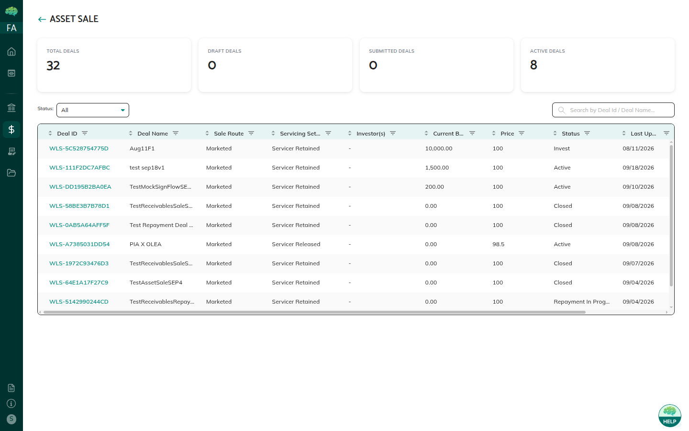

# Asset Sale Review & Allocation

## Overview

The underwriter (Market Maker / Arranger) reviews the issuer’s deal, publishes it to investors, then allocates commitments so settlement can start. You do not create the deal or record repayment. You decide whether the package is ready for the market and how much each investor receives.

## Who Can Use This

- **Underwriters (Market Makers)** named as Arranger on the deal

Issuers submit the package. Investors commit after you publish. If you are not the Arranger on the deal, you will not see review actions. Ask the issuer to set the correct Market Maker on Basics before they publish. Changing Arranger after review is not an underwriter action. Send the issuer back to Draft if the wrong firm is listed.

## When This Is Used

Use this when a deal is in **Pending Review**, or when a **Published** / **Commit** deal has commitments that need to be fitted to capacity.

## Step-by-Step Process

### Review the package

1. Open **Asset Sale**. Filter or scan for **Pending Review**.
2. Open the deal.

3. Check:
   - Basics — name, sale route, dates, buyer visibility, servicing
   - Loans — balances, verification, NFT minted status, mix
   - Sale terms — price basis, price, cutoff, settlement, commit window, recourse
   - Documents — sale agreement and supporting files
4. Decide:
   - **Approve** — status becomes **Published**. Investors in the visibility set can open the deal and commit.
   - **Reject** — status returns to **Draft**. The issuer revises and publishes again.
   - **Cancel** — status becomes **Cancelled**. The deal is not reactivated.

You cannot edit issuer fields during review. If something is wrong, reject with feedback.

### Allocate commitments

1. After publication, open the commitment list (investor and amount).
2. Compare total committed to deal size:
   - Under-subscribed — wait or allocate what you have.
   - Fully subscribed — amounts already fit.
   - Over-subscribed — reduce amounts so they fit capacity.
3. Click **Finalize Allocation**. Status becomes **Invest**. Investors are notified of the locked amount.
4. Watch agreement signing. Settlement stays blocked until the agreement is **Signed**.

Do not finalize allocation until you are satisfied with the investor set. After **Invest**, amounts are locked and the next gate is signing, not another allocation pass.

## Rules & Validations

- Only **Pending Review** deals can be approved or rejected in this cycle.
- Allocation cannot exceed deal capacity.
- After finalize, commitment amounts are locked.
- Agreement signing is allowed only in **Invest**.
- You cannot start settlement for the issuer or investor; you only confirm the deal is ready.
- Buyer Visibility on the deal controls which investors appear after you publish. You cannot widen that set from the review screen.

### What good review looks like

Before you approve, confirm minted loans match the sale story, dates are in order (cutoff ≤ settlement ≤ target), and the sale agreement (if required by your process) is attached. If recourse is used, check that triggers match the recourse type. A thin review that misses a locked field is expensive — those fields cannot be edited after publish without a reject back to Draft.

## What Happens Next

Investors and the issuer complete [Settlement & NFT Transfer](36_Settlement_and_NFT_Transfer.md). You can follow progress on the Settlement Activity trail. You do not sign for the investor and you do not confirm wires. Your job ends at a clean publish and a locked allocation.

Signing detail: [Investor Agreement & E-Signature](40_Investor_Agreement_and_E-Signature.md).
