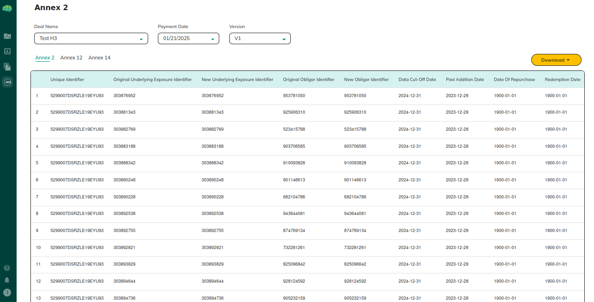
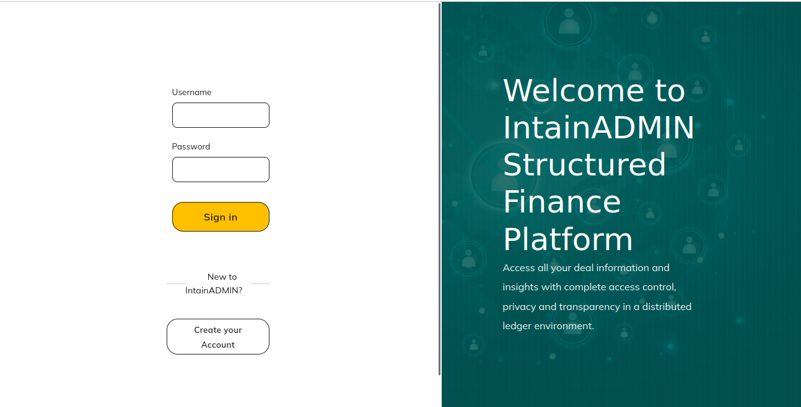

# ESMA Reporting

Available for deals configured as **ESMA Compliant** during deal setup. Generates Annex 2, 12, and 14 reports for each payment period in Excel, XML, and CSV formats.

## Who Can Use This

Market Makers, Issuers, and Admin users on ESMA-compliant securitization deals.

## Prerequisites

- Deal was marked **ESMA Compliant** during deal creation (cannot be changed after)
- Loan processing and recurring calculations are complete for the target payment period

## Steps

1. Open the deal details → **ESMA Reporting** section
2. Select the **payment period** from the dropdown
3. Select the annex: **Annex 2**, **Annex 12**, or **Annex 14**
4. Preview the report data in the table
5. Click **Download** → choose format: **Excel**, **XML**, or **CSV**

## Annexes

| Annex | Content | Field series |
|---|---|---|
| **Annex 2** — Loan-Level Data | ~40 loan-level fields: identifiers, obligor info, balances, interest rate, delinquency, collateral | SSCL1–SSCL40 |
| **Annex 12** — Investor Report | ~30 pool and tranche fields: pool balance, collections, delinquency rates, waterfall, reserve accounts | SSCI1–SSCI30 |
| **Annex 14** — Inside Information | ~30 bond/tranche fields: ISIN, coupon, payments, ratings, credit enhancement, counterparties | SSCT1–SSCT30 |

## Download Formats

| Format | Use for |
|---|---|
| **Excel (.xlsx)** | Internal review and data verification |
| **XML (.xml)** | Direct regulatory submission (follows ESMA prescribed XML schema) |
| **CSV (.csv)** | Downstream system integration and data pipelines |

## Key Rules

- Reports are generated from finalized data only — draft or in-progress calculations are excluded
- Each report is period-specific; select the correct period before downloading
- If the ESMA Reporting section is not visible, the deal was not configured as ESMA Compliant
