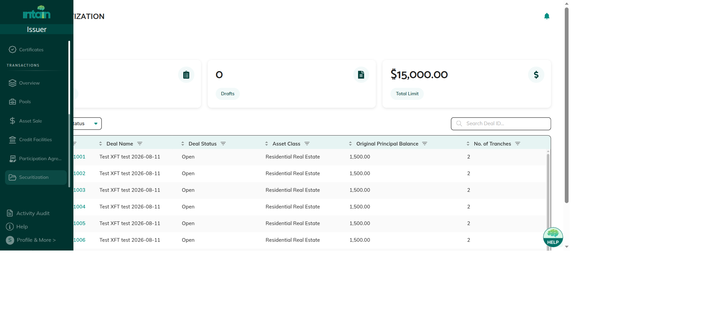

# Securitization Overview

Securitization on Intain Markets converts a pool of loans into a structured deal with multiple investment tranches. Each tranche receives its own Fungible Token (FT) on the Avalanche blockchain, representing fractional ownership of the tranche's principal balance. Investors commit funds to tranches, transfer payment, and receive FT tokens in return.

Securitization is one of four product lines on Intain Markets, alongside **Credit Facilities**, **Asset Sale**, and **Participation Agreements**.

---

## What Securitization Covers

A securitization deal typically flows through these stages:

1. **Asset Onboarding** — Issuer creates a pool and uploads loans via the Asset Registry
2. **Mandate & Deal Creation** — Underwriter accepts the pool mandate; Issuer or Underwriter creates a deal from the pool
3. **Tranche Setup** — Underwriter adds tranches (classes), each with its own principal balance, interest rate, and FT token
4. **Approval** — Deal moves through *Awaiting Approval* → *Open* after Underwriter review
5. **Investor Commitment** — Underwriter opens the Commit phase; Investors commit amounts to tranches
6. **Investment & Settlement** — Underwriter switches to Invest phase; Investors transfer funds and confirm investment
7. **Token Delivery** — Issuer approves the FT contract; Paying Agent delivers FT tokens to investors
8. **Accounts & Reporting** — Paying Agent maintains ledger accounts and ESMA compliance reports

*Securitization deals list — Issuer view showing deal IDs, statuses, and tranche counts*

---

## Key Concepts

| Concept | Description |
|---------|-------------|
| **Tranche** | A class of investment in the deal (e.g., Senior, Mezzanine). Each tranche has its own principal balance, interest rate, and FT token. |
| **Fungible Token (FT)** | An ERC-20 token on Avalanche. One token per tranche. Symbol format: 2 letters Issuer + 2 chars Deal + 2 letters Tranche (e.g., `PI98SE`). |
| **Commit Phase** | Investors indicate how much they want to invest in each tranche. No funds move yet. |
| **Invest Phase** | Investors transfer funds (bank wire or stablecoin) and confirm investment. FTs are delivered after. |
| **Payment Mode** | Offchain (bank wire/ACH) or Onchain (USDC stablecoin via MetaMask). Set when Underwriter opens the Invest phase. |

---

## Roles in Securitization

| Role | Key Actions |
|------|------------|
| **Issuer** | Creates pool → creates deal → approves FT contract (MFA + on-chain wallet signing) |
| **Underwriter** | Reviews deal → adds tranches → approves deal → opens Commit/Invest phases → selects payment mode |
| **Investor** | Views deal → commits to tranches → transfers funds → invests → receives FT tokens |
| **Paying Agent** | Delivers FT tokens to investors (MFA required) → manages accounts → records transactions |
| **Rating Agency** | Read-only access to shared pool and deal information |

---

## Payment Modes

- **Offchain** — Investor transfers via bank wire. Paying Agent confirms receipt and triggers FT delivery.
- **Onchain** — Investor connects a MetaMask wallet and transfers USDC directly to the deal's escrow smart contract. Settlement is recorded on-chain.

---

## Related Articles

→ See [Deal Lifecycle & Statuses](89_Securitization_Deal_Lifecycle_and_Statuses.md) for a full breakdown of deal statuses.  
→ See [Deal Creation & Tranche Setup](90_Deal_Creation_and_Tranche_Setup.md) for step-by-step deal creation instructions.  
→ See [Securitization Roles & Permissions](95_Securitization_Statuses_and_Roles.md) for a complete permissions reference.
