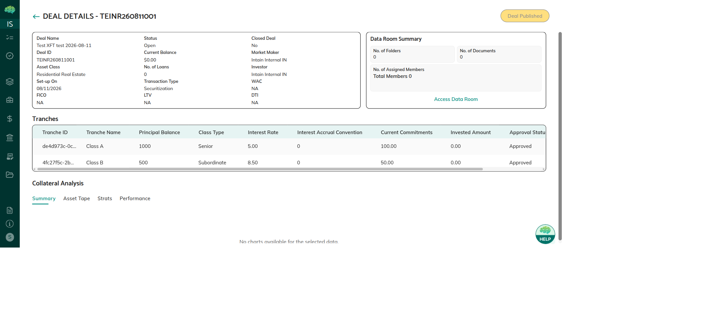

# Securitization Deal Lifecycle & Statuses

A securitization deal moves through four statuses from creation to close. Separately, each tranche tracks its own approval status, and the deal toggles between a Commit phase and an Invest phase to control investor activity.

---

## Deal Lifecycle

```
Created → Awaiting Approval → Open → Closed
```

| Status | Meaning | Who Can Act |
|--------|---------|-------------|
| **Created** | Deal has been set up with basic fields. Tranches may or may not be added yet. | Issuer or Underwriter can edit. Underwriter can add/delete tranches. |
| **Awaiting Approval** | Deal has been submitted for review. No further edits allowed until approved or rejected. | Underwriter reviews and either approves or rejects. |
| **Open** | Deal is approved and live. Underwriter manages Commit/Invest phases; Investors can participate. | All roles can view. Investors commit and invest. Paying Agent delivers FTs. |
| **Closed** | Deal has been marked closed. No new investment activity. | Read-only for all roles. |


*Deal details page — shows current status (Open), deal name, and key fields*

---

## Tranche Approval Statuses

Each tranche within a deal tracks its own approval state:

| Status | Meaning |
|--------|---------|
| **Pending** | Tranche has been created but not yet approved by the Underwriter. |
| **Approved** | Tranche is live and available for investor commitment. |
| **Rejected** | Tranche was rejected by the Underwriter. It cannot receive commitments. |

Tranches must be **Approved** before investors can commit to them.

---

## Commit vs Invest Phase

The Underwriter controls two sub-phases within an **Open** deal:

### Commit Phase

- Underwriter opens the Commit phase to start accepting investor interest.
- Investors can submit commitment amounts to any approved tranche.
- No funds are transferred in this phase — commitments are non-binding declarations of intent.
- The Available Commitments counter on each tranche decreases as investors commit.

### Invest Phase

- Underwriter switches the deal from Commit to Invest when ready to collect funds.
- **Payment mode is selected at this point** (offchain or onchain — cannot be changed after).
- Investors transfer actual funds (bank wire or USDC) and click **Invest** to confirm.
- The Invested Amount on each tranche increases as investors complete their investment.
- After investment is confirmed, the Paying Agent delivers FT tokens.

> **Note:** The deal cannot go back from Invest phase to Commit phase. The payment mode selected is fixed for the duration of the deal.

---

## Payment Mode

| Mode | Description | When Funds Move |
|------|-------------|----------------|
| **Offchain** | Investor initiates a bank wire; uploads confirmation document and reference number | After Paying Agent confirms receipt |
| **Onchain** | Investor connects MetaMask wallet and transfers USDC to escrow contract | Immediately, on-chain via smart contract |

The payment mode applies to all investors in the deal — it cannot be set per-investor.

---

## Related Articles

→ See [Deal Creation & Tranche Setup](90_Deal_Creation_and_Tranche_Setup.md) for how deals are created and tranches configured.  
→ See [Investor Commitment Phase](91_Investor_Commitment_Phase.md) for investor actions in the Commit phase.  
→ See [Investment & Settlement](92_Investment_and_Settlement.md) for the Invest phase workflow.
