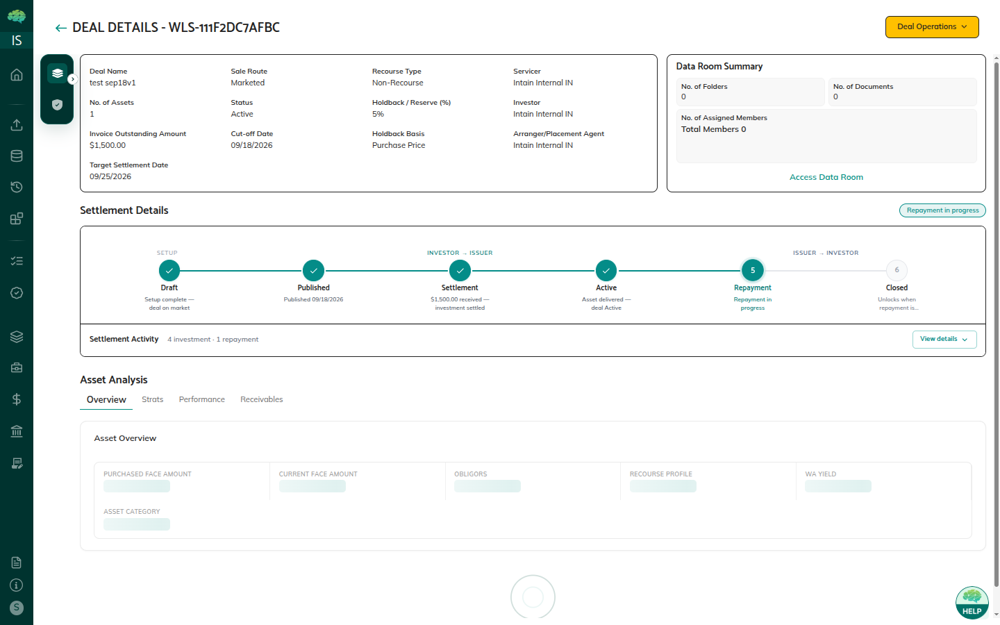

# Deal Creation & Tranche Setup

A securitization deal is **not created manually** — it is automatically generated when the Underwriter accepts the pool mandate. The Underwriter then uses the **Tools tab** inside the deal to model tranches, set terms, and assign investors before publishing to the Issuer.

→ See [Pool Sharing & Mandates](08_Pool_Sharing_and_Mandates.md) for how pools reach mandate acceptance.

---

## Step 1: Pool to Deal Conversion

1. **Issuer** creates a Securitization pool and onboards loans via the Asset Registry
2. **Issuer** shares the pool with an Underwriter (mandate request)
3. **Underwriter** previews the pool and accepts the mandate
4. The platform **automatically converts the pool into a Deal** in **Created** status
5. The deal appears in the Underwriter's **Securitization tab**

There is no "Create Deal" button — the conversion happens on mandate acceptance.

---

## Step 2: Underwriter Sets Up the Deal (Tools Tab)

The Underwriter opens the deal → clicks the **Tools tab** to access deal modeling:

### Tranche Setup

Click **Add Tranche** to define each investment class:

| Field | Description |
|-------|-------------|
| **Tranche Name** | Name of this class (e.g., "Class A Senior", "Class B Mezzanine") |
| **Class Type** | Tranche type (Senior, Mezzanine, Subordinate, etc.) |
| **Principal Balance** | Dollar amount allocated to this tranche |
| **Interest Rate** | Annual interest rate for this tranche |
| **Day Count Method** | Interest calculation convention (e.g., 30/360, Actual/365) |
| **Closing Date** | Closing date specific to this tranche |

A deal can have multiple tranches. Each tranche is a separate investment class with its own FT token.

*Tranches table — showing Tranche Name, Principal Balance, Class Type, and Interest Rate*

### FT Token Deployment

When a tranche is added, the platform automatically deploys an ERC-20 Fungible Token contract on Avalanche:

- **Token name:** `{Issuer Organization} Securitization Token`
- **Token symbol:** 2 letters (Issuer) + 2 chars (Deal ID) + 2 letters (Tranche), e.g., `PI98SE`
- One FT contract per tranche

> The FT contract starts in **Pending** status. The Issuer must approve it (MFA + on-chain wallet signing) before tokens can be delivered. See [Token Approval & FT Delivery](93_Token_Approval_and_FT_Delivery.md).

### Investor Assignment

Within the Tools tab, the Underwriter assigns specific investors to the deal — determining which investor organizations can view and commit to tranches.

---

## Step 3: Underwriter Publishes to Issuer

Once tranche setup and investor assignments are complete, the Underwriter **publishes the deal to the Issuer**:

- Deal moves to **Awaiting Approval** status
- The Issuer receives the deal for review
- The Underwriter cannot make further edits until the Issuer acts

---

## Step 4: Issuer Reviews and Publishes to Investors

The Issuer opens the deal in the Securitization tab and reviews:

- Tranche structure, names, and principal balances
- Interest rates and day count methods
- Investor assignments

If satisfied, the Issuer **publishes the deal to investors**:

- Deal moves to **Open** status
- Assigned investors can now view the deal and its tranches
- The Underwriter can now open the Commit phase

*Deal details — Issuer review view showing tranche structure and deal terms*

---

## Rules & Validations

- Each tranche must have a positive Principal Balance
- The Underwriter can delete tranches only while the deal is in **Created** status
- An FT contract is deployed per tranche at creation — changing tranche details after deployment requires re-approval
- Investor assignments control which organizations can see and interact with the deal

---

## Related Articles

→ See [Deal Lifecycle & Statuses](89_Securitization_Deal_Lifecycle_and_Statuses.md) for deal status definitions.  
→ See [Investor Commitment Phase](91_Investor_Commitment_Phase.md) for what investors do after the deal goes Open.  
→ See [Token Approval & FT Delivery](93_Token_Approval_and_FT_Delivery.md) for the Issuer FT approval step.
