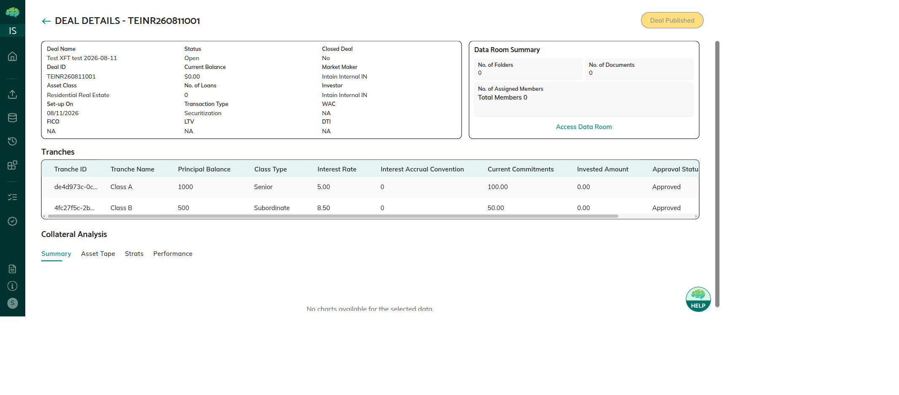

# Deal Creation & Tranche Setup

A securitization deal is created from a pool that has reached **Deal** status (mandate accepted by the Underwriter). Either the **Issuer** or the **Underwriter** can create the deal.

---

## Who Can Create a Deal

- **Issuer** — can create a deal from any pool they own that is in Deal status
- **Underwriter** — can create a deal from any pool assigned to them

The pool must be in **Deal** status (mandate accepted). Pools in Preview, Mandate Pending, or Ready for Deal status cannot yet become deals.

→ See [Pool Sharing & Mandates](08_Pool_Sharing_and_Mandates.md) for how pools reach Deal status.

---

## Step 1: Create the Deal

Navigate to the Securitization section → click **Create Deal** → fill in the required fields:

| Field | Description |
|-------|-------------|
| **Deal Name** | A descriptive name for the deal |
| **Currency** | Deal currency (e.g., USD) |
| **Original Principal Balance** | Total principal balance of all loans in the pool |
| **No. of Loans** | Number of loans included in the deal |
| **Closing Date** | Target date for deal closing and FT delivery |
| **Maturity Date** | Final expected payment date for the deal |
| **First Payment Date** | Date of the first scheduled payment to investors |
| **Payment Frequency** | How often payments are made (e.g., Monthly, Quarterly) |

After submission, the deal is in **Created** status.

---

## Step 2: Add Tranches

Once the deal is created, the **Underwriter** adds tranches. Each tranche represents a class of investment with its own risk/return profile.

Click **Add Tranche** on the deal details page and fill in:

| Field | Description |
|-------|-------------|
| **Tranche Name** | Name of this class (e.g., "Class A Senior") |
| **Class Type** | Type of tranche (e.g., Senior, Mezzanine, Subordinate) |
| **Principal Balance** | Dollar amount allocated to this tranche |
| **Interest Rate** | Annual interest rate for this tranche |
| **Day Count Method** | How interest is calculated (e.g., 30/360, Actual/365) |
| **Closing Date** | Closing date specific to this tranche |

*Deal details — Tranches table showing Tranche ID, Name, Principal Balance, Class Type, and Interest Rate*

---

## Step 3: FT Token Deployment

When a tranche is created, the platform automatically deploys an ERC-20 Fungible Token (FT) contract on the Avalanche blockchain:

- **Token name:** `{Issuer Organization} Securitization Token`
- **Token symbol:** 2 letters (Issuer) + 2 chars (Deal) + 2 letters (Tranche), e.g., `PI98SE`
- Each tranche gets its own separate FT contract
- The FT contract is deployed in **Pending** tranche status — the Issuer must approve it before delivery

> ⚠️ **Important:** The Issuer must approve each FT contract (MFA required + on-chain wallet signing) before the Paying Agent can deliver tokens to investors. See [Token Approval & FT Delivery](93_Token_Approval_and_FT_Delivery.md).

---

## Step 4: Deal Approval

Once tranches are set up:

1. The deal moves to **Awaiting Approval** status
2. The **Underwriter** reviews the deal and all tranche details
3. Underwriter clicks **Approve** → deal moves to **Open**
4. Once Open, the Underwriter can open the Commit phase for investors

> The Underwriter can also reject the deal if corrections are needed, returning it to Created status for revision.

---

## Rules & Validations

- Each tranche must have a positive Principal Balance
- The sum of tranche Principal Balances should align with the deal's Original Principal Balance
- Tranches can only be deleted by the Underwriter while the deal is in Created status
- An FT contract is deployed per tranche at creation time — changing tranche details after deployment may require re-approval

---

## Related Articles

→ See [Deal Lifecycle & Statuses](89_Securitization_Deal_Lifecycle_and_Statuses.md) for deal status definitions.  
→ See [Token Approval & FT Delivery](93_Token_Approval_and_FT_Delivery.md) for the Issuer FT approval step.  
→ See [Investor Commitment Phase](91_Investor_Commitment_Phase.md) for what happens after the deal goes Open.
